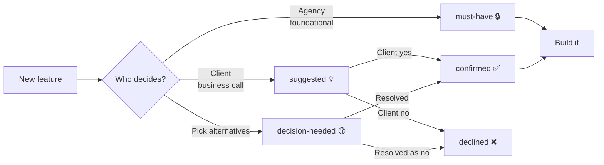

# Decision lifecycle

How a feature moves through `decision:` states.



## When to use each value

### `must-have` 🔒
Built regardless. Examples:
- Checkout, customer account, email automation, warranty registration
- All ops baseline (backup, monitoring, security)
- Analytics, accessibility, admin dashboard

If the client tries to remove a must-have, push back — it's foundational.

### `suggested` 💡
We propose, client decides. Examples:
- **Business-model dependent:** trade-in, parts-finder, returns policy complexity
- **Operationally dependent:** stock display (real-time inventory feasible?)
- **Optional UX:** first-visit popup, recently-viewed, cross-sell
- **All add-ons:** by definition, opt-in

When pitching: walk the client through the "💡 Suggested to Client" view in `_features.base` and get yes/no per item.

### `decision-needed` 🟡
Multiple valid technical alternatives — must pick one. Examples:
- Search engine (Meilisearch vs Algolia)
- Email vendor (Resend vs Loops)
- Checkout (self-built vs Airwallex Hosted)

Each `decision-needed` feature should have a paired `decisions/<question>.md` note explaining the trade-off.

### `confirmed` ✅
Client signed off. Feature is locked into scope for the engagement.

### `declined` ❌
Client said no — but capture the reason in the body of the feature note. Don't delete the feature file; keep it for future revisits.

## Flipping states

Edit the frontmatter directly:

```yaml
decision: suggested  →  decision: confirmed
```

The Bases views (`_features.base`, `_addons.base`) re-render on next open in Obsidian. Cost summaries in `_addons.base` "✅ Confirmed by Client" view will auto-sum the confirmed add-ons' setup + monthly costs.

## After client meeting workflow

1. Open `_features.base` → "💡 Suggested to Client" view
2. Walk through each item with client
3. For each: ask "yes / no / decide later"
4. Edit frontmatter inline (Obsidian properties UI or YAML edit)
5. Done — the catalogue reflects reality
