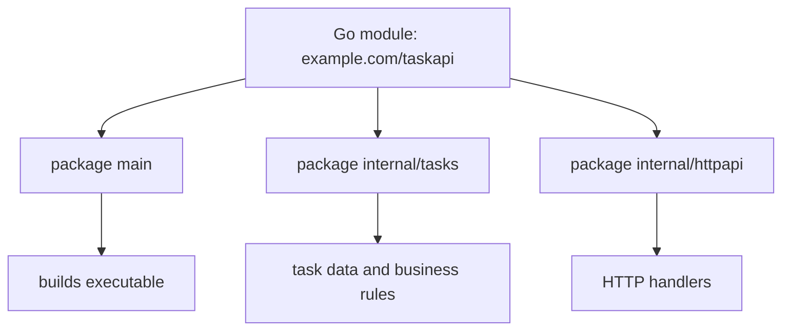

# Go Project Mental Model

## Goal

Understand how a Go project is organized.

## React Developer Mental Model

In React, `package.json` describes the project. In Go, `go.mod` does that job.

```text
taskapi/
├── go.mod
└── main.go
```

## Core Concept

A Go project is usually a module. A module can contain many packages. A package is a folder of Go files compiled together.

## Visual Memory



## Syntax

```go
module example.com/taskapi

go 1.22
```

This means imports inside this project can use paths like:

```go
import "example.com/taskapi/internal/tasks"
```

## Common Mistake

Do not think every file is its own module. A module is the project boundary. A package is the folder boundary.

## 5-Min Practice

Run:

```bash
go env GOPATH
go env GOMOD
```

Notice where Go thinks your module file is.

## Type-It-Yourself Zone

Use this space to type the lesson code by hand from memory. Do not paste from the example above. First type it, then run it, then fix the compiler errors.

```go
// Type your code here.

```

## Next

Read [[03 Packages Imports and Main]].
