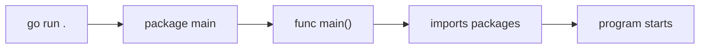

docs/superpowers/handoff-2026-05-21-catalog-to-commerce.md
# Packages Imports and Main

## Goal

Understand `package`, `import`, and `func main`.

## React Developer Mental Model

`main` is like the app entry point. In React, that might be `main.tsx`. In Go, executable programs start from `package main` and `func main()`.

## Syntax

```go
package main

import (
	"fmt"
	"time"
)

func main() {
	fmt.Println("started at", time.Now())
}
```

## Core Concept

Only `package main` builds into an executable program. Other package names are libraries used by executable code.

## Visual Memory



## Exported Names

Names that start with a capital letter are exported:

```go
fmt.Println("visible because Println starts with P")
```

## Common Mistake

Go does not allow unused imports. If you import a package and do not use it, the program will not compile.

## 5-Min Practice

Import `strings` and print:

```go
strings.ToUpper("tasks")
```

## Type-It-Yourself Zone

Use this space to type the lesson code by hand from memory. Do not paste from the example above. First type it, then run it, then fix the compiler errors.

```go
// Type your code here.

```

## Next

Read [[04 Variables Constants and Types]].
