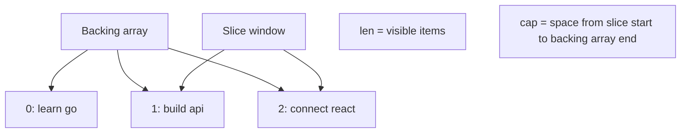

# Arrays and Slices

## Goal

Use slices, the most common list type in Go.

## React Developer Mental Model

A slice feels like a JavaScript array, but it has a length, capacity, and references an underlying array.

## Syntax

```go
tasks := []string{"learn go", "build api"}
tasks = append(tasks, "connect react")
```

## Visual Memory



Loop:

```go
for _, task := range tasks {
	fmt.Println(task)
}
```

## Arrays

Arrays have fixed length and are less common in everyday backend code:

```go
var codes [3]int
```

## Common Mistake

`append` returns the new slice. Always assign it back:

```go
tasks = append(tasks, "write tests")
```

## 5-Min Practice

Create a `[]string` of task titles, append one more, then print each title.

## Type-It-Yourself Zone

Use this space to type the lesson code by hand from memory. Do not paste from the example above. First type it, then run it, then fix the compiler errors.

```go
// Type your code here.

```

## Next

Read [[02 Maps]].
