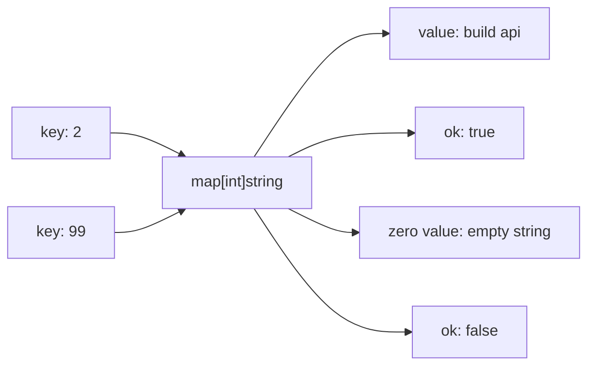

# Maps

## Goal

Use key-value storage in Go.

## React Developer Mental Model

A map is close to a JavaScript object or `Map`, but the key and value types are fixed.

## Syntax

```go
tasks := map[int]string{
	1: "learn go",
	2: "build api",
}

tasks[3] = "connect react"
```

## Checking Existence

```go
title, ok := tasks[2]
if !ok {
	fmt.Println("task not found")
}
fmt.Println(title)
```

## Visual Memory



## Delete

```go
delete(tasks, 1)
```

## Common Mistake

Reading a missing key returns the zero value. Use the `ok` value when missing data matters.

## 5-Min Practice

Create `map[int]string`, add three tasks, then check whether task `99` exists.

## Type-It-Yourself Zone

Use this space to type the lesson code by hand from memory. Do not paste from the example above. First type it, then run it, then fix the compiler errors.

```go
// Type your code here.

```

## Next

Read [[03 Strings Runes and Bytes]].
