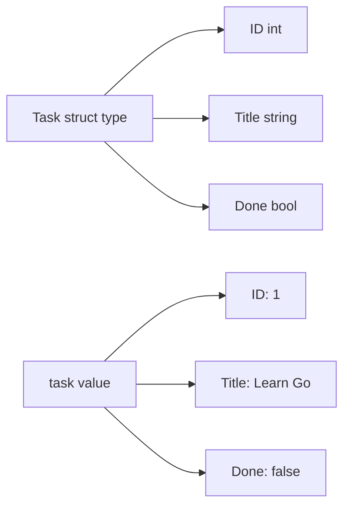

# Structs

## Goal

Model real-world data with structs.

## React Developer Mental Model

A struct is similar to a TypeScript object type, but it is a concrete runtime type.

## Syntax

```go
type Task struct {
	ID    int
	Title string
	Done  bool
}

task := Task{
	ID:    1,
	Title: "Learn Go",
	Done:  false,
}
```

Access fields:

```go
fmt.Println(task.Title)
task.Done = true
```

## Visual Memory



## Common Mistake

Field names starting with lowercase letters are not exported. JSON encoding and other packages often need exported fields.

## 5-Min Practice

Create a `Task` struct with `ID`, `Title`, `Done`, and `Priority`.

## Type-It-Yourself Zone

Use this space to type the lesson code by hand from memory. Do not paste from the example above. First type it, then run it, then fix the compiler errors.

```go
// Type your code here.

```

## Next

Read [[05 Pointers]].
