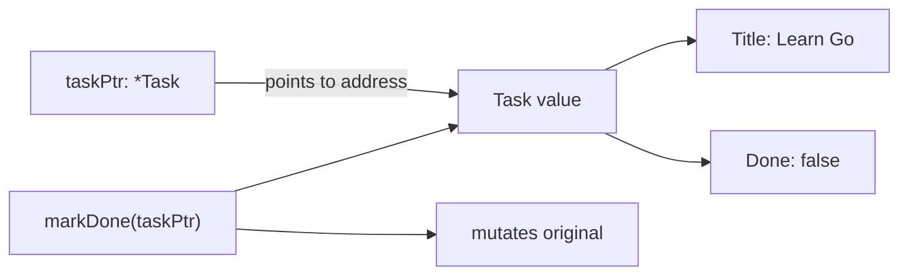

# Pointers

## Goal

Understand when Go passes values and when a function can mutate data.

## React Developer Mental Model

In React, you avoid mutating state directly. In Go, mutation is normal, but you must be clear about whether a function receives a copy or a pointer.

## Syntax

```go
func markDone(task *Task) {
	task.Done = true
}

task := Task{ID: 1, Title: "Learn Go"}
markDone(&task)
```

`&task` means "address of task". `*Task` means "pointer to Task".

## Visual Memory



## Value Copy

```go
func rename(task Task) {
	task.Title = "Changed"
}
```

This changes only the copy.

## Common Mistake

Do not use pointers everywhere. Use them when mutation, sharing, or avoiding large copies matters.

## 5-Min Practice

Write `markDone(task *Task)` and prove the original task changes.

## Type-It-Yourself Zone

Use this space to type the lesson code by hand from memory. Do not paste from the example above. First type it, then run it, then fix the compiler errors.

```go
// Type your code here.

```

## Next

Read [[06 JSON Tags]].
