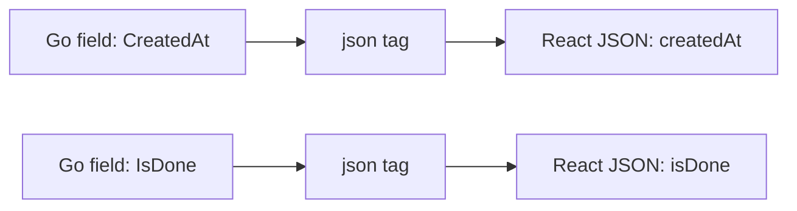

# JSON Tags

## Goal

Control how structs become JSON for a React app.

## React Developer Mental Model

Your React frontend expects camelCase JSON. Go field names are usually PascalCase when exported, so tags map the names.

## Syntax

```go
type Task struct {
	ID        int    `json:"id"`
	Title     string `json:"title"`
	IsDone    bool   `json:"isDone"`
	CreatedAt string `json:"createdAt"`
}
```

Encode:

```go
data, err := json.Marshal(task)
if err != nil {
	return err
}
fmt.Println(string(data))
```

## Visual Memory



## Omitting Empty Values

```go
Description string `json:"description,omitempty"`
```

## Common Mistake

Unexported fields are ignored by `encoding/json`, even if they have tags.

## 5-Min Practice

Create a `Task` struct and marshal it to JSON.

## Type-It-Yourself Zone

Use this space to type the lesson code by hand from memory. Do not paste from the example above. First type it, then run it, then fix the compiler errors.

```go
// Type your code here.

```

## Next

Read [[../03 Structs Methods Interfaces/00 Module Overview]].
