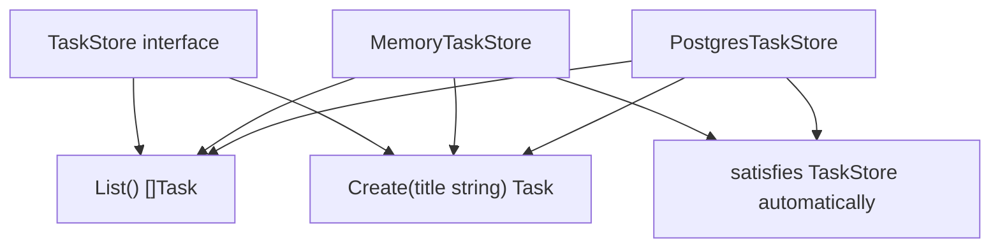

# Interfaces Are Implicit

## Goal

Understand Go interfaces.

## React Developer Mental Model

TypeScript interfaces are explicitly named by types. Go interfaces are satisfied automatically when a type has the required methods.

## Syntax

```go
type TaskStore interface {
	List() []Task
	Create(title string) Task
}
```

Any type with these methods satisfies `TaskStore`.

```go
type MemoryTaskStore struct {
	tasks []Task
}

func (s *MemoryTaskStore) List() []Task {
	return s.tasks
}

func (s *MemoryTaskStore) Create(title string) Task {
	task := Task{ID: len(s.tasks) + 1, Title: title}
	s.tasks = append(s.tasks, task)
	return task
}
```

## Visual Memory



## Common Mistake

Do not create huge interfaces. Small interfaces are easier to test and replace.

## 5-Min Practice

Create a `TaskStore` interface with `List` and `Create`.

## Type-It-Yourself Zone

Use this space to type the lesson code by hand from memory. Do not paste from the example above. First type it, then run it, then fix the compiler errors.

```go
// Type your code here.

```

## Next

Read [[03 Composition and Embedding]].
