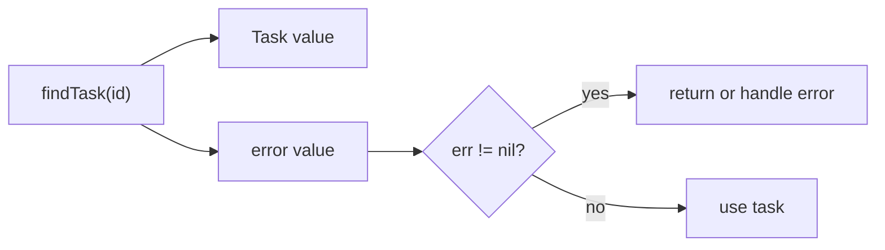

# Error Values

## Goal

Handle normal failures with returned `error` values.

## React Developer Mental Model

Go does not use thrown exceptions for normal control flow. Functions return errors and callers check them.

## Syntax

```go
func findTask(id int) (Task, error) {
	if id <= 0 {
		return Task{}, errors.New("invalid task id")
	}
	return Task{ID: id, Title: "Learn Go"}, nil
}
```

Call it:

```go
task, err := findTask(1)
if err != nil {
	return err
}
fmt.Println(task.Title)
```

## Visual Memory



## Common Mistake

Do not ignore `err`. In Go, skipped error checks become hidden bugs.

## 5-Min Practice

Write `validateTitle(title string) error` that rejects empty titles.

## Type-It-Yourself Zone

Use this space to type the lesson code by hand from memory. Do not paste from the example above. First type it, then run it, then fix the compiler errors.

```go
// Type your code here.

```

## Next

Read [[02 Custom Errors and Wrapping]].
