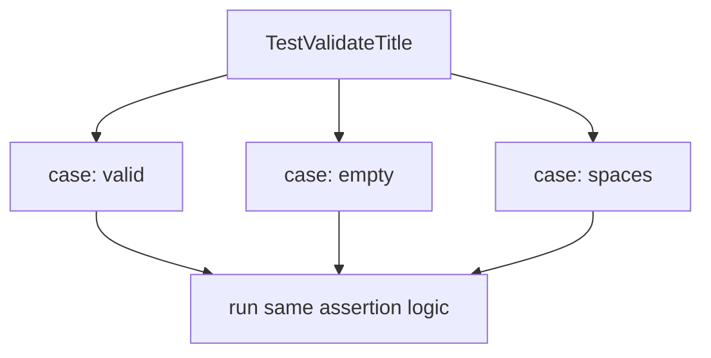

# Table Tests

## Goal

Test many cases with one test function.

## React Developer Mental Model

A table test is like mapping over test cases in Jest, but it is plain Go.

## Syntax

```go
func TestValidateTitle(t *testing.T) {
	cases := []struct {
		name    string
		title   string
		wantErr bool
	}{
		{name: "valid", title: "Learn Go", wantErr: false},
		{name: "empty", title: "", wantErr: true},
	}

	for _, tc := range cases {
		t.Run(tc.name, func(t *testing.T) {
			err := validateTitle(tc.title)
			gotErr := err != nil
			if gotErr != tc.wantErr {
				t.Fatalf("got error %v, wantErr %v", err, tc.wantErr)
			}
		})
	}
}
```

## Visual Memory



## Common Mistake

Give each case a useful `name`, otherwise failing output is hard to read.

## 5-Min Practice

Add a case for a title with only spaces.

## Type-It-Yourself Zone

Use this space to type the lesson code by hand from memory. Do not paste from the example above. First type it, then run it, then fix the compiler errors.

```go
// Type your code here.

```

## Next

Read [[04 Benchmarks]].
