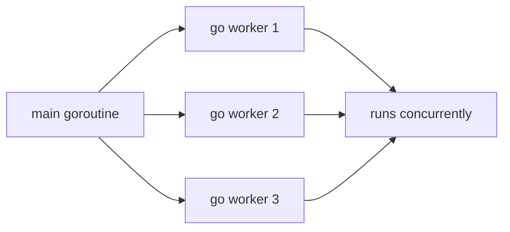

# Goroutines

## Goal

Run work concurrently with `go`.

## React Developer Mental Model

Goroutines are not promises. A goroutine starts a function concurrently and does not automatically give you a result.

## Syntax

```go
go func() {
	fmt.Println("background work")
}()
```

## Visual Memory



## Important Detail

If `main` exits, the program ends even if goroutines are still running.

```go
func main() {
	go fmt.Println("maybe prints")
}
```

## Common Mistake

Do not start goroutines without a plan for completion, cancellation, or error handling.

## 5-Min Practice

Start a goroutine that prints a message, then use `time.Sleep` briefly so you can see it. This is only for learning, not production coordination.

## Type-It-Yourself Zone

Use this space to type the lesson code by hand from memory. Do not paste from the example above. First type it, then run it, then fix the compiler errors.

```go
// Type your code here.

```

## Next

Read [[02 WaitGroups]].
