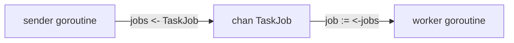

# Channels

## Goal

Pass values between goroutines.

## React Developer Mental Model

A channel is not an event emitter. It is a typed pipe for communication and synchronization.

## Syntax

```go
jobs := make(chan string)

go func() {
	jobs <- "send welcome email"
}()

job := <-jobs
fmt.Println(job)
```

## Visual Memory



## Closing

```go
close(jobs)
```

Loop over a channel:

```go
for job := range jobs {
	fmt.Println(job)
}
```

## Common Mistake

Only the sender should close a channel. Do not close a channel from the receiver side.

## 5-Min Practice

Create a channel of task titles, send one title from a goroutine, receive it in `main`.

## Type-It-Yourself Zone

Use this space to type the lesson code by hand from memory. Do not paste from the example above. First type it, then run it, then fix the compiler errors.

```go
// Type your code here.

```

## Next

Read [[04 Select Timeouts and Cancellation]].
