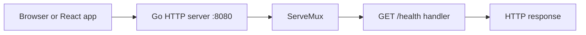

# Net HTTP Server

## Goal

Start a basic HTTP server with the standard library.

## React Developer Mental Model

This is the Go version of starting an Express server, but the standard library already includes the HTTP server.

## Syntax

```go
func main() {
	mux := http.NewServeMux()

	mux.HandleFunc("GET /health", func(w http.ResponseWriter, r *http.Request) {
		w.WriteHeader(http.StatusOK)
		_, _ = w.Write([]byte("ok"))
	})

	err := http.ListenAndServe(":8080", mux)
	if err != nil {
		log.Fatal(err)
	}
}
```

## Visual Memory



## Common Mistake

Always handle the error from `ListenAndServe`. If the port is busy, the server cannot start.

## 5-Min Practice

Create `/health` and open `http://localhost:8080/health`.

## Type-It-Yourself Zone

Use this space to type the lesson code by hand from memory. Do not paste from the example above. First type it, then run it, then fix the compiler errors.

```go
// Type your code here.

```

## Next

Read [[02 Handlers and Routing]].
