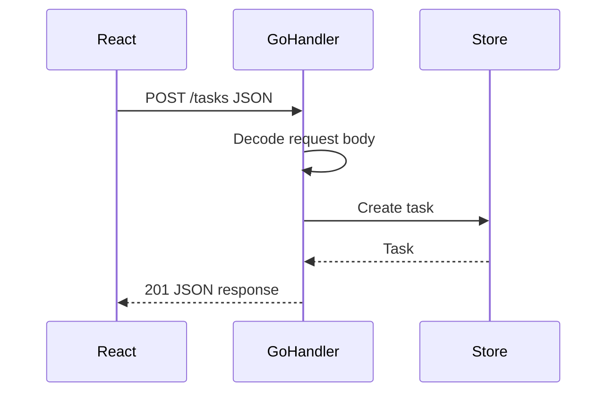

# JSON Requests and Responses

## Goal

Read and write JSON in handlers.

## React Developer Mental Model

React sends JSON with `fetch`. Go decodes the request body into a struct and encodes structs back to JSON.

## Syntax

```go
type CreateTaskRequest struct {
	Title string `json:"title"`
}

func createTask(w http.ResponseWriter, r *http.Request) {
	var req CreateTaskRequest
	if err := json.NewDecoder(r.Body).Decode(&req); err != nil {
		http.Error(w, "invalid json", http.StatusBadRequest)
		return
	}

	task := Task{ID: 1, Title: req.Title}

	w.Header().Set("Content-Type", "application/json")
	w.WriteHeader(http.StatusCreated)
	_ = json.NewEncoder(w).Encode(task)
}
```

## Visual Memory



## Common Mistake

Decode into a pointer: `Decode(&req)`, not `Decode(req)`.

## 5-Min Practice

Create `POST /tasks` that accepts `{ "title": "Learn Go" }`.

## Type-It-Yourself Zone

Use this space to type the lesson code by hand from memory. Do not paste from the example above. First type it, then run it, then fix the compiler errors.

```go
// Type your code here.

```

## Next

Read [[04 Middleware]].
