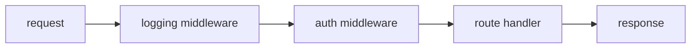

# Middleware

## Goal

Wrap handlers with shared behavior.

## React Developer Mental Model

Middleware is like Express middleware: logging, auth, CORS, and request IDs can run around route handlers.

## Syntax

```go
func logging(next http.Handler) http.Handler {
	return http.HandlerFunc(func(w http.ResponseWriter, r *http.Request) {
		log.Println(r.Method, r.URL.Path)
		next.ServeHTTP(w, r)
	})
}
```

Use it:

```go
handler := logging(mux)
log.Fatal(http.ListenAndServe(":8080", handler))
```

## Visual Memory



## Common Mistake

Call `next.ServeHTTP(w, r)` exactly when you want the request to continue.

## 5-Min Practice

Add logging middleware that prints method and path.

## Type-It-Yourself Zone

Use this space to type the lesson code by hand from memory. Do not paste from the example above. First type it, then run it, then fix the compiler errors.

```go
// Type your code here.

```

## Next

Read [[05 Environment Config]].
