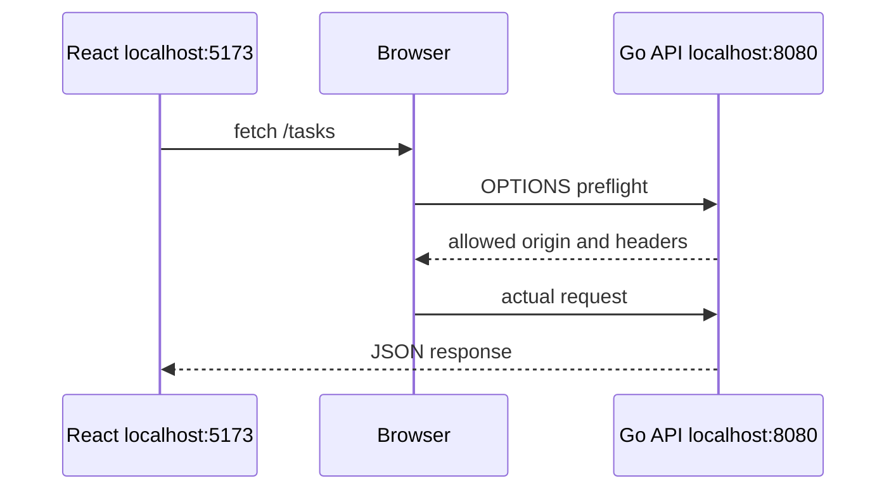

# CORS for React

## Goal

Understand why a React dev server may be blocked from calling a Go API.

## React Developer Mental Model

If React runs on `localhost:5173` and Go runs on `localhost:8080`, the browser treats them as different origins.

## Basic Headers

```go
w.Header().Set("Access-Control-Allow-Origin", "http://localhost:5173")
w.Header().Set("Access-Control-Allow-Methods", "GET,POST,PUT,DELETE,OPTIONS")
w.Header().Set("Access-Control-Allow-Headers", "Content-Type,Authorization")
```

Handle preflight:

```go
if r.Method == http.MethodOptions {
	w.WriteHeader(http.StatusNoContent)
	return
}
```

## Visual Memory



## Common Mistake

Do not use `*` with credentialed requests. Cookies and auth headers need stricter CORS rules.

## 5-Min Practice

Add CORS middleware for your local React origin.

## Type-It-Yourself Zone

Use this space to type the lesson code by hand from memory. Do not paste from the example above. First type it, then run it, then fix the compiler errors.

```go
// Type your code here.

```

## Next

Read [[../08 Advanced Go/00 Module Overview]].
