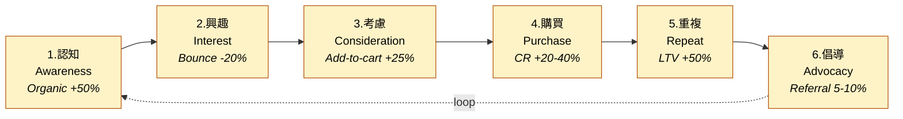

# Imarflex 伊瑪牌 — Project Home

> 數碼銷售策略 + 網站重建 pitch / build project.
> Brand 4 維度:外型 / 言行 / 價值 / 行動。

---

## 📊 Bases (database views)

- 🗂️ [[_features.base|All Features]] — 32 features, grouped by decision (must-have / suggested / decide)
- 🟠 [[_addons.base|Add-on Catalogue]] — 9 add-ons with pricing & metrics
- 🎨 [[brand/_deliverables.base|Brand Deliverables]] — 15 brand items (voice / visual / content)
- ❓ [[_open-questions.base|Open Questions]] — what's blocking decisions

### Decision legend

| Value | Meaning | Who decides |
|---|---|---|
| 🔒 `must-have` | Foundation — will be built. Non-negotiable. | Agency |
| 💡 `suggested` | We propose — **client business choice** | Client |
| 🟡 `decision-needed` | Pick between alternatives (e.g. Meilisearch vs Algolia) | Both |
| ✅ `confirmed` | Client has signed off | Client |
| ❌ `declined` | Client has declined for this engagement | Client |

**Suggested ≠ optional.** It means the answer depends on Imarflex's business model (do you do trade-ins? do you care about showing stock levels? how complex is your returns policy?). We can build any of them — client tells us which.

---

## 🛒 Funnel (6 stages + loop)



1. [[1-awareness]] — Organic +50%, brand search +30%
2. [[2-interest]] — Bounce -20%, session +40%
3. [[3-consideration]] — Add-to-cart +25%
4. [[4-purchase]] — CR +20-40%, abandonment -15%
5. [[5-repeat]] — Repeat rate 0% → 15-20%, LTV +50%
6. [[6-advocacy]] — Referral 5-10% of new customers

---

## 📚 Reference docs (the long-form narrative)

- [[pitch]] — client-facing pitch
- [[internal-master]] — internal master spec (full)
- [[add-ons-discussion]] — 8 add-ons in detail
- [[funnel-demo-spec]] — HTML/iframe demo spec for the pitch deck

---

## 🧱 Where things live

```
Imarflex/
├── _index.md                ← you are here
├── _features.base           ← feature catalogue (DB view)
├── _addons.base             ← add-on catalogue (DB view)
├── _open-questions.base     ← decisions to make
│
├── features/                ← ONE NODE PER FEATURE  (32 nodes)
├── funnel/                  ← 6 funnel-stage notes (with mermaid)
├── brand/                   ← 15 brand deliverables + social-samples/
├── decisions/               ← open questions / decisions
├── reference/               ← the 4 long-form docs
└── canvas/                  ← visual feature ↔ funnel maps
```

---

## 🎯 How to use this vault

**「What MUST be built?」** → [[_features.base]] → "🔒 Must-Have (Foundation)" view
**「What should we discuss with client?」** → [[_features.base]] → "💡 Suggested to Client" view
**「Show me add-ons + price」** → [[_addons.base]] → "Add-on Catalogue" view
**「What needs an alternatives-decision?」** → [[_features.base]] → "🟡 Decisions Needed" view
**「What's still open?」** → [[_open-questions.base]]
**「What hits the purchase stage?」** → [[_features.base]] → "By Funnel Stage" view
**「Read the full strategy」** → [[reference/internal-master]]
**「Brand voice / visual / content guidelines」** → [[brand/_index]]

---

## 🆕 Feature node template

Copy when creating a new feature:

```markdown
---
type: feature
tier: base                # base | addon
category: commerce        # commerce | conversion | retention | content | ops
funnel-stage: [purchase]  # any of 6 stages
decision: must-have       # must-have | suggested | decision-needed | confirmed | declined
priority: high            # high | medium | low
phase: 1                  # 1 (build) | 2 (migration) | 3 (retainer)
setup-cost-hkd: 0
monthly-cost-hkd: 0
depends-on: []
metric: ""
---

# Feature Name

## 解決咩問題
…

## 帶嚟咩好處
…

## 對應 funnel
- [[N-stage-name]]

## Reference
- [[internal-master#section]]
```

---

## ✅ Status

**32 feature nodes:** 23 base + 9 add-ons.
**11 must-have** (foundation) · **20 suggested** (client decides) · **1 decision-needed** (Meilisearch vs Algolia).

Next steps:
1. Seed `decisions/` folder with the 3 stack decisions + 7 client-confirm Qs (so `_open-questions.base` populates).
2. Walk the client through the "💡 Suggested to Client" view — they pick, then we flip those to `confirmed`.
3. Build `canvas/feature-funnel-map.canvas` for visual pitch.
