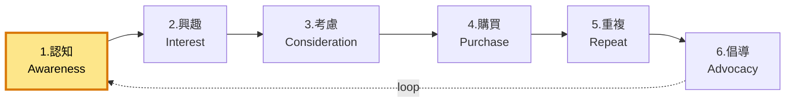

# 1. 認知 / Awareness

**URL in demo:** `/blog`
**KPI 預期:** Organic traffic +50%、品牌搜尋 +30%

## Position in funnel

## 我哋整咗咩
SEO 基礎、blog SEO、Core Web Vitals、speed

## 對應 features

### 🔒 Must-have
- [[posthog-analytics]] — 全 funnel 數據追蹤 (橫跨)
- [[accessibility]] — a11y 影響 organic ranking

### 🟠 Add-ons
- [[content-production]] — 持續寫 blog,6-12 個月後成 top channel
- [[seo-content-pack]] — 季度 keyword research + AI 草稿

## Reference
- [[internal-master#2-funnel-section]]
- [[internal-master#9-seo]]
