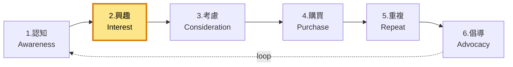

# 2. 興趣 / Interest

**URL in demo:** `/`
**KPI 預期:** Bounce -20%、Session +40%

## Position in funnel

## 我哋整咗咩
視覺一致、heritage、bento layout、homepage、品牌設計系統

## 對應 features

### 🔒 Must-have
- [[posthog-analytics]] — bounce / session metric
- [[accessibility]] — 影響第一印象

### 💡 Suggested
- [[first-visit-popup]] — email capture + 首單折扣 (鼓勵 stay)

### 🟡 Decisions
- [[search-meilisearch]] — 搜尋體驗影響興趣轉化

## Reference
- [[internal-master#2-funnel-section]]
- [[internal-master#10-brand-guidelines]]
