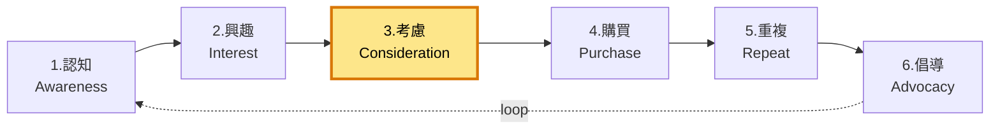

# 3. 考慮 / Consideration

**URL in demo:** `/products/iaf-30e-air-fryer`
**KPI 預期:** Add-to-cart +25%

## Position in funnel

## 我哋整咗咩
PDP 文案、reviews(add-on)、retail links、Trade-in flow、相容配件查詢

## 對應 features

### 🔒 Must-have
- [[posthog-analytics]]
- [[accessibility]]

### 💡 Suggested
- [[trade-in-flow]] — 舊機回收 → 折扣 voucher 用於新機
- [[product-bundles]] — 套裝 AOV +15-20%
- [[stock-status-display]] — 現貨 / 剩 X 件 / 缺貨
- [[cross-sell-pdp]] — 「一齊買埋」
- [[recently-viewed]] — 鼓勵返訪
- [[back-in-stock-notify]] — 缺貨通知 capture demand
- [[pdp-retail-links]] — 豐澤 / 百老匯 / 實惠

### 🟡 Decisions
- [[search-meilisearch]] — 客戶搵啱嘅型號

### 🟠 Add-ons
- [[reviews-system]] — PDP rating + SEO rich snippets
- [[ai-chatbot]] — 24/7 答產品 / 配件問題
- [[live-chat]] — 高價 SKU hand-hold
- [[ai-copywriting]] — PDP 文案統一 + 上架快

## Reference
- [[internal-master#5-platform-features]]
- [[internal-master#6-voice]] §PDP framework
