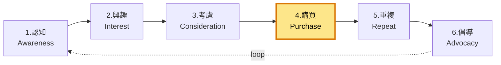

# 4. 購買 / Purchase

**URL in demo:** `/cart`
**KPI 預期:** CR +20-40%、棄單 -15%

## Position in funnel

## 我哋整咗咩
自建 checkout、Airwallex、cart drawer、search、棄單 email 自動觸發

## 對應 features

### 🔒 Must-have
- [[checkout-airwallex]] — Drop-in payment,FPS / AlipayHK / WeChat / 信用卡
- [[email-automation]] — 棄單 1hr / 24hr / 72hr 自動 recovery
- [[order-notification-center]] — 訂單 status update
- [[posthog-analytics]] — checkout funnel drop-off
- [[accessibility]]

### 💡 Suggested
- [[product-bundles]] — bundle SKU 直接 add to cart
- [[stock-status-display]] — 緊張感 → 加快決定
- [[cross-sell-pdp]] — 「一齊買埋」加 cart
- [[pdp-retail-links]] — 唔想 D2C 嘅客都有去處
- [[trade-in-flow]] — 舊機抵扣減低 friction
- [[promotional-engine]] — 限時 / 滿減 / 會員價

### 🟠 Add-ons
- [[ai-chatbot]] — 即時答付款 / 送貨問題
- [[live-chat]] — 高價 SKU 真人客服

## Reference
- [[internal-master#3-stack]] §Airwallex
- [[internal-master#7-customer-lifecycle]]
