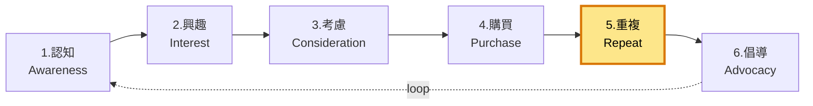

# 5. 重複購買 / Repeat

**URL in demo:** `/parts-finder`
**KPI 預期:** 重複率 0% → 15-20%、LTV +50%

## Position in funnel

## 我哋整咗咩
保養、找配件、Email 自動化(8 triggers)、訂單通知、退換 self-service

## 對應 features

### 🔒 Must-have
- [[customer-account]] — `/account/*` self-service
- [[warranty-registration]] — 保養登記 + 到期前 30/7 日 retention email
- [[email-automation]] — Win-back、保養提醒、cross-sell 配件
- [[order-notification-center]] — 訂單狀態 self-service
- [[posthog-analytics]] — 重複率 / LTV cohort

### 💡 Suggested
- [[parts-finder]] — 找配件 → 重複購買 driver
- [[returns-system]] — 退換流程順 → 增加 trust
- [[recently-viewed]] — 鼓勵返訪 multi-session

### 🟠 Add-ons
- [[ai-chatbot]] — 24/7 答保養 / 配件問題
- [[loyalty-system]] — 積分 → 重複購買 +20-30%
- [[subscription-products]] — 濾網 / 配件 recurring

## Reference
- [[internal-master#5-platform-features]]
- [[internal-master#7-customer-lifecycle]]
