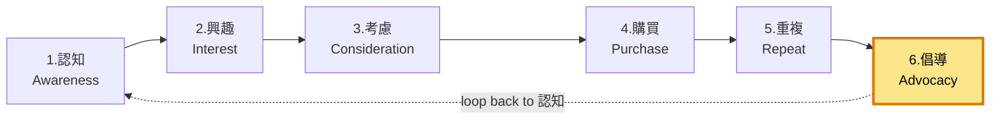

# 6. 倡導 / Advocacy

**URL in demo:** `/products/iaf-30e-air-fryer` (reviews 區)
**KPI 預期:** Referral 5-10% of new customers

## Position in funnel

## 倡導 3 條細項
1. 📝 [[reviews-system]] (add-on) — 信任建立 + SEO rich snippets
2. 🎁 [[referral-program]] (add-on) — 直接帶新客
3. 📸 UGC 收集 + share 機制 (included in [[customer-account]]) — Hashtag、share button、客戶相收集

## 對應 features

### 🔒 Must-have
- [[email-automation]] — Review 提交後 7 日 → 邀請 referral
- [[posthog-analytics]] — referral attribution

### 🟠 Add-ons
- [[reviews-system]] — PDP rating + Google rich snippets (CTR +30%)
- [[referral-program]] — CAC 1/5-1/10 of paid,LTV +16-25%
- [[loyalty-system]] — 高 tier 行為 reward 包 referral

## Loop 回去認知
> 客戶 review + referral + UGC → 推動 [[1-awareness]] 嘅自然流量,形成 flywheel。

## Reference
- [[internal-master#2-funnel-section]] §倡導 3 條細項
- [[add-ons-discussion#3-referral]]
