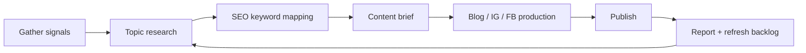

# Online Marketing 工作區

呢個 folder 用嚟將 SEO research、topic planning、blog、Instagram、Facebook、report 同已收集資料變成一個可持續運作嘅系統。

> [!info]
> [[../features/seo-content-pack|SEO 內容套件]] 負責「揀咩 topic 值得做」,[[../features/content-production|內容製作]] 負責「將 topic 寫成 blog / PDP / social caption」。呢個 folder 係兩者之間嘅工作區。

## Folder 目的

- 收集市場、客戶、搜尋、競爭對手資料
- 將資料整理成 keyword / topic / content brief
- 排定 blog、Instagram、Facebook 發佈節奏
- 儲存每次 research、brief、published content、asset、report
- 方便之後追蹤邊啲 topic 有 SEO / social / business value

## 工作流程

## 核心文件

| 文件 | 用途 | 何時使用 |
|---|---|---|
| [[topic-research-workflow]] | 教點樣收集 topic 資料 | 每週 gather idea / 每次開新 topic |
| [[seo-keyword-research]] | 教點樣為 topic 做 SEO | 每個 topic 變成 blog 前 |
| [[content-calendar]] | 安排 research、writing、social posting | 每週 / 每月 planning |
| [[channel-production-workflow]] | 一個 topic 拆成 blog、IG、FB | 寫作同排程前 |
| [[content-storage-system]] | 規定資料放邊、點命名 | 每次收集或輸出內容時 |
| [[products/_readme]] | Product info、spec、approved reference images source of truth | 每次做 SKU content / image prompt / PDP copy 前 |
| [[sales-content/_index]] | 追蹤 sales content assumptions、topic type、sales purpose、post 狀態 | 每次 planning / review sales content |
| [[_sales-content.base]] | 用 database view 睇 topic type、sales purpose、ad candidate、published posts | 每週 / 每月 review |

## Storage folders

| Folder | Link | 放咩 | 例子 |
|---|---|---|---|
| `business-focus` | [[business-focus/_readme]] | 每月 / 每季方向(research 前定) | `2026-q2-focus.md`、`2026-05-focus.md` |
| `research-inbox` | [[research-inbox/_readme]] | 未整理資料(`YYYY-MM/` 月份 subfolder) | 客戶問題、competitor link、SERP screenshot note |
| `blog` | [[blog/_readme]] | Blog 樣板文(pitch material) | `samples/recipe-air-fryer-shrimp-toast-cha-siu.md` |
| `funnel` | [[funnel/_readme]] | 6 個 funnel-stage note(KPI + mermaid) | `1-awareness.md` |
| `seo-research` | [[seo-research/_readme]] | Keyword、SERP、GSC、site search 整理 | `2026-Q3-air-fryer-keywords.md` |
| `content-briefs` | [[content-briefs/_readme]] | 已決定要做嘅 topic brief | `air-fryer-shrimp-toast-brief.md` |
| `products` | [[products/_readme]] | SKU source-of-truth: info、spec、approved images | `ifq-22r/spec.md`、`icf-140r/assets.md` |
| `published-content` | [[published-content/_readme]] | 已發佈內容紀錄 | Blog URL、IG post、FB post |
| `sales-content` | [[sales-content/_index]] |  `_system/` taxonomies + `cycles/yyyy-mm/` 每月 cycle (plan/posts/overview);campaign assets 跟 campaign 放(例 `go-live-kits/assets/`) | `cycles/2026-06/_overview.md` |
| `reports` | [[reports/_readme]] | Weekly / monthly / quarterly review(`YYYY-MM/` 月份 subfolder) | GSC review、social report |

## Operating cadence

| 節奏 | 要做咩 | 輸出 |
|---|---|---|
| Monthly / Quarterly | research 前定 business focus | [[business-focus/_readme|business-focus]] note |
| Weekly | 收集 customer / search / competitor signals | 5-10 個 raw topic notes |
| Weekly | 排下週 blog / IG / FB | 1 個 weekly content plan |
| Monthly | 選 4-8 個 priority topics | Content calendar + briefs |
| Monthly | 檢查 blog / social 表現 | Monthly report |
| Quarterly | SEO keyword research + content gap | Next-quarter SEO roadmap |

## Recommended weekly rhythm

| Day | Work | Folder |
|---|---|---|
| Monday | Gather SEO / customer / competitor signals | [[research-inbox/_readme]] |
| Tuesday | 做 keyword + SERP review | [[seo-research/_readme]] |
| Wednesday | 寫 blog brief + social angle | [[content-briefs/_readme]] |
| Thursday | Production: blog draft、IG carousel、FB post | [[sales-content/_index]] |
| Friday | Publish / schedule / review last week | [[published-content/_readme]], [[reports/_readme]] |

## Related vault notes

- [[../features/seo-content-pack]]
- [[../features/content-production]]
- [[../brand/content-blog-direction]]
- [[../brand/content-pillars]]
- [[../brand/voice-tone-of-voice]]
- [[../brand/voice-pdp-copy-framework]]
- [[funnel/1-awareness]]
- [[funnel/3-consideration]]
