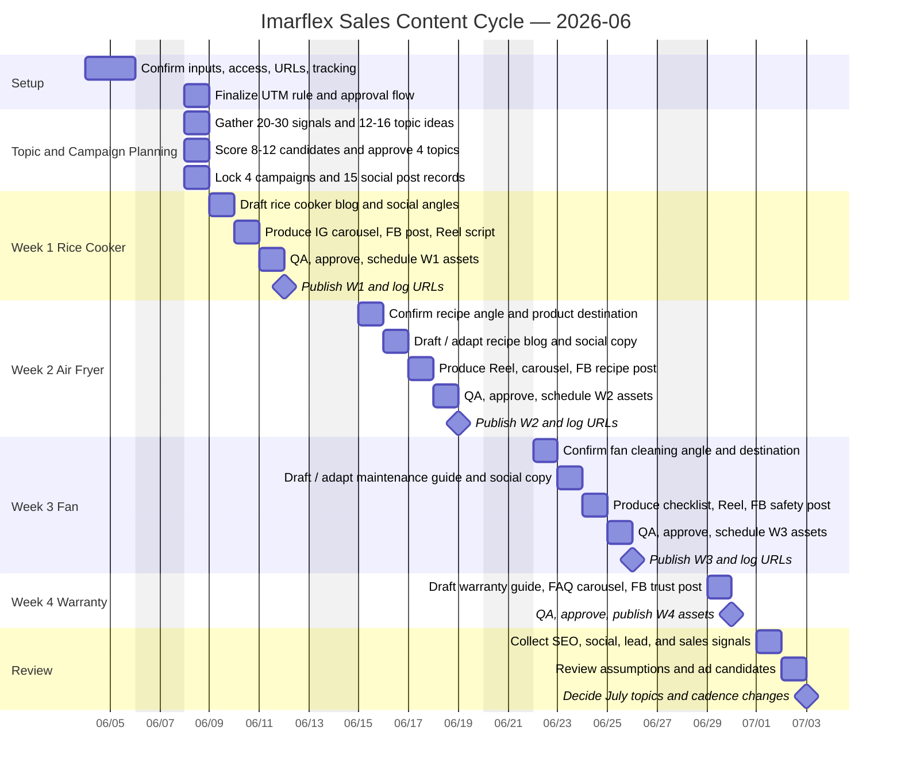
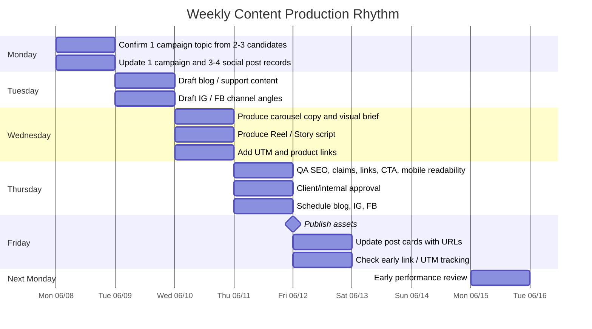

# Production Timeline Gantt — 2026-06 Sales Content Cycle

This note estimates the first sales-content cycle from setup to month-end review. It is designed for display in Obsidian using Mermaid Gantt charts.

> [!note]
> Dates are based on starting Thursday 2026-06-04. The first full production week starts Monday 2026-06-08.

## High-level cycle Gantt

## Detailed weekly production Gantt

Use this chart for each full production week. The same rhythm repeats for W1, W2, and W3.

## Step estimate

| Step | Quantity target | Estimated time | Owner / input | Output |
|---|---:|---:|---|---|
| Confirm product/category focus | 3-4 monthly categories | 0.5 day | Marketing + product owner | Final monthly focus |
| Gather raw signals | 20-30 signals | 0.5-1 day | Search/customer/competitor/product sources | Raw topic pool |
| Capture raw topic ideas | 12-16 ideas | 0.5 day | Content owner | Candidate topic list |
| Score candidate topics | 8-12 candidates | 0.5 day | Content owner + product owner | 4 approved + 4-8 backlog |
| Confirm destination and CTA | 0.5 day | Product URLs / WhatsApp / support page | One clear CTA |
| Create or update post records | 4 campaign + 15 social records monthly | 0.25-0.5 day | Content owner | Posts appear in [[../_sales-content.base]] |
| Blog / support draft | 1 per week / 4 monthly | 1 day | Writer / SEO | Draft article or support page |
| IG carousel / Reel / Story concept | 3-4 per week / 11 monthly | 0.5-1 day | Social producer | Social content outline |
| FB link / trust / offer post | 1 per week / 4 monthly | 0.25-0.5 day | Social producer | FB caption and link |
| Visual production or image brief | 1 day | Designer / image owner | Carousel/Reel/image assets |
| SEO and claim QA | 0.5 day | SEO / product reviewer | Approved facts, links, meta |
| Approval and scheduling | 0.5 day | Approval owner | Scheduled posts |
| Publish and URL logging | 0.25 day | Content owner | Post cards updated |
| Early performance check | 0.5 day | Analytics owner | Keep / boost / revise decision |
| Month-end report | 2-3 days | Marketing + analytics | [[online-marketing/reports/2026-06-sales-content-review]] |

## Quantity targets

The full quantity target is defined in [[production-volume-targets-2026-06]].

| Output | Target |
|---|---:|
| Raw signals to gather | 20-30 |
| Raw topic ideas to capture | 12-16 |
| Candidate topics to score | 8-12 |
| Campaign topics to approve | 4 |
| Backlog topics to keep | 4-8 |
| Campaign bundle records | 4 |
| Blog / support outputs | 4 |
| Instagram posts | 11 |
| Facebook posts | 4 |
| Total social posts | 15 |
| Post-level ad candidates to review | 2-5 |
| Actual paid tests | 0-2 |

## Critical path

The fastest safe path for one weekly campaign is 5 working days:

1. Monday: topic, destination, CTA, post records.
2. Tuesday: blog and channel drafts.
3. Wednesday: creative and links.
4. Thursday: QA, approval, schedule.
5. Friday: publish and log.

The critical blockers are:

- No product destination URL.
- No product facts / price / stock confirmation.
- No image or visual asset.
- No approval owner.
- No UTM / tracking rule.

## If timing slips

| Slip | What to do |
|---|---|
| Blog not ready by Thursday | Publish IG/FB lighter post only if the CTA still works; move blog to next week. |
| Visual not ready | Use text/table carousel for education posts; do not fake product imagery. |
| Product URL not ready | Do not publish sales CTA. Use trust/education CTA or wait. |
| Approval not ready | Keep as `draft-ready`; do not schedule. |
| Tracking not ready | Organic can publish with UTM draft, but paid ads should wait. |

## Display notes

In Obsidian reading view, the Mermaid blocks should render as Gantt charts. If the chart is too wide, open this note in a wider pane or switch to reading view.
