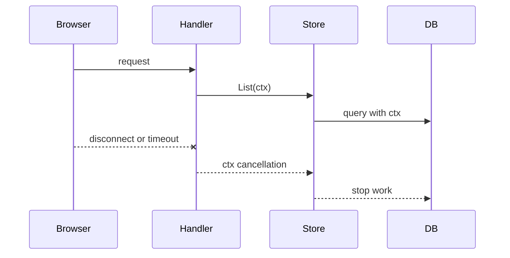

# Context for Request Lifetimes

## Goal

Use `context.Context` to carry cancellation and deadlines.

## React Developer Mental Model

`context` is not like React context. It is closer to an `AbortSignal` for backend work.

## Syntax

```go
func listTasks(ctx context.Context) ([]Task, error) {
	select {
	case <-ctx.Done():
		return nil, ctx.Err()
	default:
		return []Task{}, nil
	}
}
```

In HTTP handlers:

```go
ctx := r.Context()
tasks, err := store.List(ctx)
```

## Visual Memory



## Common Mistake

Do not store `context.Context` inside structs. Pass it as the first argument to request-scoped functions.

## 5-Min Practice

Change `TaskStore.List()` to `List(ctx context.Context)`.

## Type-It-Yourself Zone

Use this space to type the lesson code by hand from memory. Do not paste from the example above. First type it, then run it, then fix the compiler errors.

```go
// Type your code here.

```

## Next

Read [[Learn/Dev/Tech/Go/05 Testing Tooling/00 Module Overview]].
