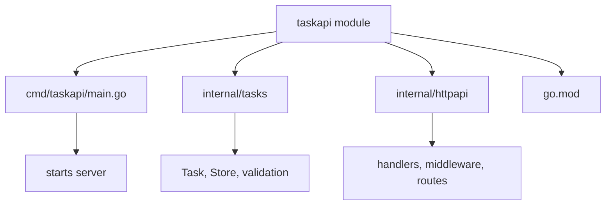

# Idiomatic Project Layout

## Goal

Use a simple project layout without overengineering.

## React Developer Mental Model

Go projects do not need framework-heavy folder structures. Start boring and split when the code needs it.

## Practical Layout

```text
taskapi/
├── cmd/
│   └── taskapi/
│       └── main.go
├── internal/
│   ├── tasks/
│   └── httpapi/
├── go.mod
└── go.sum
```

## Meaning

- `cmd/taskapi`: executable entry point
- `internal/tasks`: domain and storage
- `internal/httpapi`: handlers and middleware

## Visual Memory



## Common Mistake

Do not create folders like `controllers`, `services`, and `repositories` just because another language does. Let Go package names describe behavior.

## 5-Min Practice

Move your app toward this layout only when one folder becomes crowded.

## Type-It-Yourself Zone

Use this space to type the lesson code by hand from memory. Do not paste from the example above. First type it, then run it, then fix the compiler errors.

```go
// Type your code here.

```

## Next

Read [[Learn/Dev/Tech/Go/09 Mini Projects/00 Module Overview]].
