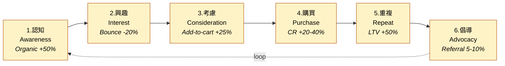

# Imarflex 伊瑪牌 — Project Home

> 數碼銷售策略 + 網站重建 pitch / build project.
> Brand 4 維度:外型 / 言行 / 價值 / 行動。
>
> 🏢 **Parent distributor:** [[ManyProfit Group/ManyProfit/_index|Many Profit 萬利嘉]] carries Imarflex + 7 other brands. The app is being extended into a shared multi-channel platform — see [[ManyProfit Group/ManyProfit/decisions/multi-brand-app-architecture]].

---

## 📊 Bases (database views)

- 🗂️ [[_features.base|All Features]] — 31 features, grouped by decision (must-have / suggested / decide)
- 🟠 [[_addons.base|Add-on Catalogue]] — 9 add-ons with pricing & metrics
- 🎨 [[brand/_deliverables.base|Brand Deliverables]] — 15 brand items (voice / visual / content)
- ❓ [[_open-questions.base|Open Questions]] — what's blocking decisions

### Decision legend

| Value | Meaning | Who decides |
|---|---|---|
| 🔒 `must-have` | Foundation — will be built. Non-negotiable. | Agency |
| 💡 `suggested` | We propose — **client business choice** | Client |
| 🟡 `decision-needed` | Pick between alternatives (e.g. Meilisearch vs Algolia) | Both |
| ✅ `confirmed` | Client has signed off | Client |
| ❌ `declined` | Client has declined for this engagement | Client |

**Suggested ≠ optional.** It means the answer depends on Imarflex's business model (do you do trade-ins? do you care about showing stock levels? how complex is your returns policy?). We can build any of them — client tells us which.

---

## 🛒 Funnel (6 stages + loop)



1. [[1-awareness]] — Organic +50%, brand search +30%
2. [[2-interest]] — Bounce -20%, session +40%
3. [[3-consideration]] — Add-to-cart +25%
4. [[4-purchase]] — CR +20-40%, abandonment -15%
5. [[5-repeat]] — Repeat rate 0% → 15-20%, LTV +50%
6. [[6-advocacy]] — Referral 5-10% of new customers

---

## 📚 Reference docs (the long-form narrative)

- [[reference/pitch|pitch]] — client-facing strategy pitch script
- [[pitch/_index]] — rendered pitch deliverables, schedules, content-direction decks, and quotations
- [[client-correspondence/_index]] — client replies, follow-up questions, and exported PDFs
- [[internal-master]] — internal master spec (full)
- [[add-ons-discussion]] — 8 add-ons in detail
- [[funnel-demo-spec]] — HTML/iframe demo spec for the pitch deck
- [[online-marketing/_index]] — SEO / topic research / blog / Instagram / Facebook operating workspace
- [[reference/product-card-spec|Product Card spec]] — storefront listing-card component (synthesised from [[ManyProfit Group/Design References/_index|Design References]])

---

## 🧱 Where things live

```
Imarflex/
├── _index.md                ← you are here
├── _features.base           ← feature catalogue (DB view)
├── _addons.base             ← add-on catalogue (DB view)
├── _open-questions.base     ← decisions to make
│
├── features/                ← ONE NODE PER FEATURE  (31 nodes)
├── brand/                   ← 15 brand deliverables + social-samples/
│   └── guideline/           ← final assets: logos / color-palettes / moodboard
├── client-correspondence/    ← dated client replies, follow-up questions, exports/
├── online-marketing/        ← SEO research, content calendar, social workflow,
│   │                          sales-content, products, reports/YYYY-MM
│   ├── blog/                ← sample blog posts
│   └── funnel/              ← 6 funnel-stage notes (with mermaid)
├── pitch/                   ← rendered pitch deliverables + quotations
│   ├── deck/                ← original digital-sales-strategy deck
│   ├── methodology-pitch/   ← methodology deck + image prompts + images/
│   ├── launch-schedule/     ← 6-month SEO launch schedule
│   ├── content-directions/  ← content direction menu + planning note
│   └── quotation/           ← versioned quotation folders
├── decisions/               ← type:decision notes (feeds _open-questions.base)
└── reference/               ← long-form narrative docs (8)
```

---

## 🎯 How to use this vault

**「What MUST be built?」** → [[_features.base]] → "🔒 Must-Have (Foundation)" view
**「What should we discuss with client?」** → [[_features.base]] → "💡 Suggested to Client" view
**「Show me add-ons + price」** → [[_addons.base]] → "Add-on Catalogue" view
**「What needs an alternatives-decision?」** → [[_features.base]] → "🟡 Decisions Needed" view
**「What's still open?」** → [[_open-questions.base]]
**「What hits the purchase stage?」** → [[_features.base]] → "By Funnel Stage" view
**「Read the full strategy」** → [[reference/internal-master]]
**「Find client replies」** → [[client-correspondence/_index]]
**「Find pitch PDFs / quotations」** → [[pitch/_index]]
**「Brand voice / visual / content guidelines」** → [[brand/_index]]
**「Final brand assets (logos / palette / moodboard)」** → [[brand/guideline/README]]

---

## 🤖 Claude Code skill + agent (live inside this folder)

When you run Claude Code from inside `Imarflex/`, these auto-load:

- **Skill `imarflex`** (`.claude/skills/imarflex/SKILL.md`) — project operating manual: vault map, frontmatter schema, decision legend, 6-stage funnel KPIs, 4 add-on combos, common operations (add feature, flip decision). Triggers on any Imarflex-related question.
- **Agent `imarflex-copywriter`** (`.claude/agents/imarflex-copywriter.md`) — brand-voice copywriter that produces PDP copy, emails (9 variants), customer-service replies, crisis statements, blog posts (5 clusters), social captions/carousels, and image-gen prompts using the Heritage Blue palette. Triggers automatically on any Imarflex copywriting request.

Try in Claude Code:
- `What's still suggested in the base plan?` → skill answers from the feature catalogue
- `Write a PDP for IRC-20IH, 2L IH rice cooker` → agent produces 5-section copy
- `Image prompt for an air-fryer top-down shot` → agent returns palette-grounded prompt

---

## 🆕 Feature node template

Copy when creating a new feature:

```markdown
---
type: feature
tier: base                # base | addon
category: commerce        # commerce | conversion | retention | content | ops
funnel-stage: [purchase]  # any of 6 stages
decision: must-have       # must-have | suggested | decision-needed | confirmed | declined
priority: high            # high | medium | low
phase: 1                  # 1 (build) | 2 (migration) | 3 (retainer)
setup-cost-hkd: 0
monthly-cost-hkd: 0
depends-on: []
metric: ""
---

# Feature Name

## 解決咩問題
…

## 帶嚟咩好處
…

## 對應 funnel
- [[N-stage-name]]

## Reference
- [[internal-master#section]]
```

---

## 🚧 Build status snapshot

> Live sync against `~/Projects/personal/imarflex-app` (Next.js 16 on Vercel + Cloudflare Workers/Hono + D1/Drizzle CMS + React/Vite admin + Airwallex + Resend + PostHog).
> As of 2026-05-14:

| Status | Count | Features |
|---|---|---|
| ✅ Shipped | 9 | admin-dashboard, back-in-stock-notify, checkout-airwallex, customer-account, parts-finder, pdp-retail-links, posthog-analytics, stock-status-display, warranty-registration |
| 🟡 In progress | 8 | accessibility, content-production, cross-sell-pdp, email-automation, search-meilisearch, security-baseline, seo-content-pack, trade-in-flow |
| ⬜ Not started | 13 | ai-chatbot, first-visit-popup, live-chat, loyalty-system, monitoring-alerts, order-notification-center, product-bundles, promotional-engine, recently-viewed, referral-program, returns-system, reviews-system, subscription-products |
| ➖ N/A (infra) | 1 | backup-dr |

Filter live in [[_features.base]] → "🚧 Build Status" view.

---

## ✅ Status

**31 feature nodes:** 23 base + 8 add-ons.
**11 must-have** (foundation) · **20 suggested** (client decides) · **1 decision-needed** (Meilisearch vs Algolia).

Next steps:
1. Walk the client through the "💡 Suggested to Client" view — they pick, then we flip those to `confirmed`.
2. Populate `decisions/` with the remaining stack + client-confirm questions (so `_open-questions.base` keeps filling).
