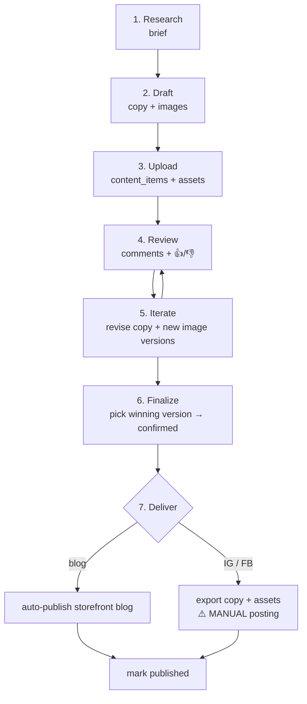

# CMS Content Pipeline

之前嘅 workflow doc 講到 `Production → Publish` 就停咗,好抽象。呢張 note 將個流程接落 **實際運作緊嘅 CMS** ——  imarflex-app admin panel 上面嗰個 content calendar —— 同埋 Claude 經 API 驅動嘅 **per-post / per-image review-feedback loop**。

一句講晒:一個 content brief 點樣變成 calendar 上面一個 post、點樣俾 Jack + 客戶 review、點樣 iterate 到 confirm,最後點樣 deliver(blog 自動出、IG/FB 人手出)。production 嘅角度睇 [[channel-production-workflow]];呢度講 CMS 上面點 create / review / deliver。

> [!info]
> 個 backend + admin UI 已經 **build 好同 verified**(bearer-token auth 行得通)。下面寫嘅係一個 working system,present tense。API 機制細節喺 `imarflex-cms` skill。

## 7-stage pipeline



## Stage → API action → owner

| # | Stage | 做咩 | API action | Owner |
|---|---|---|---|---|
| 1 | **Research** | 由 signal / topic 揀題,SEO 確認,出 content brief | (vault-only) [[topic-research-workflow]] + `imarflex-research` skill + Ahrefs (SEO) | Claude |
| 2 | **Draft** | 寫 copy、生圖。Copy 跟 imarflex-copywriter conventions;圖經 `imarflex-gpt-image-posters` / `codex-image-workflow` 生(parallel 出圖記得 md5-dedup) | (本地生成,未入 CMS) | Claude |
| 3 | **Upload** | 喺 calendar create post,狀態 `in-production`;圖以 **versioned ASSETS** attach,每個 version 帶住佢自己嘅 generation prompt-JSON | `POST /cms/content-items` → `POST /cms/media` → `POST /cms/content-items/:id/assets` (`initialVersion.promptJson`) | Claude |
| 4 | **Review** | 開 admin calendar,逐個 post **同埋** 逐個 image variant 留言 + 👍/👎 | `PUT …/reaction`、`POST …/comments`、asset 層 `…/assets/:assetId/reaction` + `…/assets/:assetId/comments` | Jack + 客戶 |
| 5 | **Iterate** | 讀返 feedback,改 copy(**改之前先 snapshot 現有 text**),push 新 image version | `GET …/comments` + `GET …/assets`、`POST …/text-versions`(snapshot)→ `PATCH /cms/content-items/:id`、`POST …/assets/:assetId/versions` | Claude |
| 6 | **Finalize** | 揀勝出嗰個 image version 做 current,個 item 標 `confirmed` | `PUT …/assets/:assetId/current { versionId }` → `PATCH /cms/content-items/:id { status:"confirmed" }` | Claude(Jack 拍板) |
| 7 | **Deliver** | `blog` item → 自動出 storefront blog post;IG / FB → export approved copy + assets 俾人手出;標 `published` | blog: `POST /cms/blog-posts` → `PATCH …/:id { blogPostId, status:"published" }`;IG/FB: export 後 `PATCH …/:id { status:"published" }` | Claude(blog)/ Jack(社交人手出) |

## Status lifecycle

```
idea → reserved → in-production → confirmed → published
```

- `idea` / `reserved` —— planning 階段嘅 placeholder(可由 content-pattern template bulk 生成)。
- `in-production` —— Stage 3 一 upload 就到呢度,代表開咗工。
- `confirmed` —— Stage 6 揀好勝出 version、Jack 拍板。
- `published` —— Stage 7 出咗(blog 自動 / 社交人手)。

> [!warning] Delivery boundary —— 冇自動出社交貼
> 系統 **唔會** 自動 post 上 IG / FB。`blog`-type item 先會自動 publish 上 storefront;IG / FB delivery 一律 **人手**:CMS 只負責 export 已 approve 嘅 copy + assets,真正出 post 由人喺 IG / FB 度做。標 `published` ≠ 系統幫你出咗街。

## How Claude operates this

API 機制(auth、base URL、每個 endpoint 嘅 curl、enum cheat-sheet、per-batch checklist)集中喺新 skill **`imarflex-cms`**。要 upload / create calendar post / 讀 feedback / publish blog 時 trigger 嗰個 skill,唔好喺呢張 note 度抄 API 細節 —— 呢度只係流程,skill 先係 source of truth。

幾個操作要點:

- **Post categories(方向)係 runtime-editable** —— 喺 admin「Content categories」screen 管理,程式上經 `GET /cms/content-categories` 攞。唔好 hardcode direction slug;每個 batch 開工前 fetch 返最新 list。預設 8 個:`buying-guide`、`product-showcase`、`pain-point`、`comparison`、`recipe-use-case`、`care-maintenance`、`trust-service`、`festival-seasonal`。
- **Post text 有 version history**(snapshot / restore),同 image version history 一個樣。改 copy 前 `POST …/text-versions` snapshot 現有 row,改錯可以 `…/restore` 還原(restore 本身會 auto-snapshot,可逆)。
- **Image 用 versioned assets** —— 一個 asset 可以有多個 version,各自帶 prompt-JSON;review 時逐個 variant 俾 👍/👎;finalize 揀一個做 current。Item 一旦有 assets,`content_items.images` 係由 assets 嘅 current version **derive** 出嚟,唔好再手改 `images`。

## Related

- [[channel-production-workflow]] —— 一個 topic 點拆做 blog / IG / FB(production 角度)
- [[content-calendar]] —— planning level、monthly mix、status 值
- [[topic-research-workflow]] —— Stage 1 嘅上游,brief 由邊度嚟
- [[sales-content/_index]] —— sales purpose、topic type、post 狀態追蹤
- `imarflex-cms` skill —— Stage 3-7 嘅 API runbook
