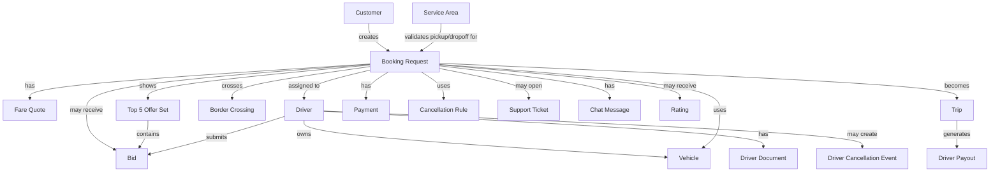

# Data Model

This note lists the core entities the backend and app should share.

## Customer

- `id`
- `name`
- `phone_country_code`
- `phone_number`
- `email`
- `preferred_language`
- `saved_locations`
- `payment_methods`
- `booking_history`
- `support_history`

## Driver

- `id`
- `name`
- `phone_number`
- `preferred_language`
- `verification_status`
- `service_directions`
- `service_areas`
- `availability_status`
- `current_area`
- `current_location`
- `current_location_updated_at`
- `temporary_ban_until`
- `late_cancellation_count`
- `rating`
- `completed_trip_count`
- `cancellation_rate`
- `reliability_score`
- `payout_account`
- `documents`
- `vehicles`

## Vehicle

- `id`
- `driver_id`
- `plate_number`
- `vehicle_class`
- `seat_count`
- `luggage_capacity`
- `verification_status`
- `insurance_status`
- `cross_border_capability`
- `current_area`
- `photos`

## Driver Document

- `id`
- `driver_id`
- `document_type`
- `document_number` optional
- `expiry_date`
- `verification_status`
- `verified_by`
- `verified_at`

## Service Area

- `id`
- `name`
- `country_or_region`
- `city`
- `zone_type`
- `pickup_allowed`
- `dropoff_allowed`
- `active`

## Border Crossing

- `id`
- `name`
- `supported_directions`
- `active`
- `estimated_processing_time_min`
- `route_fee_rules`
- `special_instructions`

## Map Provider Rule

- `id`
- `name`
- `provider` amap
- `applies_to_user_region`
- `applies_to_pickup_region`
- `applies_to_dropoff_region`
- `fallback_provider`
- `active`

## Booking Request

- `id`
- `customer_id`
- `booking_type` reservation, instant, bid_request
- `status`
- `pickup_location`
- `dropoff_location`
- `scheduled_pickup_time`
- `passenger_count`
- `luggage_count`
- `vehicle_class`
- `special_requests`
- `route_direction`
- `pickup_side_area`
- `border_crossing_id`
- `fare_quote_id`
- `offer_collection_expires_at`
- `selected_bid_id`
- `assigned_driver_id`
- `assigned_vehicle_id`
- `payment_id`
- `created_at`
- `updated_at`

## Fare Quote

- `id`
- `booking_request_id`
- `currency`
- `customer_fare`
- `driver_earning_estimate`
- `platform_fee`
- `instant_reference_fare`
- `reservation_discount_rate`
- `base_fare`
- `distance_fee`
- `time_fee`
- `route_fees`
- `border_service_fee`
- `discount_amount`
- `quote_expiry_at`
- `pricing_version`
- `included_fees`
- `excluded_fees`

## Bid

- `id`
- `booking_request_id`
- `driver_id`
- `vehicle_id`
- `bid_amount`
- `currency`
- `included_fees`
- `excluded_fees`
- `estimated_pickup_time`
- `driver_reliability_snapshot`
- `customer_visible_rank`
- `ranking_score`
- `driver_set_price`
- `platform_price_control_applied`
- `is_customer_visible`
- `message`
- `status`
- `expires_at`

## Top 5 Offer Set

- `id`
- `booking_request_id`
- `generated_at`
- `expires_at`
- `ranking_version`
- `visible_bid_ids`
- `suppressed_bid_ids`
- `selected_bid_id`
- `selection_deadline`
- `offer_collection_window_seconds`

## Trip

- `id`
- `booking_request_id`
- `driver_id`
- `vehicle_id`
- `actual_pickup_time`
- `actual_dropoff_time`
- `trip_status`
- `pickup_arrived_at`
- `trip_started_at`
- `border_crossing_started_at`
- `border_crossing_completed_at`
- `completed_at`
- `route_trace`
- `incident_flags`

## Driver Cancellation Event

- `id`
- `booking_request_id`
- `driver_id`
- `cancelled_at`
- `accepted_at`
- `minutes_after_acceptance`
- `within_grace_period`
- `penalty_applied`
- `warning_count_after_event`
- `temporary_ban_until`
- `reason`

## Payment

- `id`
- `booking_request_id`
- `customer_id`
- `payment_method`
- `payment_processor`
- `stripe_customer_id`
- `stripe_payment_method_id`
- `stripe_payment_intent_id`
- `currency`
- `booking_payment_mode`
- `capture_method`
- `amount_authorized`
- `amount_charged`
- `amount_captured`
- `amount_released`
- `cancellation_fee_amount`
- `cancellation_fee_rate`
- `refund_amount`
- `refund_rate`
- `charged_at`
- `authorized_at`
- `captured_at`
- `released_at`
- `capture_before`
- `refunded_at`
- `payment_status`
- `provider_reference`

## Cancellation Rule

- `id`
- `name`
- `currency`
- `arrival_grace_minutes`
- `late_customer_cancel_fee_rate`
- `late_customer_cancel_fee_driver_share_rate`
- `late_customer_cancel_fee_platform_share_rate`
- `instant_free_cancel_after_driver_accept_minutes`
- `instant_cancel_fee_driver_eta_threshold_minutes`
- `early_cancel_before_pickup_hours`
- `early_cancel_fee_rate`
- `within_24h_reservation_cancel_fee_rate`
- `reservation_after_arrival_cancel_fee_rate`
- `reservation_after_arrival_fee_driver_share_rate`
- `reservation_after_arrival_fee_platform_share_rate`
- `within_24h_cancel_payment_action`
- `instant_release_hold_within_acceptance_grace`
- `instant_release_hold_when_driver_eta_above_threshold`
- `driver_cancel_payment_action`
- `admin_cancel_payment_action`
- `active`

## Driver Payout

- `id`
- `trip_id`
- `driver_id`
- `currency`
- `gross_amount`
- `platform_fee`
- `platform_commission_rate`
- `platform_commission_deducted_from_driver_submitted_price`
- `deductions`
- `net_payout`
- `payout_method`
- `payout_cycle`
- `payout_day_of_week`
- `payout_period_start`
- `payout_period_end`
- `paid_outside_stripe`
- `bank_transfer_reference`
- `payout_status`
- `payout_date`

## Support Ticket

- `id`
- `booking_request_id`
- `opened_by`
- `issue_type`
- `priority`
- `status`
- `messages`
- `response_due_at`
- `first_response_at`
- `sla_status`
- `resolution`

## Chat Message

- `id`
- `booking_request_id`
- `sender_id`
- `sender_role`
- `original_language`
- `original_text`
- `translated_text`
- `translation_requested`
- `translation_provider`
- `support_joined_at`
- `support_agent_id`
- `created_at`

## Rating

- `id`
- `booking_request_id`
- `customer_id`
- `driver_id`
- `rating`
- `tags`
- `comment`

## Configuration

- `fare_rules`
- `service_area_rules`
- `map_provider_rules`
- `vehicle_class_rules`
- `reservation_discount_rules`
- `top_5_ranking_rules`
- `offer_collection_window_seconds`
- `driver_bid_price_control_enabled`
- `stripe_charge_and_refund_rules`
- `stripe_instant_authorization_rules`
- `platform_commission_rules`
- `friday_driver_payout_rules`
- `cancellation_rules`
- `refund_rules`
- `driver_eligibility_rules`
- `driver_cancellation_penalty_rules`
- `notification_templates`

## Relationships

