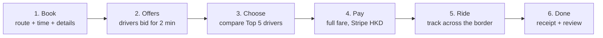
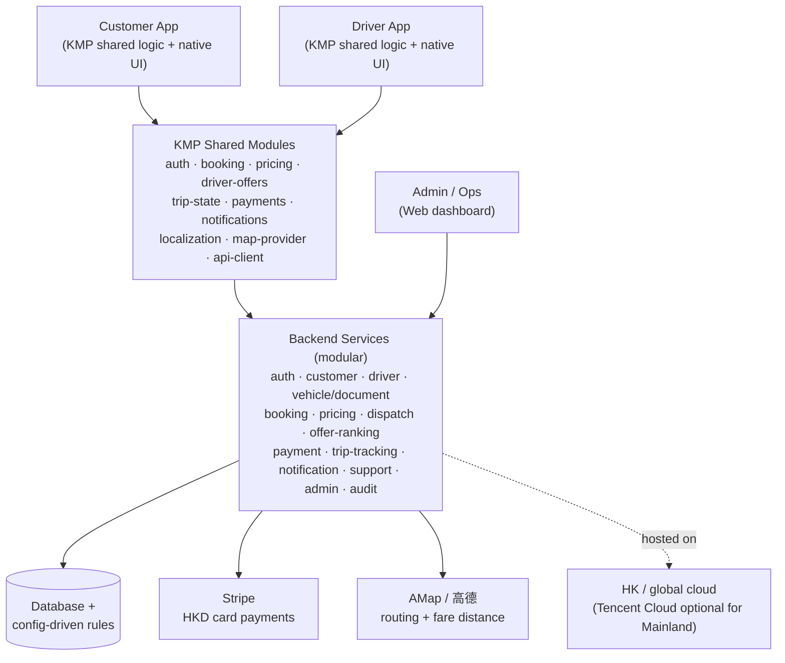
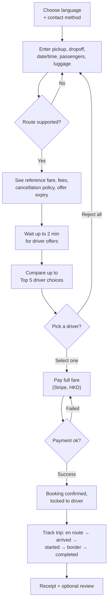
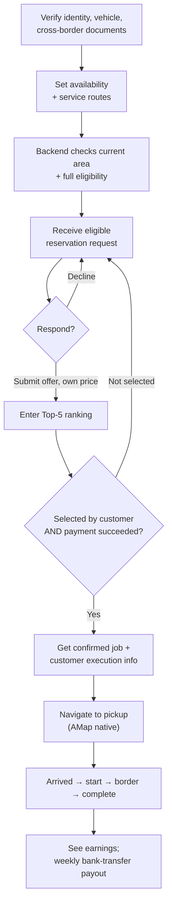
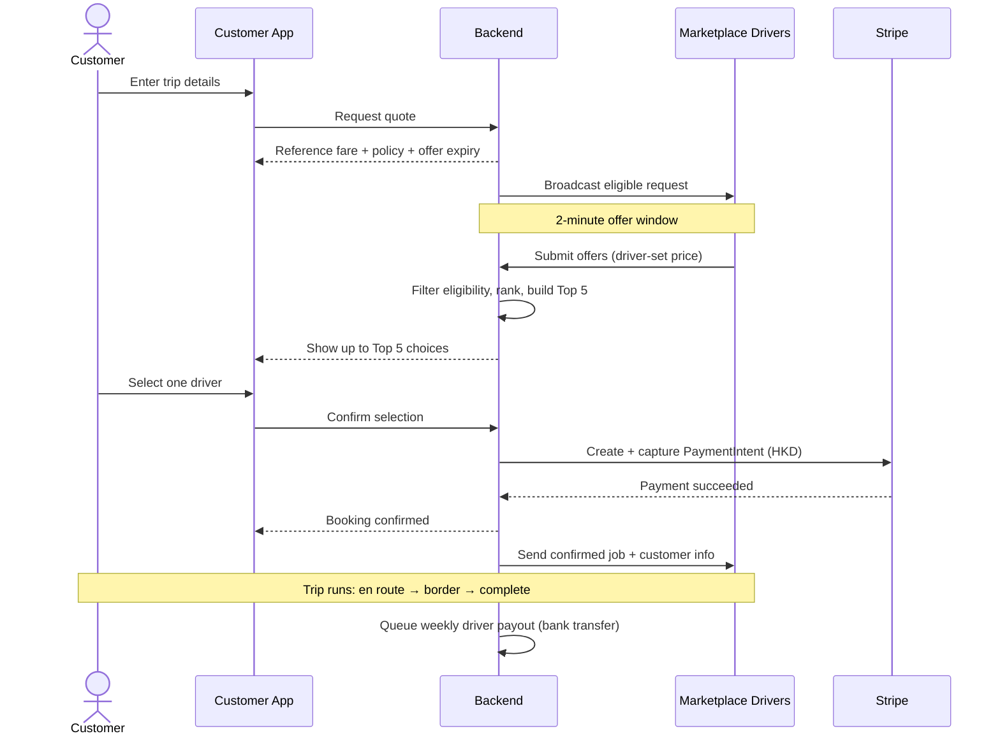
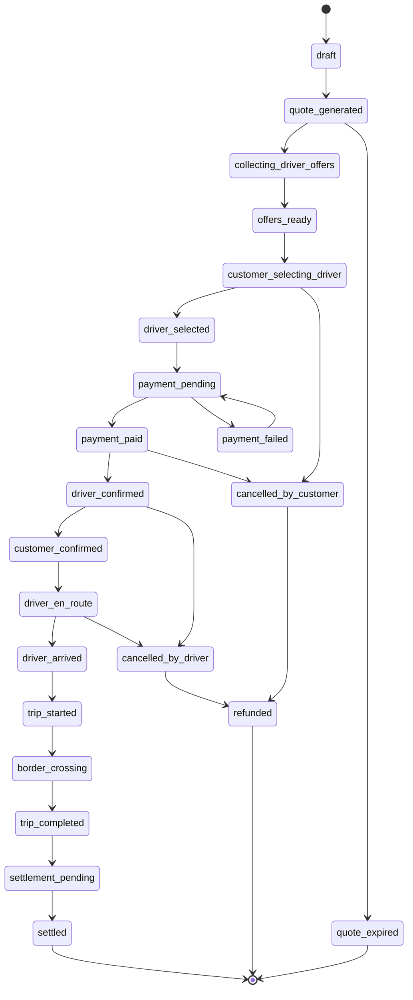
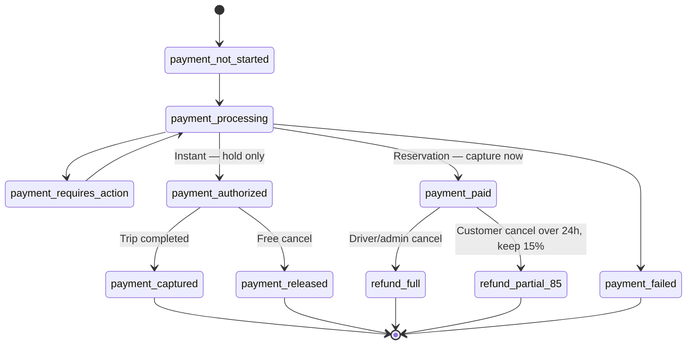
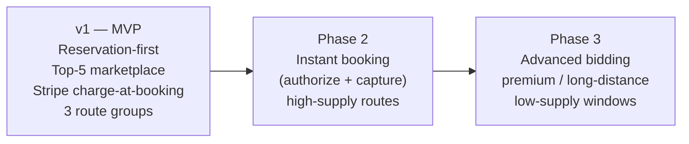

# Cross Border Car Hailing — Team Briefing

> A visual, plain-language walkthrough of **what we are building**, **how it works**, and **the tech stack behind it**. Built for a mixed audience: business and non-technical teammates can read the journeys and features; engineers can read the diagrams and state machines.

> [!tip] How to use this document
> - Read top to bottom — it goes from *what it is* → *how it works* → *how it's built* → *glossary*.
> - Diagrams are [Mermaid](https://mermaid.js.org/) and render live in Obsidian's reading view; in the exported PDF they appear as images.

---

## 1. What is this app? (in one minute)

We are building a **cross-border car-booking service** for **foreign travellers** moving between **Hong Kong and Mainland China** (Shenzhen and Guangzhou for v1).

A traveller books a car in advance, sees up to **5 driver choices**, pays by credit card, and is driven across the border — with in-app support and live tracking the whole way. Drivers are an **open marketplace** (independent drivers and fleet companies), not a fleet we own.

There are **three apps**: a **Customer app**, a **Driver app**, and an **Admin/Ops dashboard**.

![[cbch-hero-cover.png|900]]
*Figure 1. Reservation-first cross-border car booking between Hong Kong and Mainland China.*

> [!info] Why this product is harder than normal ride-hailing
> Cross-border trips add **border timing, driver permits, language gaps, payment settlement, and route uncertainty**. That is why v1 is **reservation-first** (book ahead) instead of "tap for a car right now".

---

## 2. Who it's for & the core idea

| | |
|---|---|
| **Who** | Foreign travellers, business visitors, expats, non-local customers. |
| **Where (v1)** | HK Airport ↔ Shenzhen · HK City ↔ Shenzhen · HK ↔ Guangzhou (both directions). |
| **Coverage** | All HK areas; all Shenzhen & Guangzhou areas. |
| **The promise** | Book a *legal, reliable* cross-border car without needing to understand local driver supply, border routes, payment norms, or language. |
| **Languages** | English · Traditional Chinese · Simplified Chinese. |

![[cbch-personas.png|900]]
*Figure 2. Core traveller groups: business visitors, expat families, and solo foreign tourists.*

---

## 3. How it works — the big picture (6 steps)

![[cbch-journey-strip.png|1000]]
*Figure 3. Six-step flow: book, collect offers, choose driver, pay, ride, and receive a receipt.*

---

## 4. The tech stack at a glance

> [!abstract] One-line summary
> **Two mobile apps share their brains** (Kotlin Multiplatform) but keep **native screens**. A **modular backend** owns all the real decisions — pricing, ranking, payments, trip state. **Stripe** handles card payments, **AMap** handles maps and distance, and the **business rules live in config** so ops can change fares and routes without an app release.

**Stack in plain terms (bottom to top):**

| Layer | What we use | Why |
|---|---|---|
| **Mobile apps** | Kotlin Multiplatform (KMP), native UI per platform | Share booking/pricing/payment logic across Android + iOS, keep native look and native map/payment SDKs. Chosen over React Native because the *logic* is the hard part. |
| **Admin** | Web dashboard | Ops needs verification, overrides, and monitoring from day one. |
| **Backend** | Modular services (can ship as one service at v1) | Backend owns *authoritative* decisions; apps only preview & validate. |
| **Payments** | Stripe PaymentIntents, HKD, HK merchant | Card-only for foreign customers; charge-at-booking for reservations. |
| **Maps** | AMap (authoritative for HK + Mainland) | One provider that routes on **both** sides of the border; its distance drives the fare. |
| **Cloud** | HK / global for v1 | Mainland (Tencent Cloud) only if legal/network/distribution forces it later. |
| **Rules** | Backend **configuration**, not app code | Fares, routes, discounts, ranking weights, cancellation rules change without app releases. |

![[cbch-stack-layers.png|700]]
*Figure 4. Architecture overview: apps and admin tools depend on shared logic and backend-owned rules.*

> [!note] Golden rule of the architecture
> The **apps never make final pricing or eligibility decisions.** They display and pre-validate; the **backend decides**. This keeps support, payments, analytics, and settlement consistent.

---

## 5. Customer journey (detailed)

> [!example] What each Top-5 choice shows the customer
> Final price · vehicle class + photo · driver rating + completed trips · pickup readiness · included/excluded fees · luggage & passenger fit · language · cancellation summary.

---

## 6. Driver journey (detailed)

> [!warning] Driver cancellation policy (after accepting)
> ≤ 5 min → allowed but **logged** · > 5 min → **warning/penalty** · > 3 late cancels in a rolling week → **5-hour temporary ban**.

> [!info] Privacy rule
> Before the customer pays, the driver does **not** see customer nationality or language — only operational booking details. Full execution info is revealed **only after payment succeeds**.

---

## 7. Booking + payment — who does what (sequence)

---

## 8. Booking state machine (backend-owned)

> [!note] The single source of truth
> Both apps **render** these states; neither app invents its own. This keeps notifications, analytics, and settlement aligned.

> [!quote] Side states (not drawn, to keep it readable)
> `cancelled_by_admin` · `disputed` — reachable from most active states and handled by Ops.

---

## 9. Payment state machine

> [!todo] Still open (blocking) payment decisions
> Cancel **within 24h** before pickup · **reservation after driver arrival** · the **weekly bank-transfer** payout process. See [[open-questions]].

---

## 10. Feature map — what each app does

### Customer app
| Area | Features |
|---|---|
| Onboarding | Language (EN/TC/SC), international phone, payment setup |
| Booking | Route search + service-area check, fare quote with fees & expiry, passenger/luggage/vehicle/special-needs form |
| Choosing | 2-min offer progress, Top-5 compare, select one / reject all & restart |
| Pay & ride | Stripe card (HKD), live tracking, in-app chat + auto-translate + support join |
| After | History, receipts, ratings, cancellation flow with policy |

### Driver app
| Area | Features |
|---|---|
| Setup | Full document onboarding (identity, licence, vehicle, permit, insurance, business) |
| Work | Availability + service zone + current-area, filtered eligible job feed, offer submission |
| Trip | Confirmed-job detail post-payment, AMap navigation handoff, trip-state updates |
| Money & care | Earnings + weekly payout, issue reporting, document-expiry alerts |

### Admin / Ops dashboard
| Area | Features |
|---|---|
| Trust & safety | Driver/vehicle/document verification queues, document-expiry dashboard, quality flags + temp ban |
| Operations | Booking search + timeline, marketplace offer monitoring, Top-5 override |
| Config | Fare-rule editor, service-area editor |
| Money & support | Refund/cancellation override + Stripe view, support ticket queue, audit log |

![[cbch-feature-grid.png|900]]
*Figure 5. Feature areas across the Customer app, Driver app, and Admin/Ops dashboard.*

---

## 11. Data model at a glance

The full entity list lives in [[data-model]]. Here is how the core entities relate:

![[data-model#Relationships]]

---

## 12. Roadmap — v1 and beyond

> [!failure] Explicitly **out** of MVP
> Fully automatic instant dispatch · showing every bid · real-time price negotiation · complex surge · corporate billing · loyalty · multi-stop · in-app wallet · advanced fraud detection · fully automated compliance.

---

## 13. Glossary (for the mixed audience)

| Term | Plain meaning |
|---|---|
| **KMP (Kotlin Multiplatform)** | One shared codebase for the app's *logic* on both Android and iOS, while each platform keeps its own native screens. |
| **Native UI** | Screens built with each platform's own tools, so they look and feel native. |
| **Marketplace (open) supply** | Drivers are independent / fleet partners who *opt in* and bid, not staff we employ. |
| **Reservation vs Instant** | Reservation = book ahead (v1). Instant = "car now" (later phase). |
| **Top 5 / offer ranking** | After drivers bid, the backend filters and scores them and shows the customer the best **5** — balancing reliability, price, vehicle fit, availability, and language. |
| **Offer window** | The **2 minutes** drivers have to submit offers after a request is created. |
| **Current-area eligibility** | A driver only gets a job that **starts where the driver currently is** (e.g., a car in HK gets HK→Mainland jobs). |
| **State machine** | The fixed list of stages a booking/payment moves through, with rules for who can advance or cancel each one. |
| **Stripe PaymentIntent** | Stripe's object that tracks one payment attempt from start to success/refund. |
| **Charge-at-booking** | We take the **full fare immediately** when a reservation is confirmed. |
| **Authorize / hold + capture** | "Reserve" money on a card now (hold), then actually **take** it later (capture) — used for the future instant flow. |
| **AMap (高德)** | The map provider that routes on **both** sides of the border; its distance sets the fare. |
| **Dispatch** | Deciding which eligible drivers may receive which trips. |
| **Settlement / payout** | Paying drivers — **weekly, by bank transfer, outside Stripe** in v1. |
| **Config-driven rules** | Fares, routes, discounts, ranking weights live in backend settings so ops can change them **without an app release**. |
| **SLA** | A response-time promise — here, **under 5 minutes** for active-trip support. |

---

## Related notes

- [[_index]] — project home
- [[app-summary]] — full functional spec summary
- [[product-logic]] · [[interfaces]] · [[mvp]] · [[data-model]]
- [[payment-and-cancellation]] · [[architecture-and-cloud]] · [[open-questions]]
