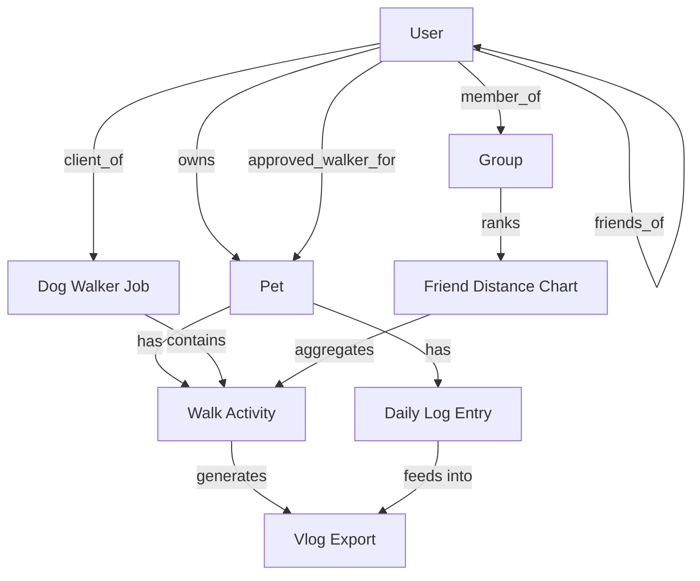

# Data Model

All entities in one place. Each entity links to the feature(s) that use it.

## User

Used by every feature.

- `name`
- `profile_photo`
- `friends` — list of user IDs
- `groups` — list of group IDs
- `privacy_defaults` — default visibility for new posts
- `role` — pet owner, dog walker, or both

## Pet

Used by [[features/pet-profile]], everywhere else as a foreign key.

- `name`
- `photo`
- `avatar_type` — real photo · real head crop · virtual pet · drawing · sticker
- `avatar_style` — sketch · soft 3D · cartoon · pixel · sticker
- `breed_primary` · `breed_secondary` — for [[features/breed-aware-activity-targets]]
- `birthday_or_age_estimate`
- `weight_kg`
- `health_flags` — list (post_op, arthritis, heart_condition, brachycephalic, etc.)
- `vet_override_weekly_minutes` (optional)
- `weekly_target_minutes` (derived)
- `weekly_target_walks` (derived)
- `linked_owners` — household / family members
- `approved_walkers` — for [[features/dog-walker-mode]]

## Daily Log Entry

Used by [[features/daily-pet-log]].

- `date_time`
- `media` — photo or video
- `caption`
- `location` (optional)
- `pet_id`
- `visibility` — private · friends · group · public

## Walk Activity

Used by [[features/pet-walking-activity]].

- `start_time`, `end_time`, `duration`
- `distance`
- `route_path` — GPS polyline
- `media` — photos / videos attached during the walk
- `pet_id`
- `visibility`
- `notes`

## Friend Distance Chart Row

Used by [[features/friends-walking-chart]].

- `chart_period` — day · week · month · challenge
- `group_or_friend_list_id`
- `pet_id`
- `owner_id`
- `total_distance`
- `ranking_position`
- `avatar_display_style`
- `visibility_for_comparison`

## Dog Walker Job

Used by [[features/dog-walker-mode]].

- `owner_id`
- `walker_id`
- `pet_ids` — supports group walks
- `scheduled_pickup_time`, `scheduled_dropoff_time`
- `actual_start_time`, `actual_end_time`
- `walk_activity_id`
- `owner_instructions`
- `walker_report` — pee/poop notes, mood, water/food, safety, walker message
- `payment_status` (optional)
- `review_rating` (optional)

## Vlog Export

Used by [[features/auto-vlog-export]].

- `source_media` — list of daily log + walk media IDs
- `template` — daily recap · walk recap · weekend recap · birthday
- `captions`
- `activity_stats_included` — distance, duration, etc.
- `export_destination` — camera roll · IG · TikTok · in-app
- `created_date`

## Relationships (quick reference)

