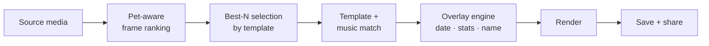

# Auto Vlog Export — Design Brief

The flagship of Prop 2 ([[value-props#Prop 2 — Curation Engine]]). Turns the day's media into a short, opinionated video the user actually wants to watch and share.

> [!important] The whole product hinges on this being good
> If the daily vlog is bad, users learn to ignore the notification and the loop dies. If it's good, it's the daily delight that pulls people back. **Better 3 great templates than 12 mediocre ones at launch.**

---

## The four questions

1. [When](#when-is-the-vlog-delivered) is the vlog delivered?
2. [How](#how-the-vlog-is-made) is it made?
3. [What](#content-direction--opinionated-not-freeform) is its content direction — opinionated or freeform?
4. [Where](#export-targets) is it exported?

---

## When is the vlog delivered

Five delivery moments, on different cadences:

| Cadence | Trigger | Length | Tone |
|---|---|---|---|
| **Walk recap** | Immediately after a walk ends | 10–15s | Quick, energetic, stats-forward |
| **Daily recap** | 9pm local (or user-set) | 15–25s | Reflective, summary |
| **Weekly digest** | Sunday evening | 30–45s | Highlights, "best of the week" |
| **Milestone** | Auto-triggered on milestones (100km, 1st birthday, anniversary, etc.) | 20–30s | Celebratory |
| **Year-in-review** | December 28 | 60–90s | Multi-chapter, emotional |

Plus:
- **On-demand** — user can generate a recap for any date range, anytime.

> [!tip] Why two daily delivery moments (walk-end + 9pm)
> Walk-end recap is the *immediate dopamine* — you finish a walk, get a satisfying montage 30 seconds later. The 9pm daily recap is the *daily ritual* — a wind-down moment that consolidates everything (walks + spontaneous + prompted captures) into one piece. Different jobs.

> [!warning] Avoid notification stacking
> If a user walks at 6pm and gets a walk recap, then gets a daily recap at 9pm covering *the same content*, it feels repetitive. The daily recap should *frame* the walk recap inside the bigger day, not repeat it. (E.g. daily recap opens with non-walk moments, then says "and you walked 3.2km", then closes with another moment.)

---

## How the vlog is made

### Inputs

- Photos and videos from [[features/daily-pet-log|daily log entries]].
- Photos and videos from active [[features/pet-walking-activity|walks]].
- Walk stats (distance, duration, route).
- Pet profile data (name, breed).
- Date + location (with [[features/privacy-controls|privacy controls]]).
- Music library (licensed).

### Pipeline (high-level)

### Pet-aware frame ranking

The core technical advantage. Selection algorithm scores frames by:

- Pet detected? (Hard requirement — frames without the pet skipped unless contextual)
- Pet centered + facing camera?
- In focus?
- Eyes open? Mouth visible / smiling?
- Action vs. rest? (Mix for pacing)
- Recency / chronological balance.

> [!important] Pet-only curation IS the moat
> iOS Memories pulls everything; we pull *only the pet*. This requires on-device pet detection — iOS Vision Pet/Animal detection, or a custom model. Investment here is the product.

### Templates

A small library of opinionated **moods**:

| Template | Pacing | Music | Used for |
|---|---|---|---|
| **Playful** | Fast cuts, ~0.6s/clip | Upbeat | Default daily / playful days |
| **Cinematic** | Slower, ~1.2s/clip | Filmic / piano | Walks in scenic places, anniversaries |
| **Throwback** | Medium, sepia/warm | Nostalgic | "1 year ago" memories |
| **Action** | Fast, beat-cut | Energetic | High-distance walks, run sessions |
| **Calm** | Slow, ~1.5s/clip | Ambient | Sleepy days, indoor days, senior dogs |

Template selection:
- **Default per cadence** (e.g. walk recap = Action, daily = Playful, weekly = Cinematic).
- **Context-aware** (rain detected → Calm; long-distance walk → Action; pet's birthday → Throwback intro).
- **User can lock a preferred mood** but the default is variable (variable reward — [[retention/2-daily-loop#Variable rewards]]).

### Overlays

Always present, low-key:

- **Date** — bottom corner.
- **Pet name** — opening card.
- **Walk stats** (walk recap only) — distance, duration, location.
- **Watermark** — small, bottom corner. Soft branding. Removable in v1.2+ as a paid unlock.
- **Title** ("Mochi's Tuesday", "100 walks!", "Beach day") — auto-generated, never robotic ("May 23, 2026").

### Aspect ratio

**9:16 vertical primary** (TikTok / Reels / Stories) — this is where it gets shared.
**1:1 square secondary** (in-app feed, IG Grid).

Render both for every vlog so the user picks at export.

---

## Content direction — opinionated, not freeform

The single biggest design call. Two extremes:

### ❌ Extreme A — Freeform like Instagram / CapCut

Open editor. User picks clips, drags, trims, adds music, adds text, picks filter.
- ✅ Maximum flexibility
- ❌ 95% of users never finish a project (Photoshop tax)
- ❌ Quality varies wildly → no brand identity
- ❌ We compete head-on with CapCut (we lose)

### ❌ Extreme B — Ultra-rigid like BeReal

One photo, one template, no options.
- ✅ Frictionless
- ❌ Boring after 2 weeks
- ❌ No room for variable reward

### ✅ The right answer — Opinionated default, light customization

Like **Spotify Wrapped** in spirit. The user doesn't *build* Wrapped — Wrapped is delivered to them, already great. The only "customization" is which card to share.

Specifically:

- **Default vlog is generated and delivered.** No edit step required.
- **Three customization knobs** — only:
  1. **Swap template** (5 choices)
  2. **Reorder / remove clips** (drag-and-drop, no fine edit)
  3. **Pick music track** from the template's mood
- **No frame-level editing.** No filters per frame. No text overlays per frame. Users who want CapCut go use CapCut — they will *export ours to CapCut* and edit there, which is fine.
- **Regenerate button.** Don't like this one? "Try again" — different template, different clip order, fresh result. (Variable reward + cheap.)

> [!tip] The Spotify Wrapped lesson
> Wrapped is a template. You don't edit it. You share or screenshot it. It works because the template *is the brand*. We want users to see a video and know it's from our app. That requires a tight, opinionated style — not a CapCut sandbox.

> [!quote] What we tell users
> "We make the video. You decide if it's worth sharing."

---

## Export targets

- **Save to camera roll** (universal fallback)
- **Instagram Story / Reel** (direct deep-link share)
- **TikTok** (direct share)
- **iMessage / WhatsApp** (system share sheet)
- **In-app post** (private / friends / group / public — see [[features/privacy-controls]])
- **Air-drop / generic share sheet**

> [!important] Growth: the watermark
> Every external export carries a small "made with [app name]" watermark by default. Soft, not annoying. This is our referral engine. Users on paid tier can remove the watermark.

---

## Direction options to discuss

### A — Daily delivery time

**A1** Fixed 9pm — predictable ritual.
**A2** Learned (user's typical app-open time + 30min before bed).
**A3** User-set during onboarding.

**Recommendation: A3 default 9pm.** Predictable beats clever; user picks the time on day 1.

### B — Number of templates at launch

**B1** 3 templates (Playful + Cinematic + Calm) — fastest to launch, lowest QA.
**B2** 5 templates (add Action + Throwback) — covers most contexts.
**B3** 10+ templates — too many; QA + selection logic gets ugly.

**Recommendation: B2 — 5 templates.** Three is too few for variable reward to feel rewarding.

### C — Music library

**C1** Licensed library only (cleared for social sharing).
**C2** Licensed + user-upload (royalty nightmare).
**C3** Public-domain only (limited mood range).

**Recommendation: C1.** Pay for a good library; never let users upload their own (DMCA cliff).

### D — Walk-end recap

**D1** Always generated, always delivered as a card after the walk.
**D2** Generated, but only delivered if user opted in.
**D3** On-demand only.

**Recommendation: D1 with a "don't show again" option.** This is the immediate-gratification moment that hooks new users.

### E — On-device vs cloud rendering

**E1** On-device (iOS AVFoundation / Android MediaCodec) — privacy + cheap.
**E2** Cloud render — flexible templates, server-side ML.
**E3** Hybrid — selection on-device, render in cloud.

**Recommendation: E1 for MVP.** Privacy story is cleaner; cost is bounded; latency lower. Switch to hybrid if template ambitions grow.

---

## What we explicitly do NOT build

- ❌ Full video editor.
- ❌ User-uploaded music (DMCA).
- ❌ Filters / effects per frame (no Snapchat-style).
- ❌ Talking-head intros / outros from owner.
- ❌ AI-generated *fake* pet content (image gen of the pet, voice clones).
- ❌ Auto-share to external platforms without explicit tap. **Every external post is a user action.**

---

## Open questions

- Are 5 templates enough for variable reward to feel fresh after 6 months? Or do we need *seasonal* templates earned via milestones?
- How aggressive is the "regenerate" button? Unlimited regenerations could feel like a slot machine — see [[retention/5-ethical-guardrails]]. Cap at 3/day?
- Watermark — soft brand mark, or a "made with" callout? (Affects shareability + virality.)
- Pet-only detection model — buy (off-the-shelf), build, or use iOS Vision Pet Detection?
- What's the **failure mode** when a day has only 1 photo and no walk? Skip vlog? Use the prompted-capture as the whole vlog? Skip and explain?

## Related

- [[concept]]
- [[value-props#Prop 2 — Curation Engine]]
- [[features/daily-pet-log]] — source media
- [[features/media-capture-modes]] — feeds the vlog
- [[features/pet-walking-activity]] — walk recap source
- [[retention/2-daily-loop#Variable rewards]] — the vlog *is* the variable reward
- [[retention/4-progression-loop]] — milestone + year-in-review
- [[retention/5-ethical-guardrails]] — regenerate cap, no fake content
