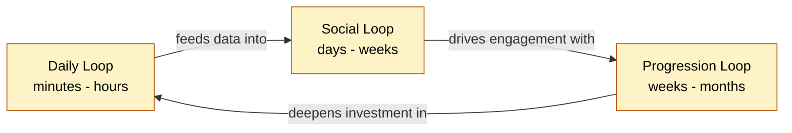

# Retention — How Do We Make People Come Back?

> [!question] The user's central question
> "How do we encourage people to get addicted to the app?"

The honest answer: by stacking **three reinforcing loops** on top of one **psychological framework**, then putting **ethical guardrails** around the whole thing so we build a healthy habit instead of a slot machine.

---

## Framework: Hook Model

Nir Eyal's Hook Model — Trigger → Action → Variable Reward → Investment — is the canonical lens. Read [[1-hook-model]] for how each step maps to a pet app.

---

## The three loops

Three reinforcing loops, each operating on a different timescale:

| Loop | Timescale | Core mechanic | Doc |
|---|---|---|---|
| **Daily** | minutes → hours | Streak + variable reward (auto-vlog) | [[2-daily-loop]] |
| **Social** | days → weeks | Leaderboards, group challenges, friend activity | [[3-social-loop]] |
| **Progression** | weeks → months | Pet character growth, badges, milestones, year-in-review | [[4-progression-loop]] |

> [!important] Why three loops, not one
> A single loop fatigues. Three loops at different timescales catch users at different moods. The daily loop pulls them in this morning; the social loop pulls them back this evening because a friend posted; the progression loop pulls them back next week because they're 2km from a badge.

---

## Highest-leverage mechanics, ranked

If you only ship a handful with the MVP, ship these in this order:

1. **Walking streak** ([[2-daily-loop]]) — single biggest behaviour driver. Trivial to build.
2. **Auto-vlog as variable reward** ([[2-daily-loop]]) — already in the product. Make it feel like a surprise.
3. **Smart time-of-day notification** ([[2-daily-loop#Triggers]]) — "trigger" half of the Hook.
4. **Friend leaderboard** ([[3-social-loop]]) — once a friend graph exists.
5. **Pet milestone badges** ([[4-progression-loop]]) — first 1km, first 100km, first park visited.
6. **Year-in-review montage** ([[4-progression-loop]]) — annual re-engagement spike.

---

## Ethical guardrails

> [!warning] Addictive vs. healthy habit
> "Addictive" is the wrong word — we want a **habit**, not a compulsion. The difference is whether the user feels good about opening the app a week later. See [[5-ethical-guardrails]].

Headline rules: no infinite feed in MVP, streak freezes built in, push notifications capped per day, no dark patterns (no fake numbers, no manipulated urgency, no FOMO without substance).

---

## How to use this folder

- **Designing a new mechanic?** Read [[1-hook-model]] first. Sanity-check against the four steps.
- **Picking what to ship?** Use the ranked list above.
- **Worried about user wellbeing?** Read [[5-ethical-guardrails]] — written as a list of *don'ts*.
