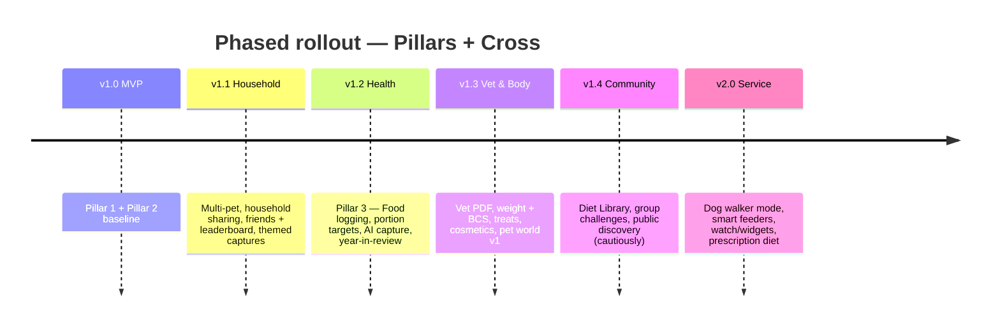

# Roadmap — Full Vision + Phased Releases

The full-feature app described here is the **mature product**. We don't ship it all at once. This doc lays out the destination, then phases the path.

> [!tip] How to read this
> - **Section 1 — Mature product** = what the app looks like at v2.0+. The destination.
> - **Section 2 — Phased releases** = how we get there. v1.0 → v2.0.
> - **Section 3 — Decision points** = checkpoints where the next phase depends on what we learn.

---

## 1. The mature product (v2.0+)

The app, fully realised, has three pillars sharing one engine. Each pillar contains the following modules:

### Pillar 1 — Routine Accountability

- ✅ Pet profile (single + multi-pet)
- ✅ Breed-aware activity targets (weekly minutes + walks)
- ✅ GPS-tracked walks with route, distance, duration, pace
- ✅ Daily pet log timeline
- ✅ Layered media capture (spontaneous · walk-tied · daily ritual · themed · AI-assist)
- ✅ Streaks + freezes
- ✅ Weekly + monthly activity stats
- ✅ Park-visited collections / location stamps
- ✅ Privacy controls (private / friends / group / public)

### Pillar 2 — Curation Engine

- ✅ Walk-end recap video
- ✅ Daily auto-vlog at user-set time
- ✅ Weekly digest
- ✅ Milestone montages (100km, 1st birthday, adoption anniversary)
- ✅ Year-in-review (December)
- ✅ Throwback resurfacing ("1 year ago today")
- ✅ Pet-aware frame ranking (on-device pet detection)
- ✅ 8–10 opinionated templates (5 base + seasonal)
- ✅ Licensed music library
- ✅ Vertical 9:16 + square 1:1 export
- ✅ One-tap external share with watermark
- ✅ Three customization knobs (template, clip order, music) — no full editor

### Pillar 3 — Health Intelligence

- ✅ Food logging (quick-add · barcode · manual · photo recognition)
- ✅ Activity-coupled portion recommendations
- ✅ Meal-time anti-double-feed alerts (multi-person households)
- ✅ Treat tracking
- ✅ Weight tracking
- ✅ Body Condition Score (BCS) tracking
- ✅ Weekly + monthly nutrition reports
- ✅ Vet PDF (standardised, structured, exportable)
- ✅ Diet Library (anonymised, browsable by breed/age/weight/condition)
- ✅ Prescription diet adherence tracking
- ✅ Water tracking (optional)

### Cross-pillar — Social & Service

- ✅ Household / shared timeline (2+ users per pet)
- ✅ Friend graph (contacts + QR invite)
- ✅ Chronological friend activity feed (no algorithm)
- ✅ Friends walking chart (avatar list + house-to-pet)
- ✅ Group rooms (3–10 users)
- ✅ Group challenges (km goal · completion · sticker hunt · seasonal)
- ✅ Reactions (paw · treat · heart)
- ✅ Comments per activity
- ✅ Pet playdate matching (co-location detection)
- ✅ Dog walker mode (full — schedule, walk, report, multi-pet)
- ✅ Optional in-app payment for walkers
- ✅ Pet profile pages (public-facing, opt-in)

### Cross-pillar — Progression / Identity

- ✅ Pet character avatar with cosmetic unlocks (frames, outfits, stickers)
- ✅ Pet "world" — illustrated home scene that grows with activity
- ✅ Distance milestone badges (1 / 10 / 100 / 1000 km lifetime)
- ✅ Consistency milestones (streaks, weekly cadence)
- ✅ Life milestones (anniversaries, birthdays, 1 year on app)
- ✅ Seasonal events (Halloween, Christmas, beach day)
- ✅ Sharable certificates

### Cross-pillar — Engine / Infra

- ✅ On-device pet detection
- ✅ Smart-feeder API integrations (Petnet / Petlibro / SureFlap)
- ✅ Watch companion (Apple Watch / Wear OS) — start walk, quick capture
- ✅ Widget support (start walk · log meal · streak counter)
- ✅ End-to-end privacy: home-zone fuzzing, route stripping on external export

---

## 2. Phased releases

Six releases from MVP to mature product. Each phase has a *goal* (what we prove), *what ships*, *what's explicitly out*, and *success criteria* (what unlocks the next phase).

---

### v1.0 — MVP (Pillars 1 + 2 baseline)

**Goal: prove the daily loop holds for a single user.**

The whole product collapses if walking + capture + auto-vlog don't form a habit. Everything else is downstream.

**Ships:**

| Pillar | Features |
|---|---|
| Pillar 1 | [[features/pet-profile]] (single pet) · [[features/breed-aware-activity-targets]] (conversational onboarding) · [[features/pet-walking-activity]] (GPS, walk-end auto-stop) · [[features/daily-pet-log]] · [[features/media-capture-modes]] (layers 1+2+3) · [[features/privacy-controls]] · Walking streak + 1 freeze/week |
| Pillar 2 | [[features/auto-vlog-export]] — 5 templates, walk-end recap + 9pm daily, on-device render · External share with watermark · 3 lifetime distance milestones (1/10/100 km) |
| Pillar 3 | **Positioned but NOT built.** Marketing says "pet health companion"; no food logging in app yet. |
| Cross | One smart time-of-day notification per day · Hard cap 1 push/day |

**Explicitly out:**
- Multi-pet, multi-user households
- Friend graph, leaderboard
- Food logging
- Vet reports
- Public discovery
- Dog walker mode
- Themed captures, AI import
- Year-in-review
- Cosmetic unlocks

**Success criteria** (100 beta users at day 30):
- ≥40% complete onboarding loop on day 1
- ≥25% active on day 7
- ≥50% of week-1 walks have media attached
- ≥20% export at least one vlog externally
- Median 3+ walks/week for retained users

**If we miss → revisit before adding features.** The loop has a hole.

---

### v1.1 — Household & Friends

**Goal: prove the social/household layer adds stickiness without diluting the loop.**

**Ships:**

| Pillar | Features |
|---|---|
| Pillar 1 | Multi-pet support (one user, multiple pets) · Household sharing (multiple users, one pet — couple/family/roommates) · Themed capture prompts (Sleepy Sunday etc., weekly rotation) · Park-visited stamps (geofenced) |
| Pillar 2 | Weekly digest vlog (Sunday) · Throwback resurfacing ("1 year ago today") · 7 templates (5 base + 2 seasonal) |
| Pillar 3 | *Still positioned only.* |
| Cross | [[features/social-sharing]] (friend invites via contacts + QR, chronological feed, paw/treat/heart reactions) · [[features/friends-walking-chart]] V1 (avatar list, weekly+monthly periods) · Anti-double-walk awareness in household ("Anna walked Mochi 2hrs ago") |

**Explicitly out:**
- Group challenges (need denser friend graph first)
- Public discovery
- House-to-pet leaderboard variant (V2 layout)
- Algorithmic feed (chronological forever)

**Success criteria** (post-launch v1.0 cohort):
- ≥20% of v1.0 users invite at least one friend or household member
- Household users show +20% D30 retention over single-user
- Users with 3+ friends view the leaderboard 3x/week+
- No regression in v1.0 success metrics

---

### v1.2 — Pillar 3 lands (Health Intelligence)

**Goal: prove food logging gets used and the activity-coupled recommendation is a real moat.**

The biggest single release. Pillar 3 finally goes live.

**Ships:**

| Pillar | Features |
|---|---|
| Pillar 1 | (no major additions — Pillar 1 is mature enough) |
| Pillar 2 | AI-assisted photo import (on-device pet detection — "we found 4 photos of Mochi today") · Year-in-review (timed for December launch) |
| Pillar 3 | [[features/food-and-nutrition-tracking]] — quick-add favourites + barcode + manual logging · Activity-coupled portion recommendations · Anti-double-feed alerts (multi-person households) · Weekly nutrition summary |
| Cross | First group challenges (km goal · completion) — once friend graph is denser |

**Explicitly out:**
- Vet PDF (waits for v1.3)
- Weight + BCS (v1.3)
- Diet Library (v1.4)
- Photo recognition for food (later — quick-add covers 90%)
- Treats as a separate category (v1.3)
- Smart feeder integrations (v2.0)
- Prescription diet adherence (v2.0)

**Success criteria** (post-launch v1.2):
- ≥30% of users log food at least 3 days/week within first month
- ≥50% of food-loggers tap through a portion recommendation
- ≥60% of active December users open the year-in-review
- Quick-add captures ≥80% of logged meals (validates the input model)

**If food-logging adoption is <15% → revisit the input model before building v1.3.** Don't pour vet/weight/BCS on top of an unused base.

---

### v1.3 — Vet & Body

**Goal: prove vet PDF gets used and weight tracking sticks.**

The Pillar 3 maturation release.

**Ships:**

| Pillar | Features |
|---|---|
| Pillar 1 | (mature) |
| Pillar 2 | Milestone montages auto-trigger (100 walks, pet's birthday, adoption anniversary) |
| Pillar 3 | Vet PDF export (standardised, structured, designed with vets) · Weight + Body Condition Score tracking · Treat tracking as separate category · Prescription diet flag (manual entry — owner says "vet prescribed X") |
| Cross | Cosmetic unlocks (frames, outfits earned via milestones) · Pet world v1 (illustrated home scene, 3 progression stages) |

**Explicitly out:**
- Clinic-side integration (vet portal, API) — PDF only
- Diet Library (v1.4 — needs scale)
- Paid cosmetic loot boxes (never)

**Success criteria:**
- ≥10% of active food-loggers generate a vet PDF in first 6 months
- ≥5% of those report sharing it with their vet (survey)
- ≥20% adoption of weight tracking among food-loggers
- Cosmetic unlocks viewed ≥3x/week by ≥30% of users (proxy for engagement on the progression loop)

---

### v1.4 — Community

**Goal: leverage scale into a unique reference utility.**

By now we have enough users to make aggregate data useful.

**Ships:**

| Pillar | Features |
|---|---|
| Pillar 3 | Diet Library — anonymised, browsable by breed/age/weight/condition. Opt-in publishing of your dog's current diet. |
| Cross | Friends walking chart V2 (house-to-pet progress view) · Group rooms (3–10 users with shared timeline, group chat tied to walks) · Pet playdate matching (co-location detection — opt-in) · Public discovery (carefully — moderation, no infinite scroll, see [[retention/5-ethical-guardrails]]) |

**Explicitly out:**
- Anything that turns Diet Library into a marketplace (no prices, no affiliate links, no influencer content)
- Algorithmic ranking on public discovery (chronological + signal-based filters only)

**Success criteria:**
- Diet Library queried ≥1x/week by ≥25% of food-loggers
- ≥40% of users with 3+ friends join a group room
- Public discovery: positive sentiment in user research (no comparison-anxiety regression)

**If public discovery causes net-negative user mood → roll back.** See ethical guardrails — engagement isn't worth the cost if users feel worse.

---

### v2.0 — Service tier

**Goal: expand the TAM with adjacent personas (dog walkers) and infrastructure (smart feeders, watch).**

**Ships:**

| Pillar | Features |
|---|---|
| Cross | [[features/dog-walker-mode]] — full version with scheduling, walk reports, multi-dog walks, owner-walker permissions, optional in-app payment · Apple Watch + Wear OS companion (start walk, quick capture, meal log) · Widgets (home screen + lock screen) · Smart-feeder API integrations (Petnet, Petlibro, SureFlap) |
| Pillar 3 | Prescription diet adherence tracking (vet sets the plan in-app or by PDF; we measure compliance) · Water tracking (optional) |

**Explicitly out (and maybe forever):**
- Pet insurance integration (regulatory burden)
- Pet adoption marketplace (mission drift)
- AI pet content generation (image gen, voice clones — never)

**Success criteria:**
- ≥1% of users enable dog walker mode (as walker or client)
- Walker users have ≥2x retention of consumer-only
- ≥5% of users connect a smart feeder
- Watch app: ≥30% of Apple Watch owners install the companion

---

## 3. Decision points / checkpoints

Before each phase ships, we should re-check the assumption that the previous phase validated. **If a previous phase's success criteria weren't met, don't pile on top — fix the foundation first.**

| Checkpoint | Question |
|---|---|
| Before v1.1 | Is the daily loop forming? (D7 retention, walks/week) |
| Before v1.2 | Does household sharing add retention or fragment it? Is friend invite working? |
| Before v1.3 | Is food logging being used? Is the activity-coupled recommendation valued (CTR on portion suggestions)? |
| Before v1.4 | Is the vet PDF actually being generated and shared? |
| Before v2.0 | Has the social loop crossed the network-density threshold? (Median friend count, leaderboard engagement) |

---

## 4. What this roadmap doesn't say

Two things deliberately *not* on the roadmap because they're too far ahead to commit to:

- **Pricing & monetization.** Free tier, subscription, cosmetic unlocks, watermark removal, vet portal — we'll know more after v1.1.
- **Geographic launch sequence.** HK / Asia first vs. US first vs. global. Depends on team location, ad costs, and breed-data availability per market.

When the time comes to commit on either, create a separate strategy doc — don't bolt onto this roadmap.

---

## See also

- [[concept]] — positioning + three pillars
- [[value-props]] — the three jobs in detail
- [[mvp]] — v1.0 in full
- [[retention/_index]] — engagement mechanics across phases
- [[decisions/_index]] — open decisions per phase
