# TimeKids — Screen References, Part 2 (extended surfaces + more education examples)

> Multi-agent Mobbin sweep (19 surfaces) covering surfaces **not** in [[screen-references|Part 1 (§1–§10)]], plus deeper education/kids examples for the core loop. Same age 4–6 rules apply (see Part 1). Images in `./images/` (prefixes 11–29). Coverage badge = how well Mobbin covers that surface *for a 4–6 kids app*.

**Jump to:** [§11](#11-parent-subscription-paywall) · [§12](#12-gentle-daily-goal-quest-young-kids) · [§13](#13-notification-permission-priming) · [§14](#14-screen-time-limit-take-a-break) · [§15](#15-settings-language-audio-toggles) · [§16](#16-content-library-browse-stories-topics) · [§17](#17-multi-kid-profile-switcher) · [§18](#18-reward-shop-avatar-dress-up) · [§19](#19-adventure-intro-preview-before-start) · [§20](#20-era-chapter-complete-milestone) · [§21](#21-interactive-mini-game-drag-sort-build) · [§22](#22-speaking-pronunciation-feedback) · [§23](#23-parent-value-prop-onboarding-carousel) · [§24](#24-offline-download-manager) · [§25](#25-parent-detailed-lesson-report-transcript) · [§26](#26-more-education-storybook-read-along) · [§27](#27-more-education-learning-path-world-map) · [§28](#28-more-education-kids-quiz-activity) · [§29](#29-more-education-lesson-complete-celebration)

---

## §11 · Parent subscription / paywall — coverage: 🟡 partial

| Duolingo 1 | Duolingo 2 | Duolingo 3 | Duolingo 4 |
|---|---|---|---|
|  |  |  | 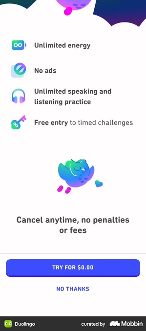 |

- **Duolingo** — Playful education paywall: friendly mascot, bold '7 day free trial' headline, two tappable plan cards (Family vs Individual) with a 'Most popular' badge and one large primary CTA - the cleanest template for TimeKids. [↗](https://mobbin.com/screens/222c1c4e-37cd-4aba-bfb2-4721973fac71)
- **Duolingo** — Same playful plan-selection pattern in a blue palette, adding a 'View all plans' secondary link and an honest auto-renew disclosure block - good model for a parent-facing transparent paywall. [↗](https://mobbin.com/screens/c90ed452-1964-4061-9ae9-c0481a9e2229)
- **Duolingo** — Family Plan vs Individual comparison with a 'Save up to 76%' badge and kid illustrations - directly relevant to a parent-buyer covering one or more children. [↗](https://mobbin.com/screens/9bbb4867-3bc1-4b86-981c-c51c038a3903)
- **Duolingo** — Icon-led benefit list ('No ads', unlimited practice) with a reassuring 'Cancel anytime, no penalties' line, big primary CTA and a low-friction 'No thanks' - the value-framing half of the paywall. [↗](https://mobbin.com/screens/4340cb2e-c140-4b89-a7b3-2ff3cf0957d0)

**What to borrow:** Borrow Duolingo's structure: a mascot/illustration hero, a short benefit list with simple icons, two large tappable plan cards (yearly/family vs monthly) with a single 'Most popular' badge, one dominant primary CTA framed around a free trial ('Try for $0.00'), and an honest, plainly worded auto-renew/cancel-anytime disclosure beneath it. Keep exactly one decision per screen and use color/badges (not dark patterns) to guide the choice.

**TimeKids adaptation:** Place this entire paywall inside the Parent zone behind the parent gate - never shown to the 4-6 child - and keep it text-and-money-light for the adult: clear bilingual (Cantonese + English) pricing, an explicit free-trial and cancel-anytime statement, and COPPA / HK-PDPO-safe copy with no urgency timers or guilt mechanics. Frame plans around the child's content unlock (e.g. 'unlock all history adventures') and a family option for siblings, with large touch targets and an obvious, non-tricky way to decline.

---

## §12 · Gentle daily goal / quest (young kids) — coverage: ✅ strong

| Duolingo ABC 1 | Duolingo ABC 2 | Duolingo | Bloom | Finch |
|---|---|---|---|---|
| 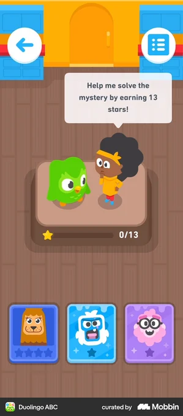 | 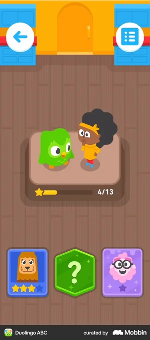 | 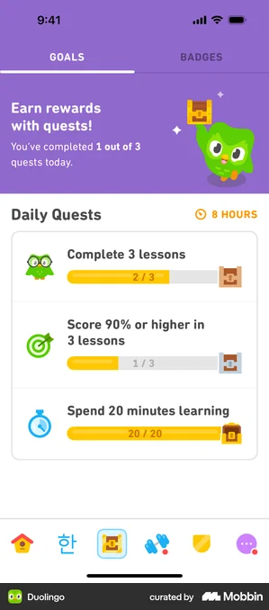 | 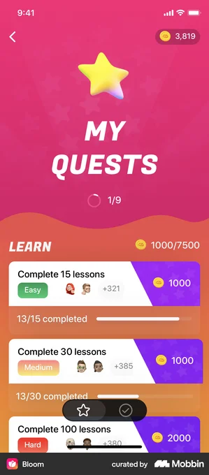 | 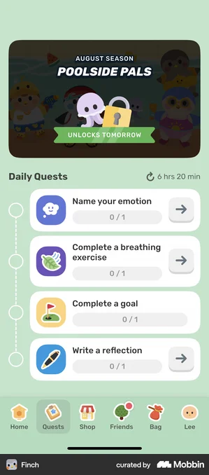 |

- **Duolingo ABC** — Best direct match: a real pre-reader education app framing the day as a quest ('earn 13 stars to solve the mystery'), with a single big star goal meter, a mascot guide speaking the instruction, and large picture-only choice cards. [↗](https://mobbin.com/screens/4efa15eb-613c-4b42-9c7c-37b992cb3e26)
- **Duolingo ABC** — Same quest mid-progress (4/13 stars filling) showing how the star meter visibly grows and a card flips to a reward state, modeling a satisfying picture-driven progress reward for kids who can't read numbers yet. [↗](https://mobbin.com/screens/6368e06d-5524-4353-b2f7-07d7e0e38fb1)
- **Duolingo** — Canonical education 'Daily Quests' panel: 2-3 simple goals as cards, each with an icon, a horizontal progress bar and a treasure-chest reward, plus a cheering mascot header and a refresh timer. [↗](https://mobbin.com/screens/48f5d484-e905-4e64-ae22-626b53a86b07)
- **Bloom** — Learning-app quest list with a large celebratory hero star and a clear 'LEARN' goal grouping plus per-quest progress bars and reward chips; good reference for a big, friendly star as the central reward token. [↗](https://mobbin.com/screens/60ed7b7b-8a61-4256-bac1-6f80dc090c07)
- **Finch** — Not an education app, but the strongest example of GENTLE, non-punishing daily quests: simple 0/1 goals with a soft mascot, a season banner and check-off rows, no streak-loss pressure, which is exactly the tone needed for 4-6s. [↗](https://mobbin.com/screens/24390f69-5bd2-4f90-b2f9-eae6fa3acfdf)

**What to borrow:** Frame the day as one small, finishable quest with a single oversized star/progress meter (e.g. 4/13 stars) so a child sees the goal grow visually rather than as a number, and keep goals to just 2-3 large icon cards each with its own friendly reward token (star or treasure chest). Anchor the surface with a mascot that introduces and celebrates the quest, and use Finch's tone: soft check-offs, a 'goals left today' summary, and a season/theme banner instead of any streak-loss or failure framing.

**TimeKids adaptation:** For pre-reading 4-6 year olds, make every quest card picture-led and audio-first: a tappable mascot or speaker reads the goal aloud in Cantonese and English, with icons (not words) carrying the meaning and finger-sized targets. Reward completion with the growing-star meter, confetti and a spoken 'woohoo' rather than points or numbers, and strictly no streaks, timers, or loss mechanics that could pressure a young child. Keep the quest surface fully inside the playful Kid zone, while any goal configuration, history, or screen-time settings live behind the parent gate, and ensure progress data stays local/parent-controlled to satisfy COPPA and HK PDPO.

---

## §13 · Notification permission priming — coverage: ✅ strong

| Imprint | Duolingo | Duolingo Math | Tempo |
|---|---|---|---|
| 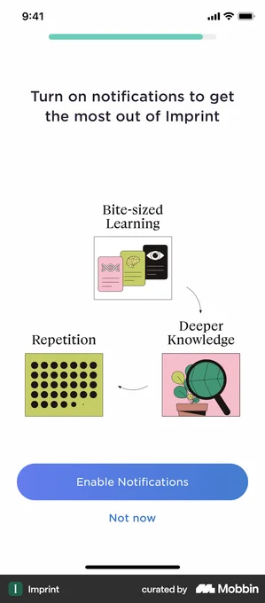 | 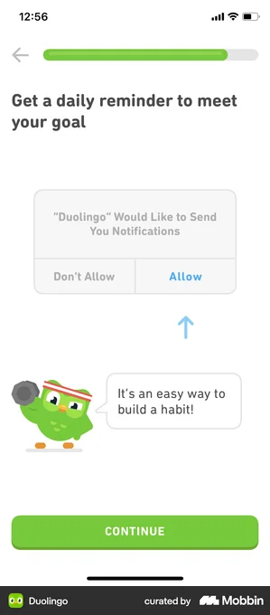 |  |  |

- **Imprint** — Education app priming screen with three illustrated benefit cards (Bite-sized Learning, Repetition, Deeper Knowledge) and Enable / Not now buttons before the OS prompt - picture-driven benefit framing. [↗](https://mobbin.com/screens/94253387-59a2-4616-8a7a-9a4001a159cc)
- **Duolingo** — Canonical priming pattern: mascot speech bubble 'It's an easy way to build a habit!' with an arrow pointing up at the real iOS permission dialog, plus a Continue button - warm, friendly framing in a learning app. [↗](https://mobbin.com/screens/115dd8e7-7f52-4845-ba5b-07b28727aeea)
- **Duolingo Math** — Kids/math learning app showing playful character cluster behind the system permission sheet with an arrow nudging toward Allow - close to TimeKids' gamified kid-facing tone. [↗](https://mobbin.com/screens/99564917-b20c-4c6b-8795-e64704e180ef)
- **Tempo** — Non-education (fitness) app included for its strong benefit-explaining copy ('We'll send you a notification one hour before...') that sets expectations before the OS sheet - useful model for the parent-facing rationale text. [↗](https://mobbin.com/screens/28a98c51-2efc-4489-8d14-2f31cd4db383)

**What to borrow:** Use a soft pre-permission priming screen that explains the concrete benefit BEFORE triggering the OS dialog, with a clear primary CTA (Enable / Allow) and a low-friction dismiss (Not now / Skip) so denial isn't a dead end. Reinforce the value with picture/icon benefit cards (Imprint) or a friendly mascot speech bubble plus an arrow that visually points at the incoming system sheet (Duolingo / Duolingo Math). Frame notifications as a gentle daily reminder / habit nudge, not nagging.

**TimeKids adaptation:** Show this priming as a PARENT-zone screen behind the parent gate, since under COPPA/HK-PDPO the notification consent decision belongs to the adult, not the 4-6 year old - copy should explain reminders help their child keep up the daily history adventure, with audio narration and large picture buttons rather than dense text. Frame benefits with friendly illustrations and a warm Cantonese/English voice-over instead of reading-dependent labels, and keep targets oversized and tappable. Avoid any punishing or streak-loss language (no 'Don't lose your record'); use only positive, pressure-free nudges like 'Come play again tomorrow' so a missed day never makes a young child feel they failed.

---

## §14 · Screen-time limit / take a break — coverage: 🟡 partial

| Duolingo ABC | Instagram | Ahead | Opal | TikTok |
|---|---|---|---|---|
|  | 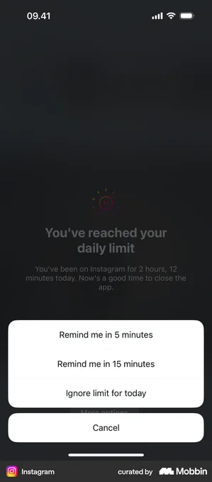 |  | 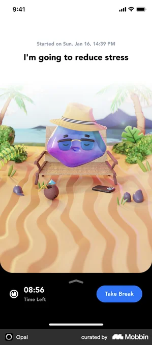 | 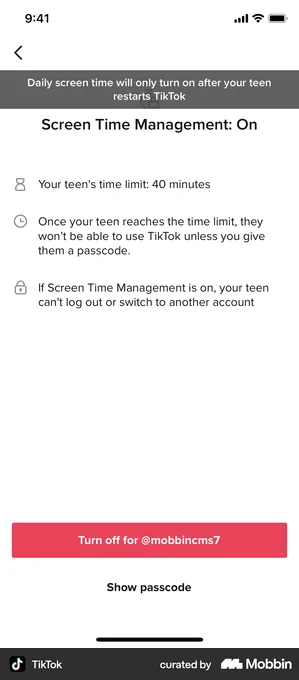 |

- **Duolingo ABC** — Best direct match: a kids learning app uses a friendly mascot with a stopwatch and a big 'Time is up!' speech bubble plus one large forward button - non-punishing, picture-driven session-end. [↗](https://mobbin.com/screens/22579359-a839-4e40-91ad-f0659edebab1)
- **Instagram** — Limit-reached pattern: 'You've reached your daily limit' bottom sheet with snooze / ignore-for-today / cancel options - a clear template for the moment the cap is hit (non-education, but the canonical limit-reached dialog). [↗](https://mobbin.com/screens/a6739647-8943-4220-9123-0720e9cbfe4b)
- **Ahead** — Calm full-screen pastel 'take a break' moment with a soft sleeping mascot and sun/clouds - tone and color reference for a gentle, soothing break interstitial. [↗](https://mobbin.com/screens/0447ba83-5be6-4f0b-b2bf-b8bfc8f7032f)
- **Opal** — Active-break screen: a 3D character relaxing in a scene with a large 'Time Left' countdown and a single 'Take Break' button - model for a playful 'come back later' waiting state. [↗](https://mobbin.com/screens/a1e60797-ddad-4b72-8556-d9627cd8ff2d)
- **TikTok** — Parent-zone reference: 'Screen Time Management' setup with a passcode-gated daily limit and a single 'Set a time limit' row - clean model for the grown-up settings behind the parent gate. [↗](https://mobbin.com/screens/f7b1f461-08e7-47f7-be3b-e925d6368b85)

**What to borrow:** Borrow the friendly-mascot 'Time is up!' session-end (Duolingo ABC) and the active-break countdown with a single large button (Opal): one character, one short message, one big action, no scolding. For the moment the cap is hit, borrow the limit-reached sheet with a clear 'come back later' choice (Instagram), and put the actual cap configuration in a passcode-gated parental settings row with sensible defaults (TikTok). Use the soft pastel full-screen break interstitial (Ahead) for the soothing visual tone.

**TimeKids adaptation:** For pre-readers aged 4-6, make the 'time is up' moment audio-first and picture-driven: the mascot speaks the message aloud in Cantonese and English with minimal text, an animated 'all done for today' scene, and one oversized tappable target (or simply auto-ends with no dismiss the child can fight). Keep it warm and celebratory rather than a lockout - reward what they did today, never punish - and put the entire limit/duration configuration behind the parent gate in the grown-up zone, with COPPA/HK-PDPO-safe defaults (conservative caps, no data shown to the child, no nagging notifications to the kid).

---

## §15 · Settings: language + audio toggles — coverage: ✅ strong

| Drops | Memrise 1 | Memrise 2 | CapWords | Babbel |
|---|---|---|---|---|
| 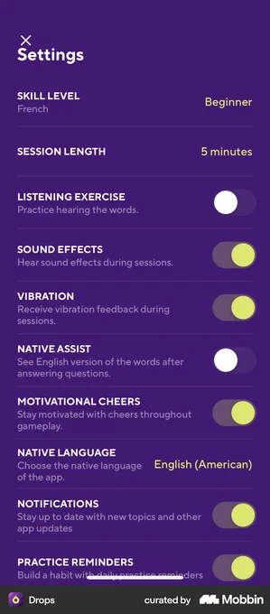 | 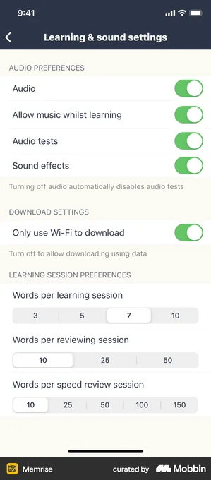 | 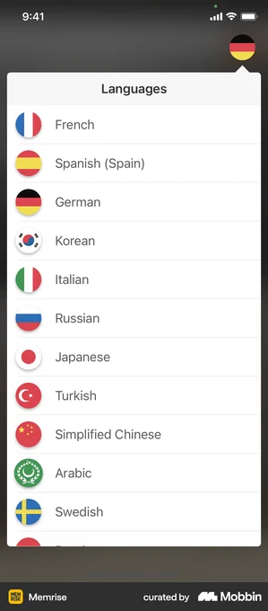 | 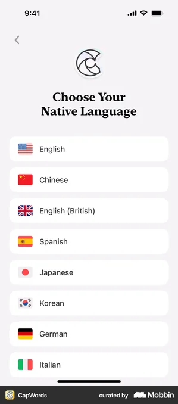 | 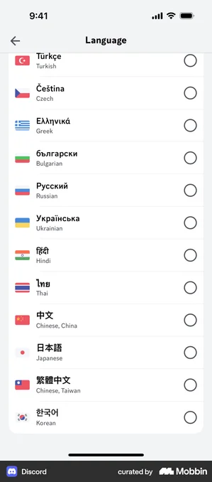 |

- **Drops** — Education app settings combining audio toggles (Sound Effects, Native Assist, Motivational Cheers) AND a Native Language picker on one screen - the exact pattern for this surface. [↗](https://mobbin.com/screens/6d4c3351-1d5b-4c52-bd1a-78b41741ab13)
- **Memrise** — Learning app 'Learning & sound settings' with a clean grouped Audio Preferences block (Audio, Allow music whilst learning, Sound effects) - ideal audio-toggle grouping reference. [↗](https://mobbin.com/screens/b1df65f2-9277-446f-8662-e88ea10d28ba)
- **Memrise** — Education app language picker as a flag-icon list - picture-driven rows readable without text, good for pre-readers choosing a language. [↗](https://mobbin.com/screens/dab49ad5-0447-4d65-a7a4-dd883fc1c90e)
- **CapWords** — Vocab-learning app 'Choose Your Native Language' with big rounded flag cards and generous spacing - large, friendly tap targets suited to small fingers. [↗](https://mobbin.com/screens/177f3688-c3ca-41c4-aa83-cc8c81c3b0e5)
- **Babbel** — Language-learning app interface-language picker with one large flag-card per row - clean big-target list pattern for the language-selection half of this surface. [↗](https://mobbin.com/screens/e3d2274e-edcd-4e06-8c3e-42e920a0f7c9)

**What to borrow:** Borrow Drops' and Memrise's grouped settings layout that separates an Audio/Sound block (master audio, background music, sound effects as clear iOS-style switches) from a Language section, and the flag-icon row pattern from Memrise/CapWords/Babbel where each language is a large card with a recognizable flag plus the language written in its own script. Keep toggles as big, high-contrast switches with a short subtitle explaining each one.

**TimeKids adaptation:** For 4-6 pre-readers, replace text-led rows with large picture-driven tiles (a flag for each Cantonese/English option, a speaker icon for sound, a music-note for music) where every label is also spoken aloud on tap, so children never need to read; make targets oversized with generous spacing for imprecise touch. House these controls in the Parent/grown-up zone behind a parent gate (no punishing or destructive actions reachable by the child), keep the kid-facing toggle to a simple sound on/off, and ensure language/audio prefs and any analytics consent comply with COPPA and HK-PDPO with no third-party data sharing surfaced to the child.

---

## §16 · Content library browse (stories/topics) — coverage: ✅ strong

| Duolingo | Khan Academy | GoHenry | Memrise |
|---|---|---|---|
| 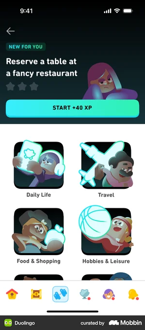 | 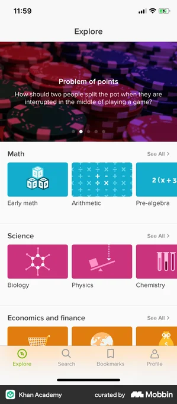 | 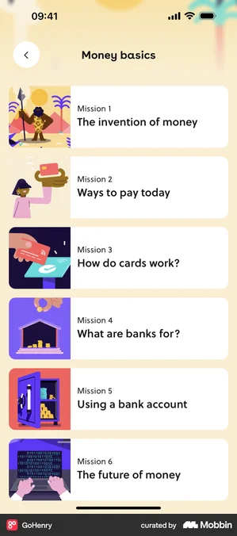 | 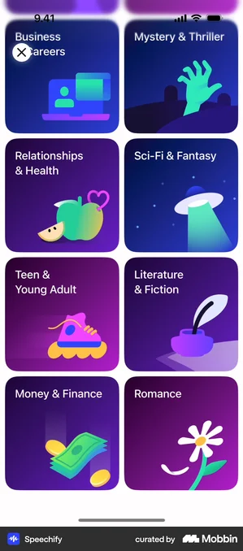 |

- **Duolingo** — Gamified 2-up grid of big illustrated theme cards (Daily Life, Travel, Food & Shopping) with a featured XP-reward banner on top; ideal model for picture-first, playful topic browsing. [↗](https://mobbin.com/screens/a2c34ba6-fe14-401d-b5c2-cd7564c13827)
- **Khan Academy** — Education explore screen with subjects grouped into labelled rows (Math, Science) of colored icon cards plus a featured hero and See All links; strong pattern for organizing many history topics into scannable sections. [↗](https://mobbin.com/screens/2ea63bf9-bfaa-4a05-ae76-374a1cbaba94)
- **GoHenry** — Kid-money education app showing a numbered 'Mission 1...6' list with full-bleed illustration thumbnails and short titles; closest analog to a sequenced, chaptered history-story library for young kids. [↗](https://mobbin.com/screens/79b60f59-c5a4-4a75-9123-d8629ca1516b)
- **Memrise** — Horizontally scrolling rows of bright color-coded topic tiles with progress and an 'info' affordance under section headers; good for showing in-progress vs new story sets at a glance. [↗](https://mobbin.com/screens/7c84d76a-0172-4e7b-8bb5-92ac57699c2e)

**What to borrow:** Borrow the 2-up grid of large illustrated cards (Duolingo) where the picture is the primary tappable element and text is secondary, combined with Khan Academy's pattern of grouping topics into labelled, horizontally scannable sections with a featured hero card at top. Use GoHenry's numbered-mission list with full-bleed illustrations for a clear sequenced order through a story/era, and Memrise's color-coding plus a thin progress bar to signal what's been started or completed.

**TimeKids adaptation:** Make every card image-led with a large embedded play/speaker button so a non-reading 4-6 year old taps the picture (and hears the title auto-spoken in Cantonese/English) rather than reading labels; keep tap targets oversized with generous spacing and at most two cards per row on iPad. Replace numbered text and "See All" with picture chapters and friendly characters, use only encouraging progress (filled stars/stickers, never lock-out or streak-loss punishment), and gate any settings, search, or account/upgrade entry points behind a parent gate so the kid library stays a safe, COPPA/HK-PDPO-compliant zone with no open text input or external links.

---

## §17 · Multi-kid profile switcher — coverage: 🟡 partial

| Disney+ | HBO Max | Netflix 1 | Netflix 2 | LINE |
|---|---|---|---|---|
|  |  | 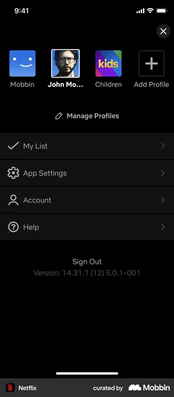 | 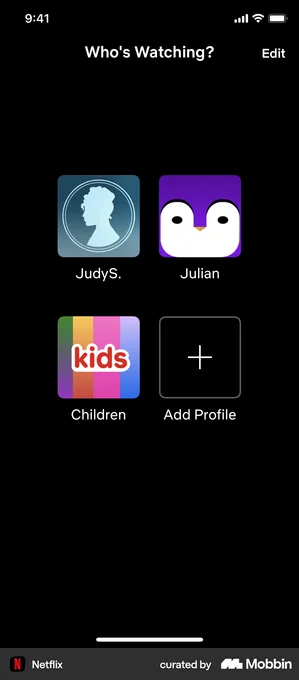 | 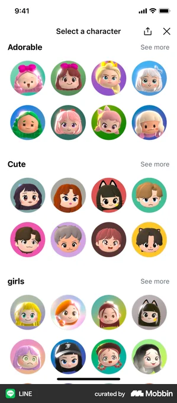 |

- **Disney+** — Best example: playful 'Who's watching?' grid with large round character-avatar profiles, named tiles, lock icons, and a clear Add Profile target over a vibrant background. [↗](https://mobbin.com/screens/fbcb9fd4-1d7c-4aaf-9680-a1f7b671b47e)
- **HBO Max** — Shows a dedicated 'Kids' profile alongside an adult profile with a PIN-lock badge, illustrating the kid-zone vs grown-up-zone gating relevant to the parent gate. [↗](https://mobbin.com/screens/f44beff7-45cf-4a89-b1b3-0fbeb8a2a6e1)
- **Netflix** — Horizontal profile switcher with a distinct rainbow 'Children' tile and Add Profile, plus a 'Manage Profiles' affordance for the parent zone. [↗](https://mobbin.com/screens/31a25353-aea8-44fe-9c32-e3cb0917a495)
- **Netflix** — Clean 2-up square-tile grid with a colorful 'Children' tile and big Add Profile button; good simple layout reference for very few profiles. [↗](https://mobbin.com/screens/56828317-e043-4028-b611-6449437fe8f6)
- **LINE** — Not a profile switcher, but the best example of a kid-appealing avatar-picker: categorized grid of cute 'Adorable/Cute' character faces a child could choose as their profile picture. [↗](https://mobbin.com/screens/f3fea1bd-87cf-4b99-a5c3-1e618e3616da)

**What to borrow:** Borrow the streaming-app "Who's watching?" pattern: a small grid of large, tappable round avatar tiles, one per kid, each with a name and a clearly different "Kids/Children" treatment, plus a prominent "Add Profile" tile. Use lock/PIN badges to mark the grown-up profile, and a separate "Manage Profiles" entry to keep editing out of the child's main flow. For the avatar itself, borrow LINE's categorized grid of cute, illustrated character faces so a child picks identity by picture, not text.

**TimeKids adaptation:** Make every kid tile huge and picture-only (big illustrated character or photo, name spoken aloud on focus/tap) so a 4-6 pre-reader can choose themselves without reading; auto-play a short Cantonese/English voice prompt like "邊個玩? Who's playing?" instead of relying on the header text. Invert the lock logic of the streaming apps: kid profiles are freely tappable and lead into the playful locked Kid zone, while "Add/Manage Profiles" and the grown-up profile sit behind the parent gate with no punishing states. Keep child data minimal (first name or nickname + chosen avatar only, no email/photo upload by the child) to stay COPPA/HK-PDPO friendly, with all account and consent management living in the parent zone.

---

## §18 · Reward shop / avatar dress-up — coverage: 🟡 partial

| Finch 1 | Finch 2 | Mimo | Forest | Duolingo |
|---|---|---|---|---|
|  |  | 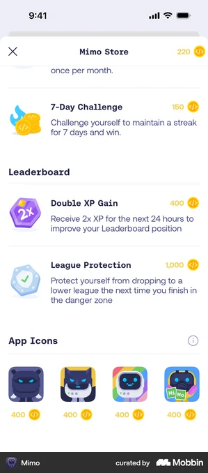 | 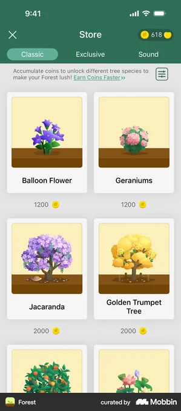 | 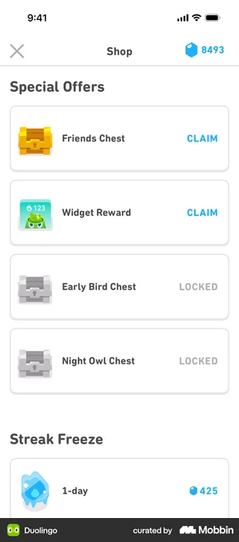 |

- **Finch** — Finch 'Everyday Collection' shop: 4-column grid of cartoon outfit items each tagged with a coin price and a persistent currency balance up top - the cleanest coin-priced reward-shop grid pattern. [↗](https://mobbin.com/screens/9dc19213-f77f-432e-93b8-35256e7604cb)
- **Finch** — Finch dress-up screen: cute character previewed at top, clothing-category icon row, and a big-tile item grid with Items/Appearance toggle - exactly the avatar dress-up loop, with a friendly non-text-heavy layout. [↗](https://mobbin.com/screens/3fba181d-6016-4ac6-a28d-bf43f367ab4a)
- **Mimo** — Education app store: spend earned coins on rewards plus a swappable App Icons row - a direct learning-app precedent for cosmetic/reward purchasing tied to progress currency. [↗](https://mobbin.com/screens/5ebe6ec1-6bb1-4726-a2c4-e9fc1b0d7111)
- **Forest** — Coin store with Classic/Exclusive/Sound category tabs, coin balance in header, and a 2-column card grid of unlockable collectibles each priced in coins - good non-avatar 'spend coins to unlock' layout. [↗](https://mobbin.com/screens/5026f9ce-4e0e-49a5-ae9e-d4d253ce1387)
- **Duolingo** — Duolingo Shop: gem balance in header, Special Offers chests (Claim vs LOCKED states) and priced power-ups - the canonical education-app reward shop with clear locked/unlocked affordances. [↗](https://mobbin.com/screens/102ada31-f18d-4fc0-a66c-73f41d7c3993)

**What to borrow:** Borrow the persistent currency balance pinned in the header, a chunky card/tile grid of purchasable items each showing its coin price, and category tabs (outfits, accessories, backgrounds) to organize cosmetics. From the dress-up flow, take the live character preview at the top with the item picker below so the child sees the change instantly, plus clear locked-vs-owned visual states (greyed chest / checkmark) as in Duolingo and Mimo.

**TimeKids adaptation:** Make it audio-first and picture-driven: every item tile is a large illustrated icon (no item names needed) that speaks its name in Cantonese/English on tap, and the coin price is shown as a count of coin pictures rather than digits. Use only big, tappable targets with celebratory non-punishing feedback - items are simply 'not enough coins yet' rather than failure states, and earning is always additive. Keep purchasing/IAP and any real-money coin packs strictly inside the parent zone behind the parent gate so the child only ever spends earned in-app coins, satisfying COPPA/HK-PDPO by avoiding child-facing commerce and data collection.

---

## §19 · Adventure intro / preview before start — coverage: ✅ strong

| Duolingo 1 | Finch | Duolingo 2 | Brilliant | KakaoBank |
|---|---|---|---|---|
|  |  |  | 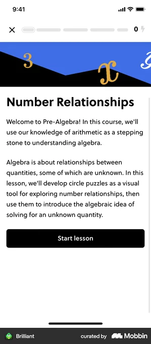 |  |

- **Duolingo** — Adventure framing done right: illustrated isometric scene with a character, a short story-mission prompt ('Help Oscar return a lost passport') and one big blue START button - exactly the playful preview-before-start moment. [↗](https://mobbin.com/screens/72d74d83-acac-42df-85bd-001546b6ebc5)
- **Finch** — Full-bleed illustrated character in a scene with warm encouraging copy and a literal 'Start Adventure!' button - shows how to make the launch feel like stepping into a world, not opening a lesson. [↗](https://mobbin.com/screens/84e8f220-03a6-432a-8e95-9da55e87d860)
- **Duolingo** — Preview-before-start with a character mascot, star/reward icons, two compact stat chips (Level 3 of 3, Earn up to 40 XP) and a big PLAY button - good model for previewing the goal and reward in a glanceable way. [↗](https://mobbin.com/screens/54156104-6c30-4054-bcb4-894041fa5a1f)
- **Brilliant** — Classic lesson-intro layout: illustrated topic header banner, a short 'what this is about' intro and a prominent Start lesson button - the educational-preview pattern to adapt for a history adventure topic card. [↗](https://mobbin.com/screens/5757133d-8fd3-4eec-a2bf-06ae7a2a28bd)
- **KakaoBank** — Non-education app, included as the cleanest example of a 'STAGE 1 START!' splash moment - a centered character card, a countdown/progress strip and bold stage title; useful for the brief animated handoff right before play begins. [↗](https://mobbin.com/screens/956c9f93-5da5-422a-99ae-f1719ca1de83)

**What to borrow:** Open on a single illustrated scene that establishes the adventure (character + setting) plus a one-line mission/story prompt and exactly ONE large primary action button (Start / Play / Start Adventure). Optionally surface 1-2 glanceable preview chips (level, reward/stars, est. time) and an illustrated topic header so the child sees where they are going before committing, then a brief animated 'Stage Start' splash to hand off into play.

**TimeKids adaptation:** Replace all text-dependence with audio-first, picture-driven framing: the mission prompt and topic title should auto-narrate in Cantonese/English with a tappable speaker icon, and the scene art (a historical character/place) carries the meaning for pre-readers, with one oversized, animated START button as the only target. Drop XP/timer/star-pressure mechanics in the Kid zone - keep the preview celebratory and non-punishing - and gate any settings, level-skipping, or progress detail behind the parent gate so the child screen stays a single safe tap, consistent with COPPA/HK-PDPO (no data entry or external links in the kid flow).

---

## §20 · Era / chapter complete milestone — coverage: ✅ strong

| Imprint                                                               | Duolingo 1                                                             | Duolingo 2                                                  | Duolingo 3                                                    | Fabulous                                                      |
| --------------------------------------------------------------------- | ---------------------------------------------------------------------- | ----------------------------------------------------------- | ------------------------------------------------------------- | ------------------------------------------------------------- |
| 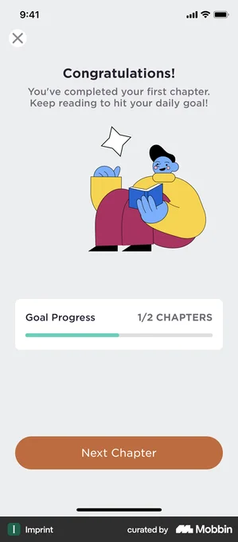 | 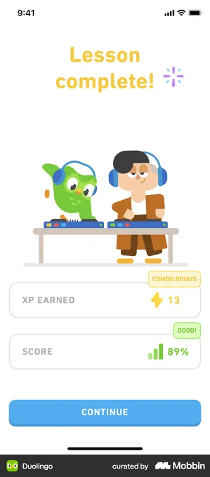 | 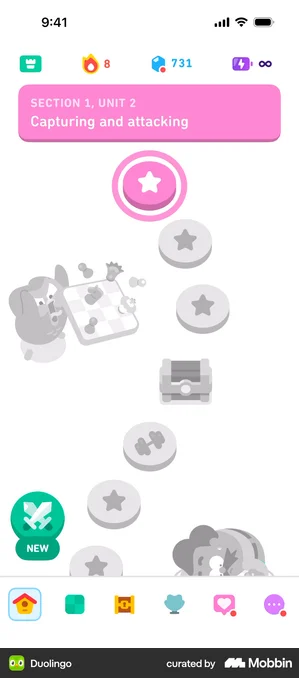 | 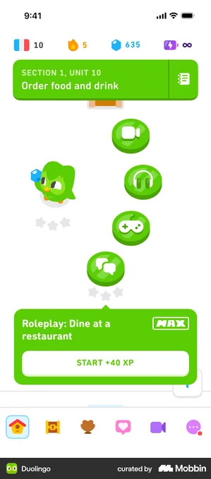 | 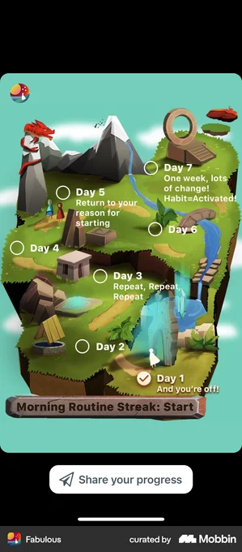 |

- **Imprint** — Near-exact match: 'Congratulations! You've completed your first chapter' with a friendly illustration, a goal-progress bar (1/2 chapters) and a single 'Next Chapter' CTA. [↗](https://mobbin.com/screens/585e1990-dd0e-4e58-8413-07fc335659cd)
- **Duolingo** — Canonical playful celebration: big 'Lesson complete!' headline, hero mascot moment, reward stat cards (XP, score) and one full-width Continue button. [↗](https://mobbin.com/screens/1a2f86c2-d341-4019-acf3-25c2e9ae709a)
- **Duolingo** — Shows the 'what's next' state right after completing: a labeled unit header and a vertical path of star-stamped nodes plus a treasure-chest reward, the map you return to post-milestone. [↗](https://mobbin.com/screens/824aab40-061e-43be-b8cd-bc4890cf370c)
- **Duolingo** — Section/unit progression with completed lesson nodes each earning up to three stars and a clear 'Section 1, Unit 10' header plus next-step XP CTA; good model for visualising an era's chapters as a star-rated path. [↗](https://mobbin.com/screens/fd077091-e8e9-413f-9aff-bb68984e5b04)
- **Fabulous** — Non-education app, included as the strongest illustrated-world 'stars on a map' example: a 3D themed island where completed milestones show a checkmark, ideal inspiration for an era-themed history map. [↗](https://mobbin.com/screens/2d2a01d5-d116-4fd4-a313-b85163d643ce)

**What to borrow:** Borrow the two-beat structure: an immediate full-screen celebration (big headline, hero character/animation, confetti, one clear forward CTA) followed by a return to an illustrated journey map where the just-finished chapter is stamped complete (checkmark or 1-3 stars) and the next node unlocks. Use a single, oversized primary action ("Next Chapter"), a simple visual progress indicator (filled bar or star-rated path nodes), and a tappable treasure/reward marker to pull kids onward.

**TimeKids adaptation:** Make it audio-first and picture-driven: the "Era complete!" moment should auto-play a bilingual Cantonese/English voice cheer with a celebratory animation, and progress should read as pictures (filled-in era map, glowing stars, a stamped era badge) rather than text, numbers, or XP digits a pre-reader cannot parse. Keep one giant tappable target to continue, drop any punishing or streak-loss mechanics (only gains and gentle "more to explore" prompts), and confine all parent-facing data, sharing, and account actions to the parent zone behind a gate, with no child PII collected on the milestone screen per COPPA/HK-PDPO.

---

## §21 · Interactive mini-game (drag/sort/build) — coverage: ✅ strong

| Khan Academy | KakaoBank 1 | Duolingo | Nibble | KakaoBank 2 |
|---|---|---|---|---|
| 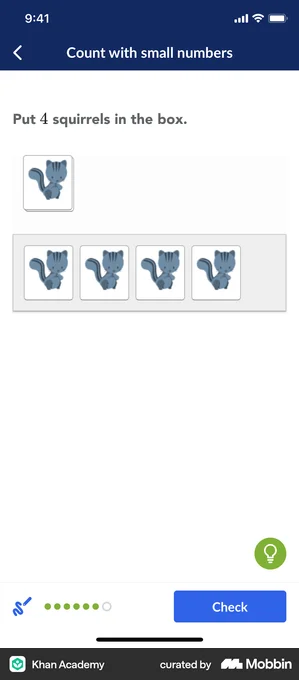 |  | 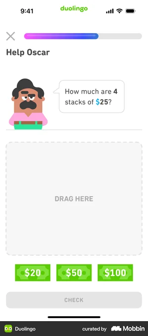 |  |  |

- **Khan Academy** — Drag picture tiles (squirrels) from a tray into a single target box; purely image-driven counting task with big tappable tiles and a clear target zone - the cleanest direct example of the drag-into-box mechanic for young learners. [↗](https://mobbin.com/screens/7c39d23f-f244-4737-b878-df736c14e280)
- **KakaoBank** — Highly gamified sort game: a falling item is dragged into the correct labeled bin among three, with a cute peeking mascot and playful scene. Non-education app, but the best example of the gamified sort-into-categories pattern and visual energy we want. [↗](https://mobbin.com/screens/82d51be0-ae9b-4b5e-b3c0-f6aeb8d15d20)
- **Duolingo** — Explicit large dashed DRAG HERE drop zone with a row of source tiles below and a friendly character posing the prompt - a strong template for signposting the drop target and tile tray layout. [↗](https://mobbin.com/screens/a1dc4887-9f1f-430b-aff6-21dd09b1f21f)
- **Nibble** — Build-a-scene mechanic: a canvas where you tap/drag illustrated component tiles (ingredients) to assemble something, with a level progress bar and star score - the closest match to a 'build' activity that assembles picture pieces. [↗](https://mobbin.com/screens/4a8aac2e-15bb-41ef-8951-60d6bc2ae3c7)
- **KakaoBank** — Pre-game instruction overlay for the same sort game: a friendly card explains the category icons before play. Useful pattern for showing a picture-based legend/how-to-play before the mini-game starts. [↗](https://mobbin.com/screens/7c3bc852-6e29-4b82-aecf-4220ad01a0d8)

**What to borrow:** Use a single clearly-signposted target zone (dashed or highlighted, like Duolingo and Khan Academy) with a separate tray of big, image-only draggable tiles below, so the source and destination are unmistakable. Borrow KakaoBank's gamified framing - a peeking mascot, lively scene, and a pre-game picture legend overlay - to make the activity feel like play rather than a test, and Nibble's build-a-scene canvas with a star/progress bar for the 'build' variant.

**TimeKids adaptation:** Strip all text from tiles and instructions for pre-readers: every prompt, tile label, and the how-to-play legend should be spoken aloud (Cantonese + English) and represented by large pictures or character icons, with a tap-to-replay audio button. Make targets oversized and forgiving with generous snap-to-zone hit areas, celebratory animations and chimes for any reasonable attempt, and never penalize wrong drops (gently bounce the tile back instead of buzzing or deducting). Keep the mini-game entirely in the locked Kid zone with no links, ads, or data entry, gating any settings, progress dashboards, or purchases behind the parent gate to stay COPPA/HK-PDPO compliant.

---

## §22 · Speaking / pronunciation feedback — coverage: ✅ strong

| Duolingo ABC | CapWords | Memrise 1 | Memrise 2 | Duolingo |
|---|---|---|---|---|
|  |  | 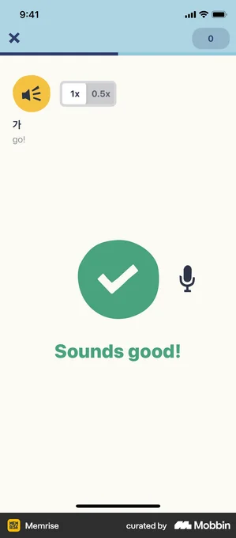 |  |  |

- **Duolingo ABC** — Best direct match: a kids phonics app for pre-readers, with a single huge tap-to-speak mic in a soft target ring beside a picture (mouse) and letter, near-zero text and progress bar at top. [↗](https://mobbin.com/screens/f6fb21c6-fd7d-42c3-9661-b555549584f1)
- **CapWords** — Picture-card word (illustrated flower) with hold-to-speak mic and warmly encouraging non-punishing retry feedback ('You're putting in effort, let's try again!') plus tap-to-hear-ideal-speed replay. [↗](https://mobbin.com/screens/f42babbc-d249-4893-89c8-6b569abff84f)
- **Memrise** — Clean positive success state: big green check + mic icon + 'Sounds good!' — a simple celebratory result pattern that reads instantly without literacy. [↗](https://mobbin.com/screens/1742b55b-89a4-405f-bfb8-f09840927849)
- **Memrise** — Gentle 'not quite' state paired with a large replay/play button, a small mic to retry, and 0.5x slow-down — a soft-fail loop with no penalty, ideal reference for kind correction. [↗](https://mobbin.com/screens/6454676f-9c81-42e5-8085-5392104e890c)
- **Duolingo** — Character-driven 'Repeat after Falstaff' with an audio speech bubble to model the phrase and a large mic/waveform record button — a mascot-led listen-and-repeat layout that suits an audio-first history app. [↗](https://mobbin.com/screens/68634e56-78f8-484d-aedb-a2cb6117d216)

**What to borrow:** One oversized tap-or-hold mic as the single primary target inside a soft glowing ring (Duolingo ABC / CapWords), an audio-bubble or play button that models the phrase first plus a 0.5x slow replay, and friendly state-driven feedback: a big green check + cheerful phrase for success and a warm 'let's try again' with an easy replay/retry loop for misses (Memrise / CapWords). Anchor everything to a picture card and a guiding mascot rather than text (Duolingo).

**TimeKids adaptation:** Drive the whole flow with audio and pictures: a mascot speaks the Cantonese/English word or history phrase, the child taps one huge mic to echo it, and feedback is purely visual-plus-sound (sparkle + happy chime for success, gentle replay-and-retry for misses) with no streaks, scores, timers, or red 'wrong' states that could discourage a 4-6 year old. Keep targets oversized for imprecise taps, never gate progress on perfect speech, and process voice on-device or ephemerally with no recordings stored or shared, surfacing any pronunciation history, mic-permission, and data controls only in the parent zone behind the parent gate to satisfy COPPA and HK-PDPO.

---

## §23 · Parent value-prop onboarding carousel — coverage: ✅ strong

| Duolingo | Nibble | Mimo | Imprint | Kahoot! |
|---|---|---|---|---|
| 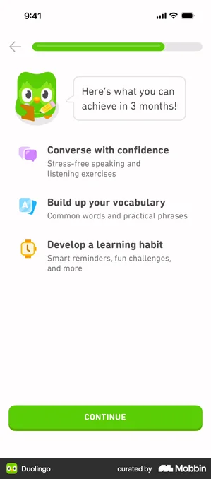 | 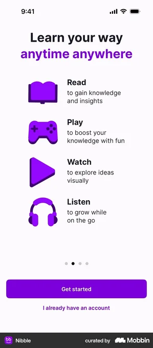 | 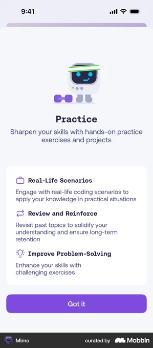 | 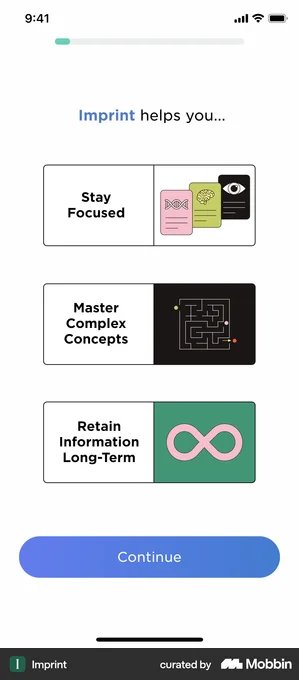 |  |

- **Duolingo** — Mascot speech-bubble framing 'Here's what you can achieve' over three icon-plus-benefit rows; gold-standard outcome-focused value prop with progress bar and single CONTINUE CTA. [↗](https://mobbin.com/screens/0eed678c-da44-4e3a-ba32-c02660e92866)
- **Nibble** — 'Learn your way' lists Read / Play / Watch / Listen as big icon rows - directly maps modality variety (incl. audio/listen) onto a single carousel slide with dots and Get started CTA. [↗](https://mobbin.com/screens/cdb79ab9-e864-4df4-a318-bef874fb5262)
- **Mimo** — Friendly character illustration + headline + a benefit card with three icon bullets and a single 'Got it' button - clean one-slide template for explaining a feature's value. [↗](https://mobbin.com/screens/369586fa-b2de-4dfd-a87c-79c7b09a1b9d)
- **Imprint** — 'Imprint helps you...' with three stacked benefit cards each pairing a short label and a distinct illustration - strong layout for parents skimming concrete learning outcomes. [↗](https://mobbin.com/screens/e406227f-a963-4edd-94cd-b514d3f02890)
- **Kahoot!** — Playful welcome slide with a large kids-learning illustration, one-line 'play learning games' value statement, Next CTA and Privacy/Terms links - sets the gamified, parent-trust tone. [↗](https://mobbin.com/screens/4106d8c4-32cd-4053-ae56-af20343e8ea0)

**What to borrow:** Use a 3-4 slide carousel with dot indicators and a single big primary CTA per slide: one bold outcome headline plus a small set of icon-or-illustration + short-benefit rows (Duolingo/Nibble/Imprint pattern), and a friendly character to carry warmth (Mimo/Kahoot). Frame benefits as concrete child outcomes ("learns history through stories"), keep each slide to one idea, and surface trust/Privacy links discreetly as in Kahoot.

**TimeKids adaptation:** Since this slide is read by the parent (not the pre-reader), text-forward layouts are fine here, but pair every benefit with a large, picture-driven icon and lean on audio/"listen" framing like Nibble to signal the audio-first, no-reading-required experience for the 4-6 child. Keep CTAs to one giant tappable button per slide, no skippable punishment or timers, and place this carousel clearly in the parent zone, ending into a parent gate before any account/COPPA/HK-PDPO consent step so kids never reach setup or data screens.

---

## §24 · Offline download manager — coverage: ✅ strong

| Brilliant 1 | Brilliant 2 | Coupang Play | Skillshare | Headspace |
|---|---|---|---|---|
|  | 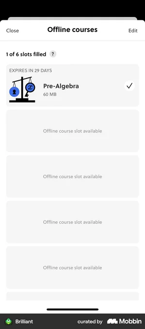 | 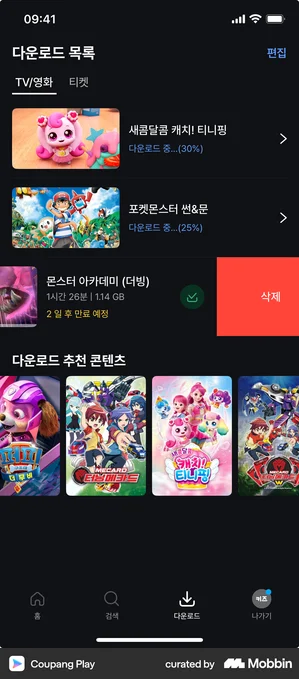 | 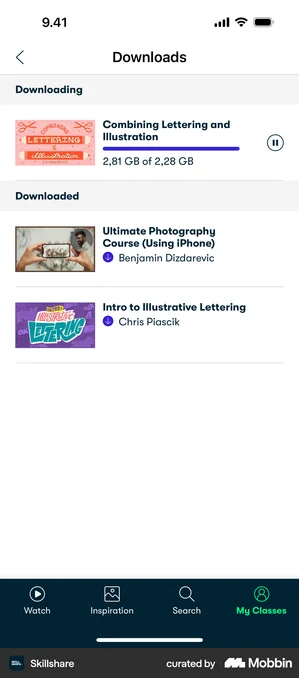 | 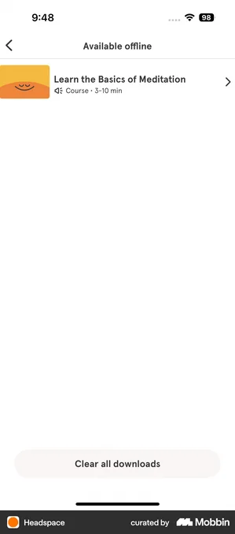 |

- **Brilliant** — Learning-app offline manager with a finite slot grid ('1 of 6 slots filled') and a course downloading with live percentage progress; the slot-card model maps cleanly to a kid-safe, bounded download list. [↗](https://mobbin.com/screens/f2751eb6-6bb7-499b-b4c6-002d5c6feb98)
- **Brilliant** — Completed-download state of the same Brilliant flow: big checkmark, file size (60 MB) and expiry, showing how to confirm 'this lesson is saved and ready' clearly. [↗](https://mobbin.com/screens/596944f1-451b-46eb-b75d-493def78a088)
- **Coupang Play** — Kids download list with large colorful artwork thumbnails, per-item download progress percentages, swipe-to-delete, and a 'recommended to download' shelf; best picture-driven kids example of this surface. [↗](https://mobbin.com/screens/2db8cb01-dd05-482e-b401-c84779bdddbf)
- **Skillshare** — Education-app downloads list cleanly split into 'Downloading' (active progress bar) and 'Downloaded' sections with thumbnails; a clear template for grouping in-progress vs ready content. [↗](https://mobbin.com/screens/c5d27450-a0dc-48c5-bb97-f40087d76433)
- **Headspace** — Minimal, friendly 'Available offline' screen: single soft illustrated course card plus one large 'Clear all downloads' button - good reference for low-clutter, low-stress management. [↗](https://mobbin.com/screens/43d841d6-90be-4f12-8082-874271af24ea)

**What to borrow:** Borrow Brilliant's bounded "slots" model (e.g. "3 of 6 saved") with per-card states - downloading-with-percentage, downloaded-with-checkmark, and size/expiry metadata - so storage stays predictable and self-limiting. Combine it with Coupang Play's large colorful artwork thumbnails and swipe-to-delete, and Skillshare's clean split between a "Downloading" section (live progress bar) and a "Downloaded / ready" section, plus Headspace's single prominent "Clear all downloads" action.

**TimeKids adaptation:** For 4-6 pre-readers, make each saved item a big square cover-art tile (history adventure / character art) with no required text - tapping plays an audio label like "The Great Wall story is ready" - and replace percentages with a simple animated filling ring or progress bear so waiting feels playful, never a failure. Keep the kid-facing zone to a read-only "My saved stories" shelf where they can only tap-to-play; gate all destructive and storage actions (delete, clear all, manage storage, download-over-cellular) behind the parent gate, and keep downloads device-local with no child data leaving the device to respect COPPA and HK PDPO.

---

## §25 · Parent detailed lesson report + transcript — coverage: ✅ strong

| Balance | Speak 1 | Duolingo | Speak 2 | Quizlet |
|---|---|---|---|---|
| 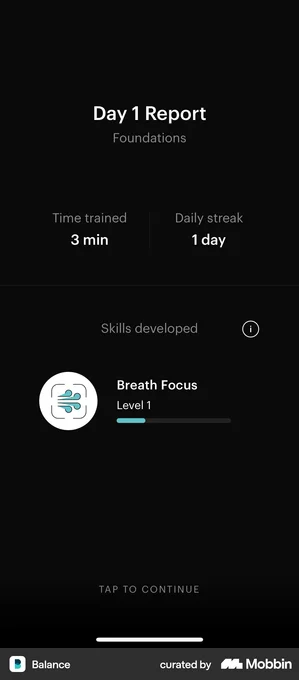 | 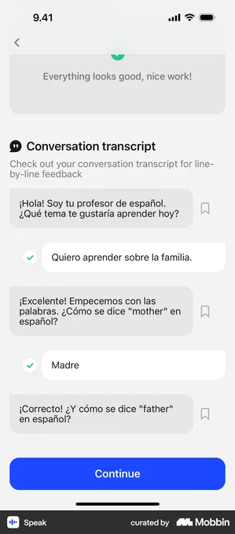 | 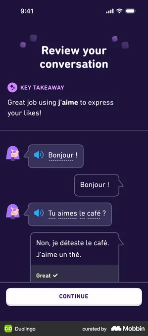 |  | 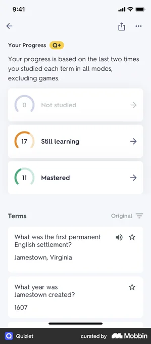 |

- **Balance** — Per-session 'Day 1 Report' with Time trained, Daily streak, and a 'Skills developed' card showing a named skill with a level progress bar - the exact post-lesson report metric layout to borrow. [↗](https://mobbin.com/screens/2299ce1b-e901-44f1-a7cc-4981a693a438)
- **Speak** — Education app's line-by-line 'Conversation transcript' with prompt/response bubbles and green checkmarks for correct turns - the canonical transcript pattern for this surface. [↗](https://mobbin.com/screens/d9115641-90f3-4ee4-9ee7-fff6cdf1c5ac)
- **Duolingo** — 'Review your conversation' transcript with avatar speech bubbles, tappable audio-replay icons, and a positive 'Key takeaway' - audio-first transcript styling that fits a kids/parent recap. [↗](https://mobbin.com/screens/66327b6e-0b5c-4494-995c-079525a19d4b)
- **Speak** — 'History & Usage' lesson-history list with named activities, timestamps, and a usage summary card - the per-lesson activity log a parent drills into for detail. [↗](https://mobbin.com/screens/9d2d3577-07a1-45db-acf1-42dc269d0216)
- **Quizlet** — Education progress detail using ring meters (Not studied / Still learning / Mastered) plus a per-term breakdown list - a clear 'skills learned' mastery model for the report header. [↗](https://mobbin.com/screens/cd7e7bfb-c149-4b86-8e04-2edb01cd8bb3)

**What to borrow:** Lead the report with a compact metric strip (time spent, streak, lessons done) and a "Skills developed/learned" card that names each skill with a level or mastery indicator (Balance's level bars, Quizlet's Still-learning/Mastered rings). Below it, show a per-lesson activity log with timestamps (Speak History) that expands into a line-by-line transcript of bubbles, each correct/attempted turn marked with a checkmark and a tap-to-replay audio icon plus a warm "Key takeaway" summary (Speak + Duolingo).

**TimeKids adaptation:** Keep this entire surface behind the parent gate (parent-only, never shown to the 4-6 child) and present it as plain parent-readable English/Cantonese text and charts, not kid icons. For the transcript, render the child's audio-first answers as replayable clips with picture cues and friendly "mastered / still exploring" labels instead of right/wrong scoring, since pre-readers can't be punished or shamed by a grade. Surface only aggregate skill/time data, store the audio recordings under HK-PDPO/COPPA-compliant consent with an obvious delete control, and avoid any raw child-identifying content in the visible report.

---

## §26 · MORE education storybook / read-along — coverage: ✅ strong

| Duolingo ABC | Duolingo 1 | Duolingo 2 | Duolingo 3 |
|---|---|---|---|
| 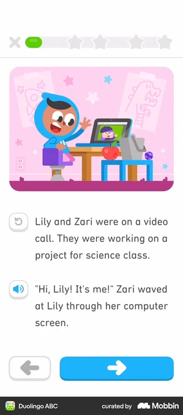 |  |  | 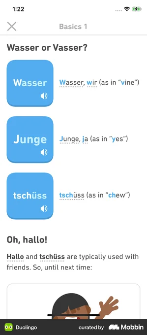 |

- **Duolingo ABC** — Kids read-along page: full-width illustration up top, story text broken into short lines each with its own tap-to-hear speaker icon, plus large back/forward arrows for page turns - the closest direct match to TimeKids. [↗](https://mobbin.com/screens/d0a39189-314a-4bc2-925e-ae0dbad25335)
- **Duolingo** — Narrated story screen with a progress bar, scene illustration, audio-icon prefixed narration lines and a character speech bubble with its own play button - shows how to pair a speaking character with read-along text. [↗](https://mobbin.com/screens/dbd664de-7555-4b13-a22e-e54a41c54212)
- **Duolingo** — Story entry / intro screen ('Listen and read along with a quick story') with friendly mascot and one big primary Start button - a clean template for the audio-first launch into a story. [↗](https://mobbin.com/screens/e52d90f3-38d0-42ae-bba6-fb916ec8082d)
- **Duolingo** — Story-selection library: chunky picture tiles in a grid with NEW badges and reward labels, plus a tooltip CTA - a model for how kids browse and pick a story before read-along. [↗](https://mobbin.com/screens/8f637d2e-9717-4074-b9fc-8da3e62c0803)

**What to borrow:** Break narration into short one-line chunks, each fronted by its own tap-to-hear speaker icon so any line can be replayed, sitting beneath a large scene illustration. Pair a speaking character (avatar + speech bubble with its own play button) with the read-along text, gate each page with oversized back/forward arrows, and front the experience with a single friendly intro screen and a picture-tile story library for selection.

**TimeKids adaptation:** For pre-readers, lead with audio and pictures: auto-narrate each page in Cantonese or English with karaoke-style word/line highlighting synced to the voice, make the speaker icons and page arrows finger-sized tap targets, and let the whole picture be tappable to replay. Drop XP/streak/score pressure inside the kid story zone (keep it warm and endless), reserve any progress dashboards, settings and data collection behind the parent gate, and ship only on-device or pre-vetted local audio with no chat, links or ads to stay COPPA/HK-PDPO safe.

---

## §27 · MORE education learning-path / world map — coverage: ✅ strong

| Duolingo ABC 1                                       | Duolingo ABC 2                                      | Duolingo 1                                        | Duolingo 2                                      | Liven                                             |
| ---------------------------------------------------- | --------------------------------------------------- | ------------------------------------------------- | ----------------------------------------------- | ------------------------------------------------- |
|  |  | 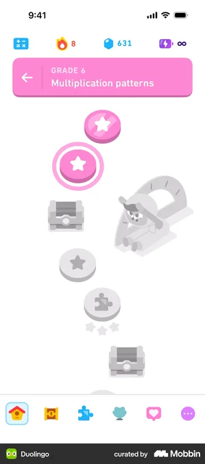 |  |  |

- **Duolingo ABC** — Pre-reader reading app: vertical lesson path with the mascot as the 'you are here' avatar, big locked/unlocked nodes and a winding dotted trail on a themed background - the closest direct match for a kid world-map. [↗](https://mobbin.com/screens/7599d3b5-26c2-466e-98a3-2687ac207c95)
- **Duolingo ABC** — Same path pattern on a fully illustrated 'house/door' scene - shows how to make a learning path feel like a place/world rather than a list, with picture-only locked nodes (no text needed). [↗](https://mobbin.com/screens/8b8197e9-09cc-46d7-9296-49384d03f231)
- **Duolingo** — Canonical gamified learning path: 3D star nodes, treasure-chest rewards, a section header banner and a 'current' highlighted node - the reference template for progress through themed units. [↗](https://mobbin.com/screens/0e28d33f-fd59-48cb-80c5-738ff089cc97)
- **Duolingo** — Path with icon-coded node types (video, headphones, microphone, star) plus a character scene - directly useful for signalling audio/listening vs other activity types on the map without words. [↗](https://mobbin.com/screens/673d73bb-bb22-4481-8f14-7cf966c9e7bd)
- **Liven** — Non-kids but a clean alternative styling: chapter/section grouping with a collapsible header and concentric-ring progress nodes - useful for structuring the History 'chapters as worlds' hierarchy. [↗](https://mobbin.com/screens/d4c3a7a4-8003-4a6d-b030-d880b24c10f3)

**What to borrow:** Borrow the vertical winding-trail learning path with large tappable round nodes connected by a dotted line, a single highlighted 'current' node, a clear locked vs unlocked state, treasure/reward checkpoints, and a section/chapter header banner that gives each stretch of the path a themed identity. Use icon-coded node shapes (as in the Duolingo audio/video path) to differentiate activity types, and place a mascot/avatar token on the trail as the 'you are here' marker.

**TimeKids adaptation:** Recast each section banner as a History 'world' (e.g. Dinosaurs, Ancient Egypt, Old Hong Kong) with a fully illustrated themed backdrop, and make every node picture-only with a big tap target and an audio label that speaks the Cantonese/English name on focus - no reading required. Replace locks and any failure/streak-loss mechanics with gentle 'come back soon' shimmer states and always-celebratory rewards, and keep the map entirely in the playful Kid zone while world unlocks, progress data and any settings live behind the parent gate to satisfy COPPA/HK-PDPO.

---

## §28 · MORE education kids quiz / activity — coverage: ✅ strong

| Duolingo 1 | Duolingo ABC | Duolingo 2 | Duolingo 3 | Khan Academy |
|---|---|---|---|---|
|  |  |  |  |  |

- **Duolingo** — Canonical audio-first picture quiz: a tap-to-play speaker button poses the prompt and the child picks among four large illustrated cards, with a green 'Nice!' success bar — exactly the MORE quiz pattern for pre-readers. [↗](https://mobbin.com/screens/9ab4ea77-71e1-426c-9e31-3bb72c7848ed)
- **Duolingo ABC** — Purpose-built preschool layout: a single large speaker tile as the whole question and a 2x2 grid of big tap targets, zero instruction text — the cleanest no-reading-required answer pattern for ages 4-6. [↗](https://mobbin.com/screens/081147eb-05b0-4eb5-9dce-6dc42b59f4a8)
- **Duolingo** — Shows the answer-selection state: an image tile with an embedded replay speaker, a stacked list of choices, a highlighted selected option, and a persistent CHECK button — a model for 'tap an answer, then confirm' interaction. [↗](https://mobbin.com/screens/84e04211-d431-4f74-a9bc-3848af71bc7f)
- **Duolingo** — Matching activity where the left column is audio waveform speaker buttons (not text) paired against the right column, plus a full-bleed character scene up top — a good audio-driven matching variant for a history MORE activity. [↗](https://mobbin.com/screens/5da952d5-cf7f-494e-b276-bd46beef1989)
- **Khan Academy** — Non-Duolingo education example for variety: a drag-the-pictures-into-boxes counting activity with an inline 'Watch a video' hint, progress dots and a Check button — useful for the hint/scaffold and drag-interaction patterns. [↗](https://mobbin.com/screens/33a0cee6-2c93-4637-a9c5-d31be149afae)

**What to borrow:** Borrow the audio-first quiz frame: a prominent tap-to-replay speaker button as the question itself, answers presented as a small set of big illustrated picture cards (2x2) or large stacked tiles, a single clear primary action (Check/Continue), and a warm full-width success state. Selected-answer highlighting plus an embedded replay control and an optional 'watch a hint' scaffold keep the loop forgiving and self-paced.

**TimeKids adaptation:** For pre-reading 4-6 year olds, drive every history question and answer with Cantonese/English audio plus a picture so nothing requires reading; replace text-only matching tiles with illustration or audio-waveform tiles, keep 2-4 oversized tap targets with generous spacing, and auto-narrate on screen entry with a tappable replay. Make wrong answers gently bounce-and-retry (no streak loss, timers, or red 'fail' screens), and confine all quiz/activity play to the locked Kid zone while any settings, progress, or data lives behind the parent gate to stay COPPA / HK-PDPO compliant.

---

## §29 · MORE education lesson-complete celebration — coverage: ✅ strong

| Duolingo 1 | Duolingo 2 | Duolingo 3 | Duolingo 4 | Duolingo 5 |
|---|---|---|---|---|
|  |  |  |  |  |

- **Duolingo** — Mascot celebration with a big yellow praise headline plus three color-coded stat cards (XP / Speed / Accuracy) and one primary Claim button - the canonical education lesson-complete pattern. [↗](https://mobbin.com/screens/bf8e9ac3-9e61-4ccf-a63d-538209327e00)
- **Duolingo** — Stripped-back single-mascot + confetti praise moment with no stats - the simplest, most picture-driven celebration, ideal as a transient reward beat for pre-readers. [↗](https://mobbin.com/screens/92705902-10f2-4dd7-b46f-21fe7732cfff)
- **Duolingo** — Animated mascot 'taking a bow' with warm praise copy and the same stat-card trio - shows how character animation carries the emotional payoff of finishing. [↗](https://mobbin.com/screens/8890cd2b-0375-4eea-963d-58a1fdc79f00)
- **Duolingo** — Three-star reward rating above a happy mascot - the universally legible 'how well you did' signal that pre-readers understand without text. [↗](https://mobbin.com/screens/5ebbb76b-1506-4fac-ac3d-f3315704a323)
- **Duolingo** — Treasure-chest currency reward ('+11 gems') with a single Continue CTA - the tangible collectible-reward variant of the completion screen. [↗](https://mobbin.com/screens/d6945317-2f82-4264-8695-fda0e3f115de)

**What to borrow:** Borrow the core completion beat: a big animated mascot with confetti/sparkles, one short celebratory headline, and an optional row of color-coded reward chips (stars, a currency icon, or simple stat tiles) sitting above a single dominant primary action. Keep exactly one path forward (Continue / Claim) and use the mascot animation, not text, to deliver the emotional payoff. The three-star rating and treasure-chest reward give two clean, picture-only ways to signal "you did great" and "here is your prize."

**TimeKids adaptation:** Replace all reading-dependent stats (XP numbers, percentages, timers) with picture-only rewards - earned stars, a collectible history-themed token (e.g. a stamp or relic going into a chest), and a spoken Cantonese+English "Well done!" that auto-plays so the celebration is fully audio-first. Make the single forward control one oversized, brightly outlined tap target with a mascot voice prompt, never a punishing or comparative score, and route any parent-facing progress detail behind the parent gate so the kid zone stays pure positive reinforcement while keeping data collection minimal and on-device for COPPA / HK-PDPO safety.

---

## Still-missing surfaces to consider (from completeness critics)

Surfaces absent from **both** Part 1 and Part 2. "Ref likely?" = whether mainstream apps on Mobbin would plausibly have a good example to gather next.

| Surface | Why it matters for TimeKids | Ref likely? | Suggested Mobbin search |
|---|---|---|---|
| **B2B teacher/classroom dashboard (multi-student roster overview)** | The brief explicitly calls out a B2B-ready kindergarten/teacher path, yet nothing in Part 1 or 2 covers the teacher's classroom view: a roster of pupils, per-class progress at a glance, who finished today's adventure, class-level mastery. This is the core surface that makes the B2B story real and is structurally different from the single-child parent dashboard (§9). | yes | teacher classroom dashboard student roster progress |
| **Teacher: assign content / lesson plan to a class** | A teacher needs to pick an era/adventure and assign it to the whole class or groups, optionally schedule it. No assignment-creation surface exists. Essential to the kindergarten path and distinct from the kid-facing library browse (§16). | yes | teacher assign lesson to class create assignment |
| **Classroom / school onboarding & student roster setup (join code, bulk add, seats)** | B2B requires a way for a school/teacher to create a class, add pupils in bulk (no per-child parent email), and distribute a join/class code or seat licenses. Parent onboarding (§1) is single-buyer and does not cover institutional account creation or roster import. | yes | classroom setup join code add students roster invite |
| **Child-safe AI chat guardrail / fallback UI ("I can't help with that" + safe redirect)** | The AI character chat is a defining, regulated feature. There is precedent for the happy path (§5) but no surface for when the child says something off-topic/unsafe, when the model must refuse, or when it gently redirects back to picture choices. For COPPA/PDPO and child-safety this guardrail state must be designed and shown. | yes | AI chatbot safety refusal fallback can't help redirect |
| **Parent AI-chat controls & transcript review / safety settings** | Parents of 4-6 year-olds will expect to review what the AI said, set chat boundaries (on/off, topic limits), and report a concerning response. §25 covers a lesson report+transcript but not parent-facing AI safety controls or a report/flag mechanism. Compliance-critical. | yes | parental controls AI chat history review report content |
| **Privacy / consent detail screen + data rights (delete/export child data)** | COPPA & HK PDPO require verifiable parental consent and data subject rights. Only an inline consent line is noted in §1. A dedicated consent/privacy screen and a data management surface (delete child profile & data, export) is missing and legally important. | yes | privacy consent data deletion export account kids COPPA |
| **History timeline / "long ago vs today" comparison surface** | This is the history-specific UX that makes TimeKids not just another lesson app. The era map (§3) is a node path, not a timeline. A horizontal time-scrubber showing where an era sits relative to "now," and a then-vs-now compare view (e.g. ancient home vs modern home), is core to teaching time to pre-readers and has no current representation. | no — custom | timeline scrubber history then and now comparison kids |
| **Search within content library** | §16 covers browse-by-topic but not search. Even a pre-reader app needs a parent/teacher-facing search (and possibly icon/voice search for kids) to find a specific era or character. Missing. | yes | search results education content library voice search |
| **Manage subscription / billing & plan management (restore, cancel, switch)** | §11 paywall is partial and only covers the sell. The post-purchase surfaces — current plan, renewal date, switch/cancel, restore purchases, family/seat management for B2B — are absent and are required by App Store and for retention. | yes | manage subscription billing restore purchase cancel plan |
| **Returning-user / sign-in & account recovery** | All onboarding shown is first-run. A returning parent on a new device needs login, and account recovery (forgot PIN / password). No sign-in or recovery surface exists, and forgot-PIN is specifically needed given the parent-gate PIN (§8). | yes | login sign in forgot password account recovery |
| **Error / empty / loading / no-content states** | Across the whole product there is no representation of failure and empty states: failed to load an adventure, no internet (vs §24 download manager), empty museum before first artifact, content still downloading. For an audio-heavy iPad app aimed at kids, friendly error/loading states are essential and currently absent. | yes | error state empty state loading no connection kids app |
| **Accessibility & input-needs settings (captions, reduced motion, dyslexia/large text, switch/assistive)** | §15 covers language + audio toggles only. For pre-readers and special-needs children an explicit accessibility surface (narration speed already noted, but also captions on/off, reduced motion, high-contrast, larger touch targets, left/right-hand) is a gap and is part of the stated accessibility concern. | yes | accessibility settings reduced motion captions text size |
| **Help / support / contact & FAQ (parent zone)** | No support surface exists. Paying parents and B2B buyers need a help center, contact/feedback, and FAQ. Standard and expected behind the parent gate. | yes | help center support FAQ contact us settings |
| **Re-engagement / win-back & "come back" surface (in-app, post-notification)** | §13 covers notification permission priming and §12 daily quest, but not the re-engagement landing the child/parent sees after being away (welcome-back, streak-safe "your guide missed you", new content available). For this no-streak-guilt age the gentle return moment must be designed distinctly. | yes | welcome back re-engagement come back screen app |
| **New content / "new era unlocked" announcement & what's-new** | A live content app needs a way to surface newly added eras/adventures to returning families (and teachers). No what's-new or content-drop announcement surface is covered; it supports retention and justifies subscription. | yes | what's new feature announcement new content unlocked |
| **Teacher / parent detailed reporting export & print (B2B reporting)** | §25 covers a single detailed lesson report for a parent. B2B kindergartens typically need class-level reports they can export/print/share with parents at term end. This institutional reporting/export surface is missing. | yes | class report export PDF print analytics teacher |
| **App Store / install & first-launch splash + age-gate / language pick** | The very first run — language choice (Cantonese/English), splash, and the initial "is a grown-up setting this up" age gate before onboarding — is not represented. Bilingual HK launch makes the first-language pick load-bearing. | yes | app first launch splash language selection onboarding |
| **Interactive era scene / explorable diorama (tap hotspots in a historical setting)** | The core HISTORY-domain surface: a full-screen illustrated past scene (e.g., a Tang dynasty market, a 1950s Hong Kong street) where a pre-reader taps glowing hotspots to trigger narration, animation, or a fact. This is the heart of an audio-first history app and is absent from the board. Generic Mobbin apps (Duolingo, Khan) are list/card/lesson-step UIs and rarely ship a free-explore illustrated scene with points-of-interest tuned for non-readers. | no — custom | interactive scene hotspot tap explore children picture book |
| **Child-comprehensible visual timeline (chronology for non-readers)** | A timeline a pre-reader understands (faces, objects, color-coded eras, a draggable time-slider or a train moving through ages) is intrinsic to teaching 'when' in history. The board has a home time-map and edu learning paths, but a true past-to-present ordering surface is distinct and has no obvious pre-reader analog on Mobbin; adult timeline UIs exist but not 4-6yo ones. | no — custom | timeline history kids chronology scroll ages visual |
| **Past-vs-present comparison / then-and-now reveal** | A signature history teaching device (same place or object then vs now, side-by-side or before/after wipe slider) framed for pre-readers. No board surface covers comparison UI. Closest Mobbin analogs are real-estate or photo before/after sliders, not a child-framed learning moment with audio. | no — custom | before after comparison slider then and now image reveal |
| **AI character chat refusal / redirect (the safety guardrail moment)** | Section 5 covers normal picture-choice chat, but the child-safe SAFETY surface (what the child sees when the AI declines, redirects an off-topic or unsafe input, or hands off to a parent) is its own screen and is missing. Mobbin will not have COPPA/PDPO-grade kid-facing refusal UI; this is bespoke trust-and-safety design. | no — custom | ai chat guardrail safety refusal kids assistant boundary |
| **Parent/teacher AI transparency & chat-log review (what did the AI say to my child)** | A bilingual, child-safe AI app legally and commercially needs a parent-facing view of AI conversation transcripts with flagging/report controls, distinct from the section 25 lesson report. No board surface covers AI-output auditing or content-controls. Reference apps with this are rare. | no — custom | parent controls ai chat transcript review report kids |
| **Mic / record permission priming + listening state for speaking activities** | Voice feedback (22) is gathered, but the upstream MICROPHONE permission prime plus the active 'I'm listening' affordance for a non-reader (big animated mic, waveform, character cupping ear) is a separate surface and not on the board. Notification permission (13) is covered but mic is not. | yes | microphone permission listening recording kids speak |
| **Kindergarten / teacher classroom dashboard (B2B path)** | The brief names a B2B kindergarten/teacher path, but every gathered parent surface is single-household. A teacher view (roster of many kids, class assignment, whole-class progress, license seats) is a whole missing surface. EdTech B2B dashboards exist on Mobbin but none for pre-reader history. | yes | teacher classroom dashboard student roster education progress |
| **Bilingual language-pairing / Cantonese-vs-English mode at content level** | Settings (15) has language/audio toggles globally, but an in-context bilingual surface (per-story language pick, dual-subtitle Cantonese+English, jyutping vs characters) is intrinsic to a HK bilingual product and unaddressed. Mobbin language toggles are UI-locale switches, not simultaneous-bilingual learning modes. | no — custom | bilingual dual language toggle subtitles learning content |
| **Empty / pre-content first-run state of the time-museum collection** | Collection (10) and shop (18) assume populated states. The zero-state of an artifact/sticker museum for a brand-new child (locked silhouettes, 'collect your first artifact' prompt) drives early retention and is a distinct surface not called out. | yes | empty collection locked items first item onboarding gallery |
| **Error / no-connection / interrupted-audio recovery for a non-reader** | An audio-first app needs a wordless error and loading/buffering state a 4-6yo can act on (character shrugs, retry as a big icon, offline fallback). No board surface covers failure states; offline (24) is download management, not runtime failure. Mobbin error screens are text-heavy and adult. | yes | error state no connection retry kids illustration friendly |

## True gaps — design custom (no good off-the-shelf reference)

The genuinely bespoke design work; do these as design sprints, not Mobbin lookups.

- History timeline scrubber for pre-readers: a visual 'how long ago' device (placing dinosaurs vs Egypt vs knights vs today on a child-legible time ribbon) — no mainstream app teaches deep-time to non-readers, must be designed.
- Then-vs-now / 'long ago vs today' comparison interaction (side-by-side or swipe-reveal of an era scene vs the modern equivalent) — history-pedagogy-specific, no off-the-shelf reference.
- Era scene art with tappable hotspots (tap an object in the illustrated world to hear its Cantonese/English name) — already flagged custom in the existing notes; confirmed still custom, it's the core content-art workstream.
- Cantonese word-level read-along highlight timing driven by TTS — already flagged open; a technical+UX custom build with no reference, depends on the realtime-AI spike.
- Bounded AI-chat guardrail UX specifically tuned for a 4-6 pre-reader (picture-only safe redirect, no text refusal a child can't read, audio reassurance) — generic chatbot refusals don't translate to this audience; must be designed.
- Time-machine transition / travel moment between eras (the signature 'we are travelling to Ancient Egypt now' beat that ties the map node to the story player) — brand-defining motion/sound moment with no direct reference.
- Artifact-to-museum 'claim' bridge tuned as a deep-time reward (placing the earned artifact onto the correct era shelf reinforcing chronology) — partially referenced (Headway claim) but the chronology-teaching layering is custom.
- Explorable era scene with tappable hotspots: a full-screen illustrated historical setting where a pre-reader taps glowing points-of-interest to trigger audio narration, micro-animations and facts; this is the signature history-as-play surface and has no generic-app equivalent.
- Pre-reader visual timeline: communicating chronology (long-long-ago vs today) to a 4-6yo via faces, objects and color-coded eras with a draggable time slider, rather than dates or text.
- Then-and-now comparison: a child-framed before/after or side-by-side reveal of the same place or object across eras, with audio explaining the change, designed for non-readers.
- Diorama-style time-museum: collected artifacts displayed as an explorable 3D-ish history exhibit (tap an artifact to hear its era story) instead of a generic sticker/badge grid.
- Child-facing AI guardrail states: the wordless, character-mediated way the AI declines, redirects an off-topic or unsafe input, or pauses and suggests asking a grown-up, so the boundary feels friendly rather than like an error.
- Picture-only bounded chat input: a no-free-text conversation model where the child only ever picks from illustrated answer choices, including how new choice sets are surfaced and how dead-ends are avoided for a non-reader.
- Parent/teacher AI transparency: a trust-and-safety surface where adults can read AI conversation transcripts, see what was filtered, and flag/report, required by COPPA/PDPO and absent from generic apps.
- Cantonese word/character-level read-along highlighting: syncing audio to Chinese text that has no inter-word spaces and is tone-driven, including character grouping and a karaoke-style sweep tuned for kids who cannot yet read.
- Simultaneous-bilingual content mode: per-story or per-line Cantonese+English presentation (dual narration, dual or jyutping subtitles, language switch mid-story) that goes beyond a UI-locale toggle.
- Kid-zone blended with the AI character: the persistent narrator/companion that appears across home, story, quiz and reward as one continuous character presence (reacting to taps, cheering, ear-cupping to listen) rather than a chat screen siloed away from gameplay.
- Wordless failure and listening states: error, buffering, no-connection and active-microphone affordances a 4-6yo can understand and act on without reading (character gestures, big single-icon retry, waveform).
- Pre-reader navigation grammar overall: tap targets, audio labels on every control, and no-text wayfinding so a child who cannot read can move between scenes, eras and activities independently.
- Teacher/classroom B2B layer: whole-class rosters, seat licensing and per-child era assignment layered onto a product whose entire gathered design assumes a single home parent.

## Flagged thin coverage

- **11-paywall** — Marked partial and is Duolingo-only (adult). Missing post-purchase management, free-trial-of-a-kids-app framing, and B2B/seat pricing. No HK payment-context (local methods) reference. Needs a manage-subscription companion surface.
- **14-screentime** — Marked partial and the references skew to adult self-limiting apps (Instagram, TikTok, Opal). For 4-6 the limit is parent-set, not child-self-set; a parent-configured daily-limit + child-facing gentle "time's up, see you tomorrow" pair needs clearer kid-appropriate references.
- **17-profiles** — Marked partial; references are streaming-app profile pickers (Disney+, Netflix). Missing the kid-safe switch flow where leaving a child profile requires the parent gate, and how it ties to per-child progress/data separation for COPPA.
- **18-shop** — Marked partial and references include coin/IAP-style reward shops (Mimo, Duolingo). For a child-safe app the shop must be earned-currency only (no kid-facing purchase), and dress-up should map to era costumes. Risk that referenced patterns imply real-money or open purchase a 4-6 app must avoid.
- **05-chat (character chat)** — Strong on the happy path but the bounded/guarded nature (refusals, off-topic handling, escalation to parent) — the part that actually satisfies child-safety requirements — has no reference. The compliance-defining states are uncovered.
- **5-character chat (picture-choice)** — Likely sourced from generic chat/assistant UIs. It almost certainly lacks the BOUNDED guardrail states (decline, redirect, off-topic deflection, parent handoff) and the picture-only (no free text) input model for pre-readers. The happy-path bubble flow is covered; the safety and constraint design is not.
- **4-story player (read-along) and 26-story-edu** — Sourced from Duolingo ABC which highlights at WORD level for ENGLISH/phonics. Cantonese word-level / character-by-character sync highlighting (no spaces between words, tone-driven, character grouping) is a hard custom problem these references do not solve. Read-along coverage is strong for English, weak-to-absent for Cantonese.
- **10-time-museum / collection and 18-shop** — Marked partial. Pulled from habit/avatar apps (Finch, Forest, Duolingo). The HISTORY-specific framing (artifacts tied to real eras, a museum-diorama display rather than a generic sticker grid, tap-an-artifact-to-hear-its-story) is the custom part and probably not represented.
- **3-home / time-map** — A time-map that doubles as history navigation (eras as destinations a pre-reader recognizes) is more than a generic learning-path home. If sourced from standard path/home screens it misses the chronological, place-and-era semantics that make it a history map rather than a level select.
- **11-paywall and 17-profiles and 14-screentime** — All marked partial. Paywall (4 screens, Duolingo) is generic adult-subscription and skips the parent-gate-before-paywall child-safety nuance; multi-kid profiles (Disney/Netflix) are media-consumption switchers, not COPPA kid-account creation with per-child age/era settings; screen-time is borrowed from adult wellbeing apps (Opal, Instagram) and not framed as a gentle character-led 'time to rest' for a 4-6yo.
- **22-voicefeedback** — Strong but sourced from pronunciation apps (CapWords, Duolingo, Speak) that judge ENGLISH phonemes. Cantonese tone/pronunciation feedback for a pre-reader, and the gentle non-punitive framing required for a 4-6yo who cannot read corrective text, is a custom layer the references do not cover.

## Critic notes

> Source of truth read: /home/lmt/Projects/personal/obsidian-sync/Personal/App Ideas/TimeKids/design-research/screen-references.md (sections 1-10) plus the Part 2 gathered list (11-29) and image filenames in the same images/ folder. The existing notes' own 'Gaps / to design custom' (lines 138-143) already flag: Cantonese read-along highlight timing and era-scene tappable hotspots as custom — I carried those forward and expanded.

Highest-priority genuine gaps, ranked: (1) the entire B2B teacher/classroom/roster/assignment/class-reporting cluster — explicitly in the brief but completely unrepresented; (2) child-safe AI chat guardrail + parent AI-safety controls — the compliance-defining states; (3) history-specific timeline / long-ago-vs-today UX — the thing that differentiates TimeKids from generic Duolingo-clone coverage and is the weakest-covered conceptually despite many education references; (4) privacy/consent detail + data delete/export for COPPA/PDPO; (5) post-purchase manage-subscription. 

Coverage is currently very deep on the Duolingo-style kid lesson loop and parent monetization, but thin-to-absent on institutional, safety/compliance, history-pedagogy, and the unglamorous system states (errors/empty/loading, sign-in/recovery, support). Recommend the next Mobbin pass prioritize teacher/classroom apps (e.g. ClassDojo, Seesaw, Google Classroom, Khan Academy for Teachers, Kahoot teacher) and AI-safety/parental-control patterns, since those are where references plausibly exist; reserve design-from-scratch effort for the history-timeline and tappable-era-scene workstreams where Mobbin will not help."

> This is an analysis-only task; I did not read files in the images directory since the work is reasoning over the TimeKids spec versus what Mobbin-style boards contain. Highest-priority genuinely custom work (no good reference will exist): the explorable hotspot era scene, the pre-reader visual timeline, then-and-now comparison, the child-facing AI guardrail/refusal states, Cantonese character-level read-along sync, and the parent/teacher AI transcript-review surface. Surfaces that LOOK covered but are thin where it matters: section 5 chat (happy-path only, missing guardrails and picture-only input model), story player / voicefeedback (English-centric sources that do not solve Cantonese), and the collection/shop/home (sourced from habit/media apps, missing the history-domain semantics). Whole surfaces missing from the board: mic-permission + listening state, teacher/classroom B2B dashboard, bilingual content-level mode, collection zero-state, and wordless runtime error/recovery states. Recommend treating the design_custom_gaps items as bespoke design sprints rather than Mobbin-reference-driven, and re-scoping the 'partial' surfaces (11, 14, 17) because their borrowed adult references miss the child-safety framing."
