# TimeKids — Screen References, Part 3 (B2B, safety & system surfaces)

> Targeted multi-agent Mobbin sweep filling the *"reference likely exists"* gaps from the [[screen-references-2|Part 2 gap analysis]]: the **B2B teacher/classroom** cluster, the **AI-safety / parental-control** cluster, and the **system/lifecycle** surfaces. Companions: [[screen-references|Part 1 (§1–§10)]] · [[screen-references-2|Part 2 (§11–§29)]]. Images in `./images/` (prefixes 30–46). Coverage badge = fit for TimeKids' actual context (kids/education, teacher/classroom, or parental-control).

**Clusters:** §30–§34 B2B teacher/classroom · §35–§39 AI-safety & parental controls · §40–§46 system/lifecycle

---

## §30 · Teacher classroom dashboard (roster + class progress) — coverage: 🟡 partial

| Remind 1 | Remind 2 | Remind 3 | Khan Academy | Coursera |
|---|---|---|---|---|
| 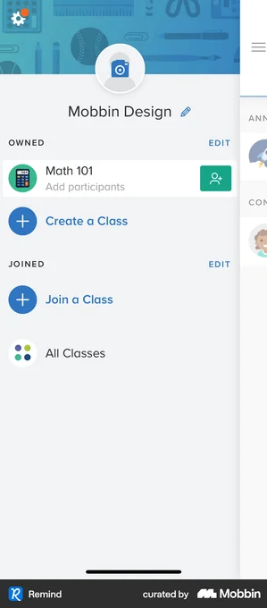 | 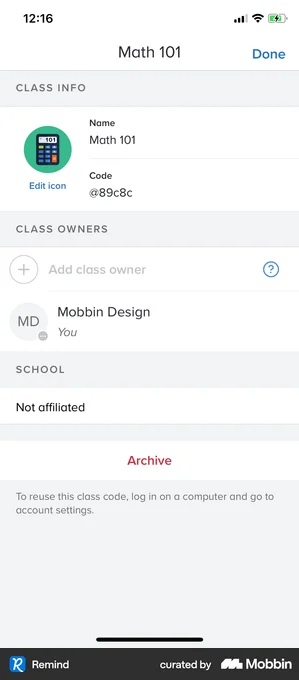 | 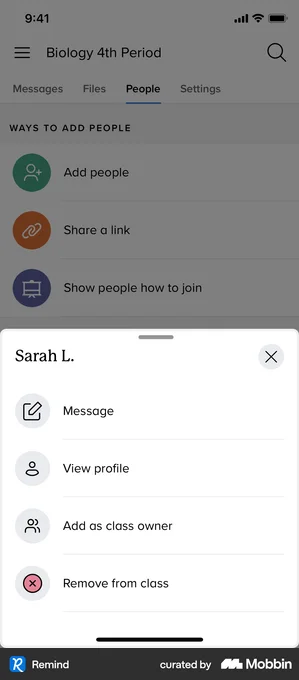 |  | 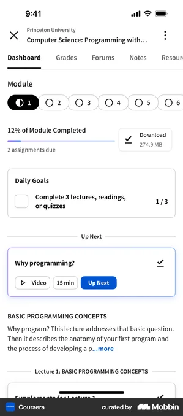 |

- **Remind** — Real classroom-comms app: teacher home listing owned/joined classes (Math 101) with Create/Join a Class - the core class-switcher pattern for a teacher landing surface. [↗](https://mobbin.com/screens/53a47886-4118-43da-af3c-d71fc900bf84)
- **Remind** — Teacher account showing multiple owned classes (Biology 4th Period, Parent support group) each as a tappable row with class icon - good model for a multi-class teacher dashboard entry. [↗](https://mobbin.com/screens/c5b45aac-1d22-4776-a275-3f20883df4a3)
- **Remind** — People tab roster with per-student action sheet (Message, View profile, Add as class owner, Remove from class) - the roster-row tap-to-manage pattern a teacher needs. [↗](https://mobbin.com/screens/0cc6ff52-b57b-4514-beae-c443c4e8ac93)
- **Khan Academy** — Mastery-points progress (1,300/12,100 = 11%) with per-topic completion bars; learner-facing not teacher-facing, but the clearest at-a-glance progress/mastery visual to reframe as a class-progress overview. [↗](https://mobbin.com/screens/95727dfd-9972-4dc6-ad1d-27140eaea02d)
- **Coursera** — Dashboard with module-completion percentage, assignments-due count and Up Next - adult/cross-domain learner view, useful only as a layout reference for a compact progress + next-action card. [↗](https://mobbin.com/screens/54680868-df5b-4260-8c11-c5d1cd6064f4)

**What to borrow:** From Remind: a teacher landing that lists classes as large tappable icon-rows (owned vs joined), a People/roster tab where each student is a row, and a tap-to-open action sheet for per-student management (message, view profile, remove). From Khan Academy/Coursera: an at-a-glance progress summary using a single percentage plus per-item completion bars and a "what's next / assignments due" count so a teacher reads class status in one screen.

**TimeKids adaptation:** This is a grown-up (teacher) zone, so it lives behind the parent/teacher gate, uses a denser data-table layout rather than the playful pre-reader kid zone, and shows aggregate class progress (e.g. % of children who finished a Timi history story) plus a per-child roster with Chinese-name + English-name display for Hong Kong bilingual classrooms. Keep progress framing encouraging not punishing - show stories completed and badges earned, never leaderboards, red "behind" flags, or rankings of children against each other. Only show teacher-entered class data and avoid exposing identifiable child PII beyond what the kindergarten provides, with no child-facing accounts, to stay COPPA / HK-PDPO compliant.

---

## §31 · Teacher: assign content / lesson to a class — coverage: 🟠 weak

| Kahoot! | Remind | Spark Mail | Microsoft Teams |
|---|---|---|---|
| 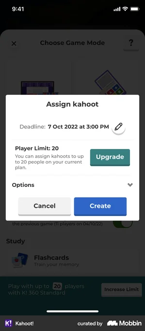 | 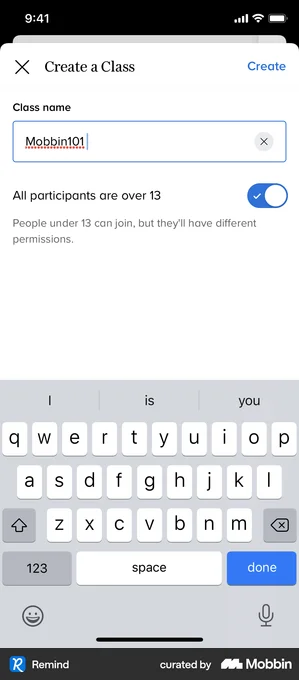 | 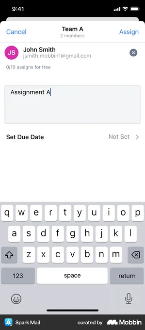 | 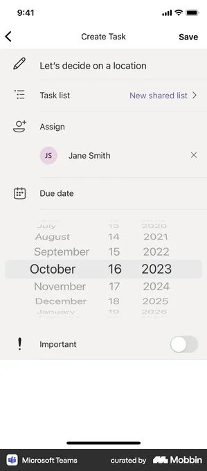 |

- **Kahoot!** — Best on-domain match: a real classroom-game app 'Assign kahoot' modal with editable deadline, player limit and Cancel/Create primary action - exactly the assign-content-with-due-date pattern this surface needs. [↗](https://mobbin.com/screens/178deab7-6ddb-4ee1-98ad-89858a27ddf0)
- **Remind** — Classroom app 'Create a Class' screen with an 'All participants are over 13' toggle and an under-13 different-permissions note - directly relevant to the class container a teacher assigns into and to COPPA-style age gating. [↗](https://mobbin.com/screens/7b6cbeef-71e6-4c15-a879-45399f478529)
- **Spark Mail** — Cross-domain (email/productivity, needs reframing): clean 'assign to a group (Team A, N members) + title field + Set Due Date + Assign' sheet - a tidy template for the bare assign-to-class flow. [↗](https://mobbin.com/screens/a88f9231-fddb-49d0-bd54-52889b10b915)
- **Microsoft Teams** — Cross-domain (Teams is project/task, though it has an EDU edition; needs reframing): full Create Task form with Assign-to chip, inline wheel Due-date picker and an Important toggle - good layout reference for stacked assign fields. [↗](https://mobbin.com/screens/7a575277-59ff-4d64-aab9-4827ae48a5b4)

**What to borrow:** Borrow the modal/sheet assign pattern: pick the content (lesson), choose the recipient group (a class roster chip, not individual kids), set an optional due date via an inline picker, then a single clear primary action (Kahoot's "Create" / Spark's "Assign"). Keep it to one short scrollable form with labeled rows (assignee, due date, options) as in Microsoft Teams, and reuse Remind's explicit age-tier toggle to surface child-data handling at class-creation time.

**TimeKids adaptation:** This whole surface lives only in TimeKids' grown-up (teacher/B2B) zone behind the parent/teacher gate, never the locked kid zone, so it can use dense text, dates and rosters that pre-readers never see. Teachers assign a Timi history story/playground unit to a whole class (by class name, not exposing individual children's identities, honoring COPPA/HK-PDPO data minimization), with all labels and confirmation toasts bilingual Cantonese + English; due dates should be soft "available from / suggested by" framing with no overdue badges, streak loss or other punishing mechanics, since the end user is a 4-6 year-old.

---

## §32 · Classroom setup: create class, join code, add students — coverage: 🟡 partial

| Remind 1 | Remind 2 | Remind 3 | Remind 4 | Remind 5 |
|---|---|---|---|---|
| 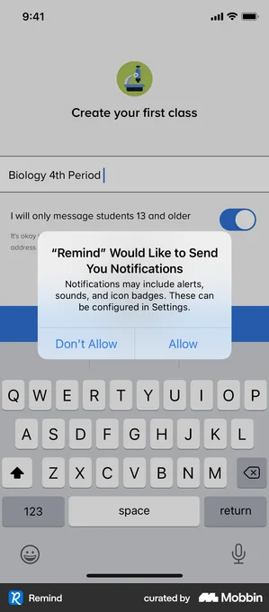 | 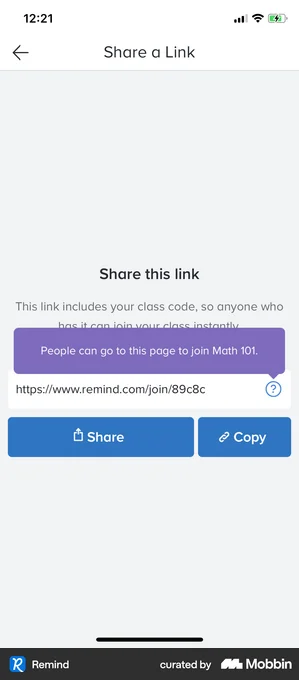 | 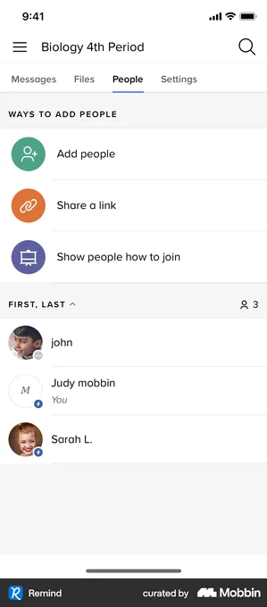 | 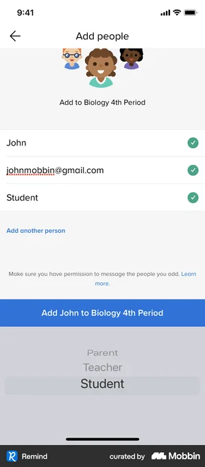 | 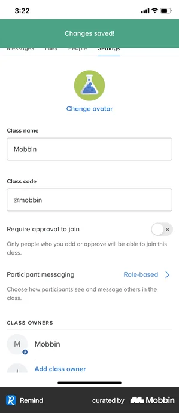 |

- **Remind** — Create-class step: single name field plus an age toggle ('only message students 13 and older; under-13 asks for a parent email') - directly models the COPPA/under-age branch we need in the grown-up zone. [↗](https://mobbin.com/screens/b8ddc81d-a260-4726-a92a-708de4bc31e3)
- **Remind** — Join-code distribution screen: a join link embedding the class code with prominent Share and Copy buttons - the canonical 'give students/parents a code to join' pattern. [↗](https://mobbin.com/screens/447d69cc-4b1d-434b-8281-4324011b307f)
- **Remind** — People tab: three 'Ways to add people' (add directly / share link / show how to join) above the live roster list - clear roster + multi-channel invite hub for the teacher dashboard. [↗](https://mobbin.com/screens/0aa8605c-9fe4-43a7-a7af-60381e01aeb2)
- **Remind** — Add-people form with per-person checkmarks and a Parent/Teacher/Student role picker plus a 'have permission to add' consent line - good model for typing in students and assigning roles. [↗](https://mobbin.com/screens/04dc805c-bc3f-4359-81ce-9fc140a8dcda)
- **Remind** — Class settings: editable class name + class code field, a 'Require approval to join' toggle and class-owner controls - shows the manage/secure side of a join-code class. [↗](https://mobbin.com/screens/f387d02e-2d5d-4b96-8a43-ddd48240bb75)

**What to borrow:** Borrow Remind's clean three-step spine: a minimal create-class form (name + an age/consent toggle), a dedicated share screen where the join code lives in a copyable link with Share/Copy buttons, and a People/roster tab that offers multiple add paths (add directly, share link, show-how-to-join) above the live student list. Reuse the 'Require approval to join' toggle and the per-person role picker (Parent/Teacher/Student) so a teacher can vet who lands in the class.

**TimeKids adaptation:** All of this lives entirely in TimeKids' grown-up/teacher zone behind the parent gate - never in the locked Kid zone - and every label needs Cantonese + English (e.g. 'Class code / 班別代碼', 'Join code / 加入碼'). Because users are pre-readers aged 4-6, students should not self-enter emails: the teacher creates the roster and pre-readers join via a big visual class code or QR scanned on the iPad, with no personal data collected from the child to honour COPPA/HK-PDPO, and approval-to-join defaulted ON. Keep it warmly Timi-branded but functional, and avoid any punishing or shaming roster mechanics.

---

## §33 · Teacher: individual student progress detail — coverage: 🟡 partial

| Khan Academy 1 | Khan Academy 2 | Elevate | Ahead | Finch |
|---|---|---|---|---|
| 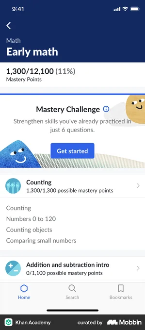 | 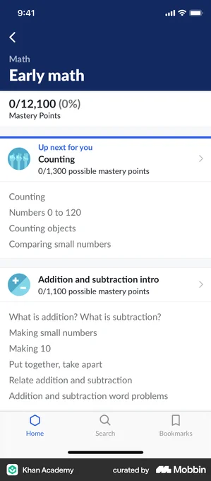 | 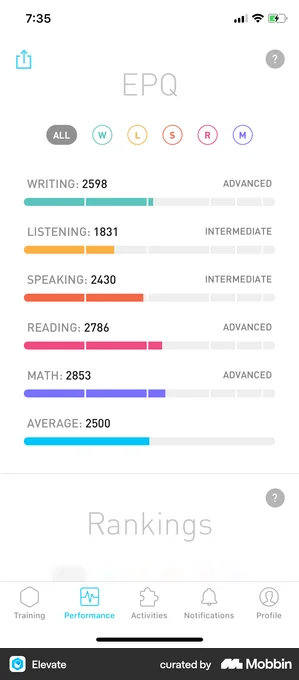 | 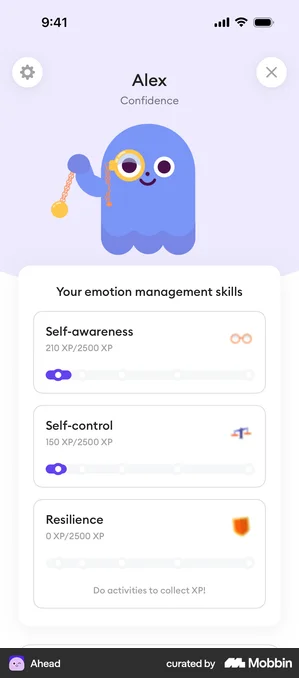 |  |

- **Khan Academy** — Subject mastery detail: overall mastery points + percent header, then per-topic mastery rows with possible-points and drill-down chevrons. Closest data layout to a teacher's per-student skill/progress detail. Learner self-view, so reframe into a teacher-reads-about-child context. [↗](https://mobbin.com/screens/95727dfd-9972-4dc6-ad1d-27140eaea02d)
- **Khan Academy** — 0% starting-state variant of the mastery detail with an 'Up next for you' callout and tappable topic groups; useful for the empty/early-progress state of a student-detail screen. Learner self-view; reframe for teacher. [↗](https://mobbin.com/screens/e6b657a5-4db4-4550-94ce-467c0d9d1f0e)
- **Elevate** — Per-skill score breakdown: labeled bars (Writing/Reading/Math...) with numeric scores and a plain-language proficiency tag (Advanced/Intermediate) plus an Average row. Strong template for a compact 'skills at a glance' panel on a student detail. Adult-leaning visual style; needs kid-domain relabeling. [↗](https://mobbin.com/screens/480a9217-f9d4-4866-8c13-4d1cdc744f4f)
- **Ahead** — Named-individual header ('Alex / Confidence') with a character avatar over a list of per-skill cards showing XP-of-total and segmented progress bars. Good model for a child's named detail header + friendly skill cards; non-punishing 'Do activities to collect XP' framing. [↗](https://mobbin.com/screens/ec7ff4d8-ecff-4305-b6d2-3fbc5d082ef9)
- **Finch** — Named child header ('Baby Lee & Sam Lee') over a 'Latest Progress' timeline of recent discoveries with icon + title + relative timestamp. Excellent recent-activity-log pattern for the lower half of a student-detail view. Kid-friendly aesthetic already close to TimeKids tone. [↗](https://mobbin.com/screens/b717349d-ebbb-4ea4-92b1-67eee8675560)

**What to borrow:** Compose the student-detail screen in three stacked zones: (1) a named header with the child's avatar and an at-a-glance summary, (2) a per-skill/per-topic mastery panel using labeled progress bars with points-of-total and a plain-language level tag (Khan's mastery-points rows + Elevate's labeled score bars + Ahead's XP cards), and (3) a reverse-chronological "Latest activity" feed of icon + title + relative timestamp (Finch). Make each skill/topic row tappable to drill into detail, and design an explicit early/empty state (Khan's 0% variant with an "up next" nudge).

**TimeKids adaptation:** This is a grown-up-zone (teacher/B2B) surface, so it lives behind the parent/teacher gate and may show real names and aggregate progress that the locked kid zone must never expose; keep all metrics encouraging and non-punishing (mastery/XP earned and "up next" nudges, never streak-loss, red deficits, or rankings between children). Relabel skill bars into pre-reader-relevant history-learning competencies with bilingual Cantonese + English headings and icon-first rows so the data reads even at a glance, and gate any personally identifiable child data per COPPA / HK-PDPO with no third-party analytics on the student detail.

---

## §34 · Class-level report / export / print (B2B reporting) — coverage: 🟠 weak

| Satispay | Wise | Flo | Elevate | Coursera |
|---|---|---|---|---|
| 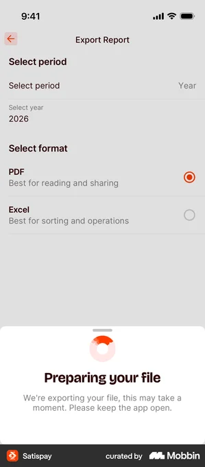 | 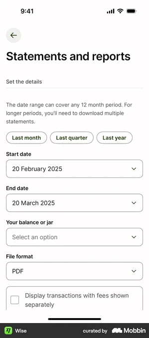 | 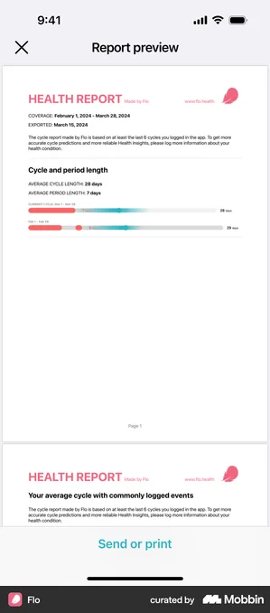 |  | 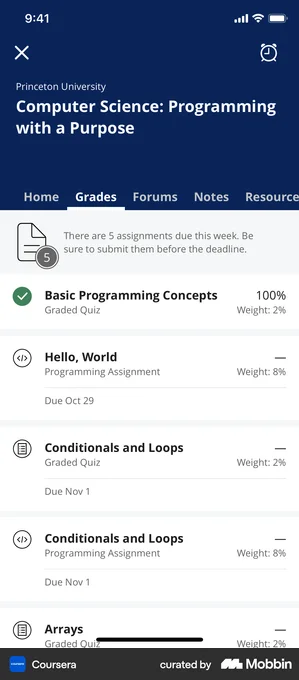 |

- **Satispay** — Clean 'Export Report' flow: pick period (year), pick format (PDF vs Excel as radio cards with rationale), then a 'Preparing your file' progress sheet. Strongest template for the export step. Cross-domain (fintech) - reframe labels to class/term. [↗](https://mobbin.com/screens/821da026-8397-43bb-b5fb-38ba1562222e)
- **Wise** — 'Statements and reports' config: quick chips (last month/quarter/year), start/end date pickers, scope selector, file-format dropdown (PDF). Good model for a teacher choosing reporting period + format. Cross-domain (fintech) - needs class/period reframing. [↗](https://mobbin.com/screens/dca57696-0137-4e2f-8ff8-1f00c6153465)
- **Flo** — Multi-page 'Report preview' with coverage dates, summary stats and charts, paginated like a printable doc, and a sticky 'Send or print' action. Best example of preview-before-export/print. Cross-domain (health) and adult-facing - reframe to class summary, keep no sensitive child data. [↗](https://mobbin.com/screens/9bc6e5a9-8038-482d-afff-0484337ff906)
- **Elevate** — Skill-by-skill score breakdown with progress bars and ALL/per-category filter pills plus a top-left share icon. Useful as the report's body: per-topic mastery rows a teacher would scan and export. Cross-domain (consumer brain-training), not true classroom B2B. [↗](https://mobbin.com/screens/480a9217-f9d4-4866-8c13-4d1cdc744f4f)
- **Coursera** — Grades tab: tabbed report header plus a scannable list of items with status icon, name, weight and percentage. Closest to a per-item completion/score table a class report would render. Cross-domain (higher-ed MOOC), text-heavy so not directly kid-facing. [↗](https://mobbin.com/screens/d72ac212-cdb9-4062-8d8f-775c80fa5764)

**What to borrow:** Borrow the two-part export pattern seen across Satispay and Wise: an export config screen (period via quick chips + date pickers, scope/class selector, format choice as PDF vs spreadsheet radio cards with one-line rationale) followed by a 'preparing your file' progress state. For the document itself, borrow Flo's paginated, printable preview with a coverage-date header and a sticky 'Send or print' bar, and use Elevate/Coursera-style scannable rows (status icon, label, progress bar/percentage, optional filter pills) as the report body.

**TimeKids adaptation:** All of these live entirely in the grown-up/teacher zone behind the parent gate - never in the locked Kid zone - and should present class-level, aggregate history-progress (topics mastered, stories completed) rather than punishing scores or rankings, with friendly Cantonese + English bilingual labels on every chip, format card and the 'Send or print' / share action. To stay COPPA/HK-PDPO safe, exported PDFs should default to class aggregates or a single child only when the requesting parent/teacher is verified, avoid embedding child PII beyond a display name, and keep no leaderboard or comparative shaming framing.

---

## §35 · Child-safe AI chat guardrail / refusal / redirect — coverage: 🟡 partial

| Bolt Food | Google Arts & Culture | Walgreens | Navigator | Taco Bell |
|---|---|---|---|---|
| 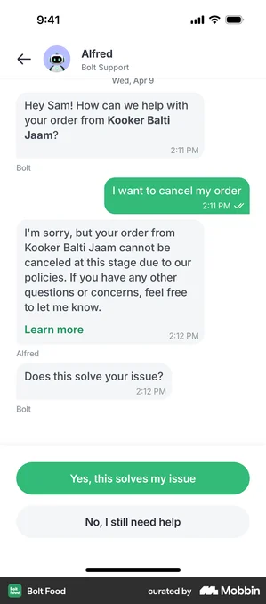 | 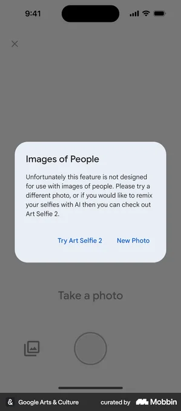 | 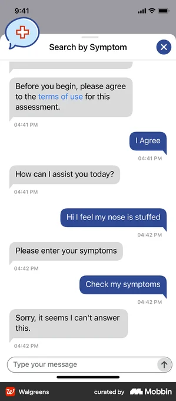 | 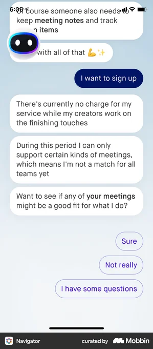 | 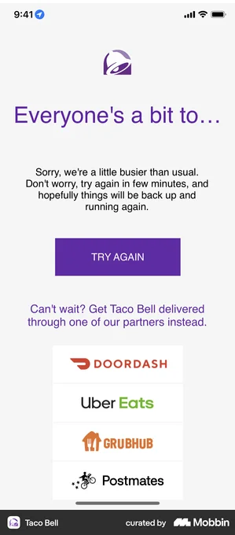 |

- **Bolt Food** — AI assistant politely declines a request inside a chat bubble ('I'm sorry, but... cannot be... If you have any other questions, feel free to let me know') then offers redirect CTAs ('Yes, this solves my issue' / 'No, I still need help'). Cleanest refusal-with-graceful-redirect pattern; adult support context, needs kid-safe reframe. [↗](https://mobbin.com/screens/23fa3478-b28d-40a1-8ed6-d79c0f0af696)
- **Google Arts & Culture** — Content-boundary modal: 'this feature is not designed for use with images of people. Please try a different photo, or...' with two safe alternative CTAs. Best example of a non-punishing refusal modal that always hands the user a constructive next step. Adult app, reframe tone for pre-readers. [↗](https://mobbin.com/screens/d4260145-ba1f-458d-9d72-dcaab86d4834)
- **Walgreens** — AI bot replies 'Sorry, it seems I can't answer this.' in a plain chat bubble after an out-of-scope query. Shows the bare in-bubble refusal copy; useful as the baseline 'I can't help with that' state to soften/illustrate for kids. Adult health-bot context. [↗](https://mobbin.com/screens/8e9a1044-585c-401f-9552-3f64a17d0e87)
- **Navigator** — AI agent proactively states its boundaries ('I can only support certain kinds of meetings... I'm not a match for all teams yet') and redirects with friendly reply chips. Good model for an assistant scoping what it can/can't do before refusing. Adult productivity context. [↗](https://mobbin.com/screens/9dd45472-9e48-458c-ab86-56d48a65fe2d)
- **Taco Bell** — Friendly branded graceful-failure screen ('Everyone's a bit too...', 'Sorry... try again') with a big Try Again button and redirect to alternatives. Illustrates warm, mascot-friendly 'let's try something else' tone over an error/blocked state. Cross-domain (food), borrow tone not content. [↗](https://mobbin.com/screens/4d1d288a-0c5a-4b90-8be2-2606c36c28b6)

**What to borrow:** Always pair a refusal with a constructive redirect: a soft, blame-free apology line plus 1-2 tappable next-step options (Google Arts and Bolt Food both never leave the user at a dead end). Keep the refusal inside the familiar chat bubble / mascot voice rather than a harsh system error, and proactively scope what the assistant can help with (Navigator) so boundaries feel friendly, not punitive. Use a warm branded graceful-failure layout (Taco Bell) with one big primary 'try something else' action.

**TimeKids adaptation:** In the locked Kid zone, deliver refusals entirely through Timi the hamster in audio-first form (spoken Cantonese + English with a calm, encouraging tone and large icon buttons, no reading required), e.g. Timi says 'Let's ask about a story instead!' and offers 2-3 picture/voice choices that steer back to history content rather than ever stating a hard 'no'. Never show punishing copy, lockout language, or anything that collects free-text personal data from the child (COPPA / HK PDPO); any escalation, logs, or 'why was this blocked' detail lives only in the grown-up zone behind the parent gate. Keep one always-available safe redirect (back to Timi's hamster house/playground) so a pre-reader is never stranded on a refusal screen.

---

## §36 · Parent AI-chat controls + transcript review + report — coverage: 🟡 partial

| Discord 1 | Discord 2 | Discord 3 | YouTube | Forest |
|---|---|---|---|---|
| 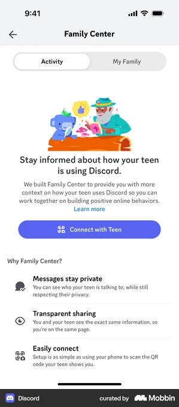 | 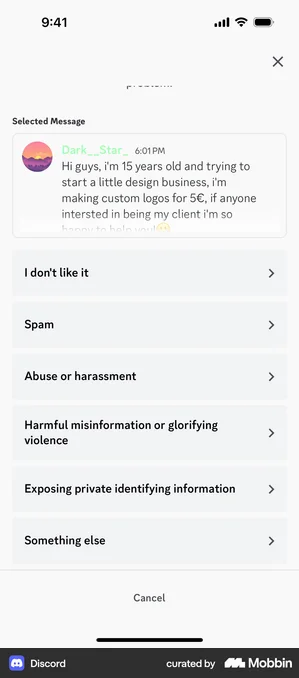 | 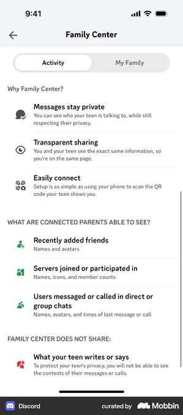 | 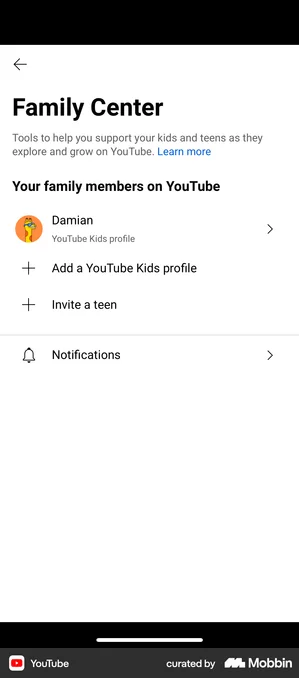 | 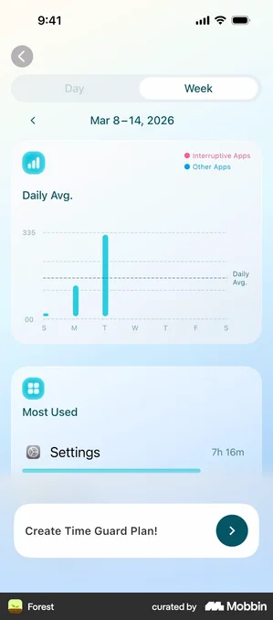 |

- **Discord** — Discord Family Center intro: Activity / My Family tabs + 'connect with your child' onboarding and a why-bullets list (messages stay private, transparent sharing). Closest real-app model for the grown-up zone landing of an AI-chat oversight surface; adult/teen domain, needs kid-safe reframing toward AI-tutor transcripts. [↗](https://mobbin.com/screens/bcef0df1-fe83-4e86-81f9-4bf5b063908a)
- **Discord** — Exact 'report a message' pattern: a quoted/selected message card pinned at top above a categorized reason list (spam, abuse, harmful misinfo, etc.). Directly maps to a parent flagging a Timi AI reply they object to; cross-domain reasons need rewriting for an AI-tutor context. [↗](https://mobbin.com/screens/a74d1f85-a134-46fc-a9b6-337a5ca1e647)
- **Discord** — Explicit 'what connected parents CAN see' vs 'Family Center does NOT share' disclosure list. Gold reference for a transparent COPPA/HK-PDPO data-visibility statement on the parent dashboard; reframe from teen-privacy to child-safety + what the AI logs. [↗](https://mobbin.com/screens/ecb6c82f-018b-420b-b2ee-88353b384630)
- **YouTube** — YouTube Family Center: per-child profile rows (YouTube Kids profile) + 'Add profile' + Notifications row. Canonical kids-app parent-zone list layout for managing each child and drilling into per-child controls/reports. [↗](https://mobbin.com/screens/5aba22e7-99cc-4e6b-9532-fda528a4ca1a)
- **Forest** — Day/Week toggle with a friendly weekly bar chart + 'Most Used' summary card. Encouraging, non-punishing model for the parent activity/progress report; borrow the positive-framing tone rather than screen-time-policing. Productivity app, not kids-specific. [↗](https://mobbin.com/screens/275c3559-e666-4d63-b6f2-f55c26e19654)

**What to borrow:** Pin the exact item under review at the top of a report sheet (Discord's quoted-message card) above a short, plain-language list of reason categories, so flagging a specific Timi AI reply is unambiguous. Use Discord/YouTube Family Center's tabbed parent-zone structure (Activity vs My Family / per-child profile rows) plus an explicit "what we can see / what we never log" disclosure list, and Forest's friendly Week-toggle bar chart + "most used" summary for the activity report.

**TimeKids adaptation:** Put all of this strictly inside the grown-up zone behind the parent gate; the pre-reader Kid zone never shows transcripts, charts, or report controls. Render the AI-chat transcript review and report categories in parallel Cantonese + English with caregiver-friendly wording, and surface a prominent COPPA/HK-PDPO data-transparency panel (what Timi's AI logs, retention, parent-controlled deletion). Keep the activity report celebratory and progress-oriented (stories explored, words heard) with zero punishing or time-shaming mechanics, while still letting a parent instantly flag or disable an AI reply they object to.

---

## §37 · Parental content controls / restrictions / approve — coverage: ✅ strong

| HBO Max | Netflix | Spotify Kids | YouTube | Prime Video |
|---|---|---|---|---|
|  | 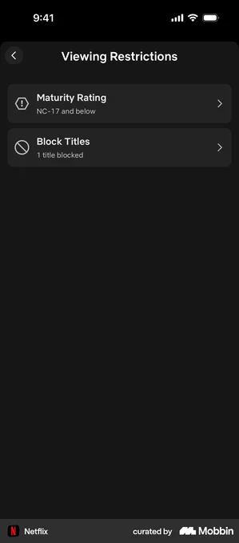 | 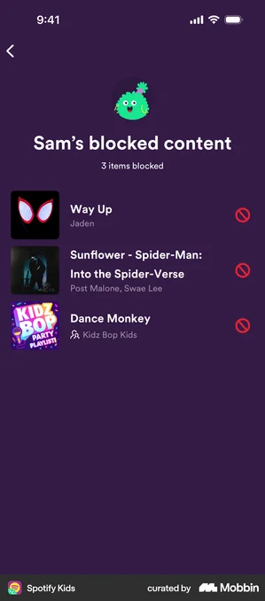 | 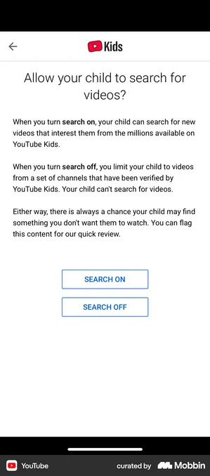 | 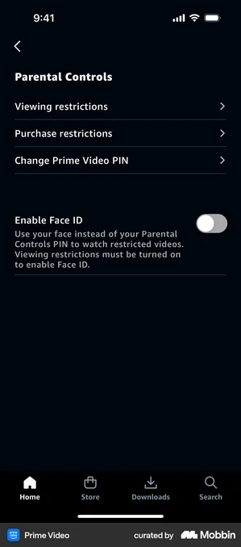 |

- **HBO Max** — Per-child max-rating selector (G/PG/...) on a dotted track plus a 'Require PIN to switch profiles' toggle - the cleanest model for letting a parent set how mature content can go and gate profile switching. Adult streaming context: reframe movie ratings into history-topic age bands for a kid zone. [↗](https://mobbin.com/screens/1aa41b20-bbc9-4fb4-b9d6-879a68388ecc)
- **Netflix** — Minimal 'Viewing Restrictions' hub with two rows - Maturity Rating ('NC-17 and below') and Block Titles ('1 title blocked') showing current state inline. Ideal IA template for a parent-zone restrictions index. Adult-domain wording needs kid-safe reframing. [↗](https://mobbin.com/screens/69dade45-8787-4de5-b289-2408d9133454)
- **Spotify Kids** — Closest in-domain match: a named child's ('Sam's') blocked-content list with cover art, title/artist, and a red block icon per row - shows how an audio-first kids app surfaces per-item exclusions to the parent in a playful but clear way. [↗](https://mobbin.com/screens/92060d61-ac33-4284-bc66-e4500cc46390)
- **YouTube** — Single high-stakes decision ('Allow your child to search for videos?') with plain-language explanation of each choice plus an honest caveat, then two big buttons - a strong pattern for explaining a content-access toggle to parents at the moment of choice. [↗](https://mobbin.com/screens/36a36568-a058-4cda-abf5-e3bfe22e3167)
- **Prime Video** — Canonical Parental Controls hub: Viewing restrictions / Purchase restrictions / Change PIN rows plus a Face ID toggle to bypass the PIN. Good reference for the grown-up-zone settings list and the PIN/biometric parent gate. Adult app - reframe purchase wording for COPPA/PDPO no-spend kid context. [↗](https://mobbin.com/screens/cdbdbd94-480c-4d76-a09c-bd89cb2b0d3e)

**What to borrow:** Borrow Prime Video's restrictions hub as the parent-zone IA (separate rows for content/access restrictions and a PIN/Face ID gate), Netflix's pattern of showing the current setting inline on each row, HBO Max's age-band selector with a 'require PIN' toggle for setting how far content can go, Spotify Kids' per-child named block-list with cover art for managing individual exclusions, and YouTube Kids' plain-language single-decision screen (with an honest caveat) for any high-stakes content-access choice.

**TimeKids adaptation:** Put all of these behind the parent gate (PIN or Face ID a la Prime Video) so only the grown-up zone exposes them; the pre-reader kid zone never shows restriction UI. Replace adult maturity ratings with history-topic age bands (4-6 appropriate), present every label in Cantonese + English, and surface current state with icons not just text since the buyer-parent may skim. Keep the framing positive and non-punishing - 'choose which stories Timi can share' and per-topic allow lists rather than blocks or time-penalty mechanics - and collect no child PII beyond a local profile to stay COPPA / HK PDPO compliant.

---

## §38 · Microphone permission priming + listening state — coverage: ✅ strong

| Duolingo ABC 1 | Duolingo | Spotify | Duolingo ABC 2 | Rise |
|---|---|---|---|---|
| 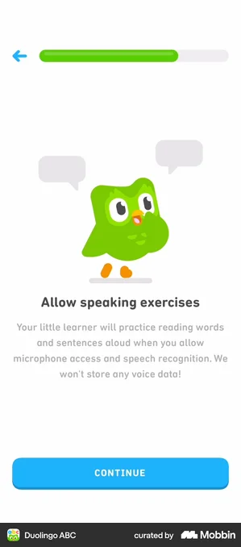 | 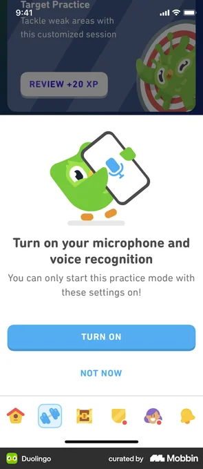 | 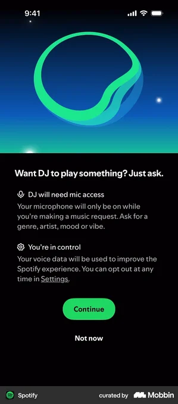 | 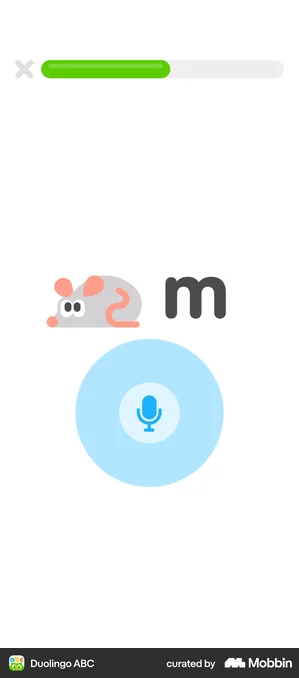 | 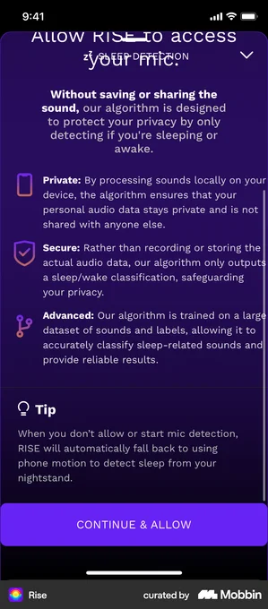 |

- **Duolingo ABC** — Best match: a kids-app mic priming screen addressed to the parent ('Your little learner will practice...') with an explicit no-data-storage promise and a single friendly mascot illustration. Directly on-target for a pre-reader education app's parent-facing pre-prompt. [↗](https://mobbin.com/screens/5ac02ec1-67f7-4297-ba40-53d95c97e9a0)
- **Duolingo** — Clean priming pattern: big friendly headline 'Turn on your microphone and voice recognition', mascot holding a phone with a mic, and a clear primary 'Turn On' plus soft secondary 'Not Now'. Shows the warm, non-coercive two-button layout to emulate. [↗](https://mobbin.com/screens/ce66307e-fb49-455c-8f93-6c8f8ae883a1)
- **Spotify** — Strong privacy-framing structure: two icon+label bullets ('DJ will need mic access' / 'You're in control' with opt-out link) before Continue / Not now. Adult/consumer reference - reframe copy for a parent-gate audience, but the consent/transparency layout is the model to borrow for COPPA/PDPO. [↗](https://mobbin.com/screens/0831a00e-8379-44a1-8992-f3e79dcd3cdb)
- **Duolingo ABC** — The actual active LISTENING state for pre-readers: a character plus a large glowing mic button inside a soft concentric ring (pulse/waveform affordance), almost no text. Exactly the wordless 'I'm listening now' state TimeKids needs for non-reading kids. [↗](https://mobbin.com/screens/f6fb21c6-fd7d-42c3-9661-b555549584f1)
- **Rise** — Most thorough privacy-priming reference: Private/Secure/Advanced bullets stressing on-device processing and 'not saving or sharing the sound', plus a graceful fallback tip if mic is declined. Adult cross-domain - reframe tone for a parent gate, but the 'why we need it + what we won't do with it + graceful no' messaging is the gold standard for child-safety copy. [↗](https://mobbin.com/screens/b1cf4e47-f3d6-4b68-b04d-46ff96b9c86c)

**What to borrow:** Borrow the two-step consent flow: a friendly priming/pre-prompt screen (mascot illustration + plain-language 'why we need the mic' + an explicit data-handling promise + clear primary 'Turn on' and soft, non-punishing 'Not now') shown before the iOS system dialog, as in Duolingo ABC, Duolingo, Spotify DJ and Rise. For the recording moment, borrow Duolingo ABC's near-wordless active listening state: a large glowing mic button inside a pulsing concentric ring that animates with the child's voice, so a pre-reader instantly sees 'I'm being heard now'.

**TimeKids adaptation:** Put the priming/consent screen with all data-handling language (on-device processing, no voice retention, COPPA/HK-PDPO) behind the parent gate in the grown-up zone, since the buyer-parent (and teacher in B2B) must grant mic consent, not the 4-6 year old. In the kid zone, surface only Timi the hamster as the listening cue: a wordless pulsing mic/waveform ring around Timi with a simple ear/'listening' chime and bilingual audio prompt (Cantonese + English), never written instructions. Keep a declined-mic fallback graceful and non-punishing (Timi keeps the story going via tap/audio so the child is never blocked or scolded), mirroring Rise's fallback tip.

---

## §39 · Privacy / consent + data delete/export (COPPA/PDPO) — coverage: ✅ strong

| YouTube Kids | Amazon Alexa | Duolingo ABC | The New Yorker | MacroFactor |
|---|---|---|---|---|
| 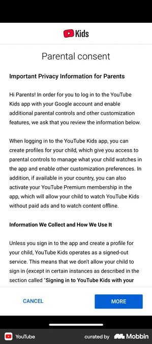 | 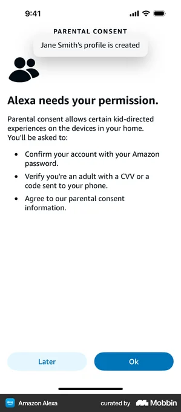 | 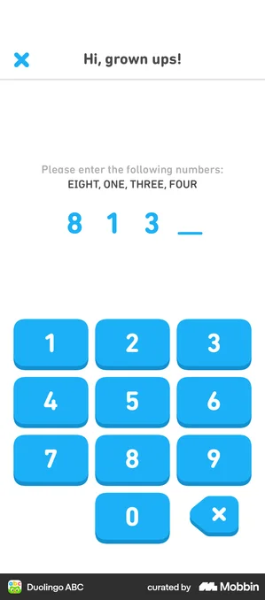 | 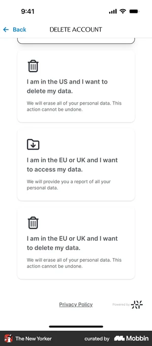 | 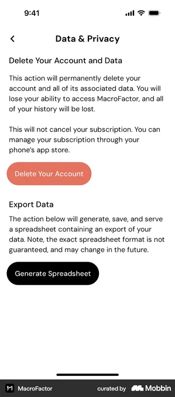 |

- **YouTube Kids** — Canonical kids-app parental consent disclosure: plain-language 'Important Privacy Information for Parents', what-we-collect section, Cancel vs More CTAs. Directly in-category (kids/education). [↗](https://mobbin.com/screens/4866ae41-7d37-4bf1-a943-7bda53bc0588)
- **Amazon Alexa** — Verifiable parental consent (VPC) steps: confirm account password, verify adult via CVV/SMS code, agree to consent. Best real example of the COPPA 'verifiable' mechanism; parental-control category. [↗](https://mobbin.com/screens/3f28566d-9464-4e52-a705-1c996b59f231)
- **Duolingo ABC** — 'Hi, grown ups!' parent gate using a spelled-out numeric challenge (EIGHT, ONE, THREE, FOUR) that a pre-reader can't pass. Ideal kid-zone-to-grown-up-zone gate; in-category (kids education). [↗](https://mobbin.com/screens/e6128e52-cdb4-42ed-9f4a-b489881650c2)
- **The New Yorker** — Region-aware data-rights split: 'US delete' vs 'EU/UK access' vs 'EU/UK delete' cards, each with a clear irreversibility warning. Maps cleanly to COPPA vs HK-PDPO branching. Adult content app, needs kid-safe reframing of tone. [↗](https://mobbin.com/screens/a09f04e3-67a2-41cc-81fd-d22e88f25e62)
- **MacroFactor** — Clean 'Data & Privacy' screen combining Delete Your Account (destructive red) and Export Data (Generate Spreadsheet) with consequence copy. Adult fitness app; reframe for grown-up zone behind parent gate. [↗](https://mobbin.com/screens/cbf9218c-64c3-4222-91f3-1c56411c904f)

**What to borrow:** Borrow the layered consent pattern: a scrollable plain-language privacy disclosure (YouTube Kids) gated by a verifiable adult check before any data collection (Alexa Kids password + CVV/SMS step), plus a child-proof parent gate (Duolingo ABC's spelled-out number challenge) guarding the grown-up zone. For data rights, copy the explicit, region-branched delete-vs-export cards with irreversibility warnings (The New Yorker) and the single combined Delete Account + Export Data panel with destructive-red styling and consequence copy (MacroFactor).

**TimeKids adaptation:** In the kid zone, surface only the playful Duolingo-style parent gate (spell-out numbers, no reading required by Timi narrating in Cantonese/English) so a 4-6 year-old cannot enter; the actual consent disclosure, verifiable parental consent step, and data delete/export controls live entirely in the grown-up/teacher zone behind that gate. Present consent and data-rights copy bilingually with a region branch (HK PDPO data-access/correction vs COPPA verifiable consent + delete), framing deletion as a neutral, reversible-feeling 'remove my child's data' action with confirmations rather than any punishing or shaming mechanic, and keep all destructive actions adult-only and clearly explained.

---

## §40 · Manage subscription / billing (restore, cancel, switch) — coverage: ✅ strong

| Duolingo | Headspace | Calm | Prime Video | Hevy |
|---|---|---|---|---|
| 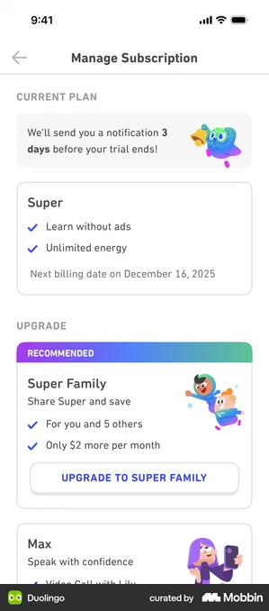 | 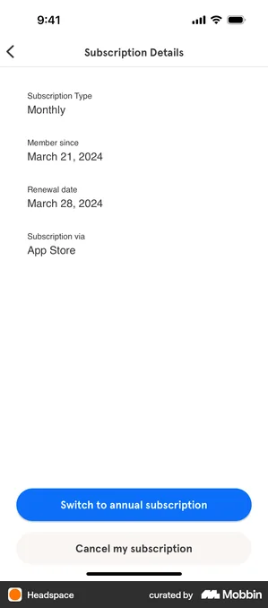 | 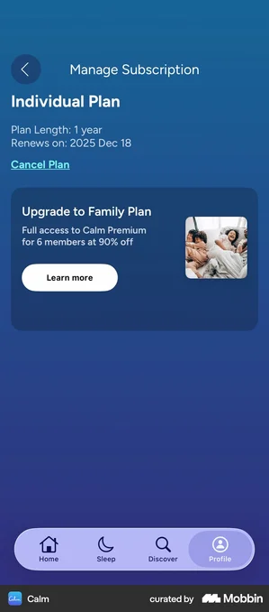 | 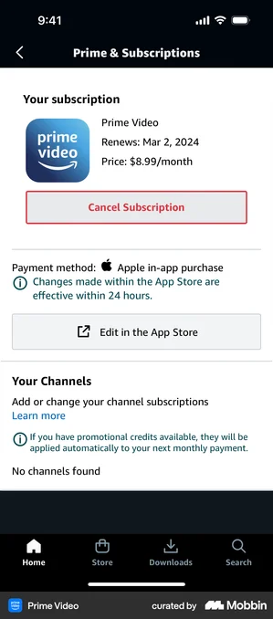 | 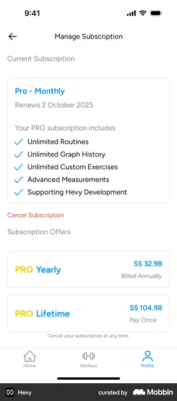 |

- **Duolingo** — Best match: education app with a friendly mascot. Shows CURRENT PLAN card (Super, benefits, 'Next billing date on December 16, 2025') plus a non-punishing trial-reminder banner and upgrade tiers. Closest analogue to TimeKids' Timi-led grown-up zone. [↗](https://mobbin.com/screens/e937c8a3-ccda-4319-a684-5107b0689fe8)
- **Headspace** — Cleanest data layout: labeled rows for Type, Member since, Renewal date, and 'Subscription via App Store', with primary 'Switch to annual' and secondary 'Cancel' buttons. Strong template for the parent-zone billing summary. [↗](https://mobbin.com/screens/91f06302-8e51-4030-92f8-9cfc3d8942e1)
- **Calm** — Top-tier wellness app. Plan name, 'Plan Length: 1 year', 'Renews on: 2025 Dec 18', a low-key text 'Cancel Plan' link, and an upsell-to-Family card. Good model for an individual-vs-family TimeKids tier with calm, non-punishing cancel placement. [↗](https://mobbin.com/screens/2f6d3ea2-ada3-4cf1-9836-a9f1713632ff)
- **Prime Video** — Adult/cross-domain (needs no kid reframing - lives in grown-up zone). Best example of correct Apple IAP handling: shows renewal date + price, payment method 'Apple in-app purchase', a note that App Store changes take 24h, and an 'Edit in the App Store' deep-link - the pattern TimeKids must follow for restore/cancel via StoreKit. [↗](https://mobbin.com/screens/504ea364-1669-424c-acf6-72a0456d7f3e)
- **Hevy** — Clear current-plan card (Pro - Monthly, 'Renews 2 October 2025', checkmarked included features), a muted 'Cancel Subscription' link, then switch-tier offers (Yearly / Lifetime) with 'Cancel anytime' reassurance. Good full-page switch-plan layout reference. [↗](https://mobbin.com/screens/3168ae2c-ca05-49a5-abfe-5d834753abe3)

**What to borrow:** Lead with a single 'Current plan' card stating the tier name, what it includes (checkmarked benefits), and an explicit renewal date in plain language; keep the destructive 'Cancel' as a low-emphasis text link while making 'Switch/Upgrade' the primary action. For Apple IAP, mirror Prime Video: surface payment method, a '24h to take effect' note, and a deep-link to the App Store rather than faking native cancel/restore flows. Offer an individual-to-family upsell card (Calm/Duolingo) for the B2C-vs-household path.

**TimeKids adaptation:** This entire surface lives in the grown-up zone behind the parent gate (math/hold-to-enter), never in the locked Kid zone, so it can use dense text and real billing data without violating COPPA/HK-PDPO; the child never sees pricing. Localize every label and renewal date in Cantonese + English and route Cancel/Restore/Switch through StoreKit (App Store deep-link) so no payment data is collected in-app. Keep cancellation calm and non-punishing - a quiet text link plus a 'you keep access until the billing date' reassurance and an optional Timi-friendly note, with no guilt mechanics, streak-loss threats, or dark patterns; mirror this layout for the B2B teacher/kindergarten billing path with seat/classroom counts instead of family members.

---

## §41 · Returning sign-in + account recovery (forgot PIN/password) — coverage: 🟡 partial

| Duolingo | Centr | HelloFresh | AllTrails | Starbucks |
|---|---|---|---|---|
|  |  |  |  |  |

- **Duolingo** — Best match: education app 'Sign back in' picker showing multiple accounts saved on this device with avatars + 'Add another account' + 'Manage accounts'. Ideal returning-user pattern for a shared family iPad with several kid profiles, avoiding typed credentials. [↗](https://mobbin.com/screens/fe4dcb10-ebc0-4675-87b9-9bff0b9c2231)
- **Centr** — Clean 'Welcome back!' returning sign-in: pre-filled email, password field with show/hide eye, inline 'Forgot password?', and a 'Sign up' path. Adult consumer app, so reframe for the grown-up/parent zone behind the gate. [↗](https://mobbin.com/screens/50e95024-f4fd-4fbc-8534-79a988c3f66c)
- **HelloFresh** — Log in screen pairing email/password + 'Forgot password?' with an 'or / Login without password' passwordless option. Useful template for offering a low-friction magic-link path to parents. Cross-domain (meal kit); for the grown-up zone only. [↗](https://mobbin.com/screens/d1c74896-cba7-4b73-bc85-8ba9689219c3)
- **AllTrails** — Full recovery loop in one frame: 'Forgot your password?' email entry + 'Send email', then a 'Check your email' confirmation sheet with a 'Log in' CTA. Shows the email-reset happy path end to end. Cross-domain; reframe for parent zone. [↗](https://mobbin.com/screens/7248fcc3-2ca7-4f1e-857c-808a0fd1be2d)
- **Starbucks** — Forgot-password screen with explanatory copy and a secondary 'Sign in with a username?' fallback for users who can't recover via email. Good model for offering an alternate recovery route. Cross-domain; parent zone. [↗](https://mobbin.com/screens/a155bb6c-3f1a-450f-8a13-9f33186ed10d)

**What to borrow:** Borrow Duolingo's device-saved account picker (tappable avatars, no typing, 'Add/Manage accounts') as the primary returning entry for a shared family iPad, plus the standard 'Welcome back' email/password card with inline 'Forgot password?', a show/hide eye, and a passwordless/magic-link alternative. From the recovery flows, borrow the simple email-entry then 'Check your email' confirmation loop and the idea of a secondary fallback route (alternate identifier or contact support) when email reset isn't enough.

**TimeKids adaptation:** Split this cleanly: the Kid zone never shows credential or recovery UI; a pre-reader just taps their Timi-themed avatar from a device-saved profile picker (large icons, audio labels, Cantonese + English), with all real sign-in and any forgot-PIN/password recovery living in the grown-up zone behind the parent gate. Keep recovery email-based and routed only to the parent's address (COPPA/HK-PDPO: no child PII, no child-typed email), localize all copy bilingually, and frame everything as friendly and pressure-free, no lockout timers, attempt-count shaming, or other punishing mechanics if a PIN is mistyped.

---

## §42 · Friendly error / empty / loading / no-connection states — coverage: 🟡 partial

| Hopper | CHOPT | Truebill | DoorDash Dasher | Wolt Delivery |
|---|---|---|---|---|
|  |  |  |  |  |

- **Hopper** — Sad bunny mascot 'Uh oh. Connection Trouble!' with a single Reload Page action - closest analog to TimeKids' hamster Timi guiding the child through an offline state. Cross-domain (travel/adult) but the animal-mascot + one-action pattern transfers directly. [↗](https://mobbin.com/screens/9ab90e13-e64d-4716-a4a2-83dc9418e14c)
- **CHOPT** — Anthropomorphic tomato character holding a phone for 'You Are Offline' - shows how a brand mascot can carry an error state with personality/emotion. Cross-domain (food, adult copy) so language must be simplified for pre-readers. [↗](https://mobbin.com/screens/ebc40138-872c-4dab-b77c-1abed601374e)
- **Truebill** — Warm magician-with-turtle illustration, 'You are offline' + prominent yellow Reload button and a top-corner help (?) - clean template: friendly art, short message, one big primary recovery button. Cross-domain (fintech). [↗](https://mobbin.com/screens/cd1a9d29-c70e-47b8-8678-c4c11f0e7f3d)
- **DoorDash Dasher** — Minimal hand-drawn cactus empty state 'No statements to display right now' - non-punishing, reassuring empty-state tone (good model for a TimeKids 'no stories unlocked yet' screen). Cross-domain (gig-work). [↗](https://mobbin.com/screens/ae11fac7-fc64-44a4-8d9b-7ca7b084b4e3)
- **Wolt Delivery** — Friendly explorer-with-map character for 'No results found' - playful, character-led no-results/empty pattern; the explorer-adventure framing fits a history-discovery app. Cross-domain (food delivery). [↗](https://mobbin.com/screens/2d5ac771-e097-4483-b274-ff83394cdc3a)

**What to borrow:** The consistent recipe: one large friendly character illustration, a short reassuring headline, one optional line of explanation, and a single oversized primary recovery button (Reload / Try again). Lean on a recurring mascot to carry the emotion (Hopper's bunny and CHOPT's tomato both anthropomorphize the error so it feels like a companion having a hiccup, not the child failing), and keep empty states gentle and non-blaming ("Nothing yet...", "No statements right now") rather than alarming.

**TimeKids adaptation:** In the kid zone, render every error/empty/offline state as Timi the hamster reacting in-character (e.g. Timi's house lights go out when offline) with audio narration in Cantonese + English and a single large tap-to-retry button - no text-dependent recovery, no red error chrome, no punishing or scary copy for pre-readers. Route any technical or connection-troubleshooting detail (settings links, the "?" help affordance seen in Truebill) into the grown-up zone behind the parent gate, and ensure offline/empty states never request data or trigger flows that would conflict with COPPA / HK-PDPO child-safety rules.

---

## §43 · Accessibility settings (reduced motion, text size, captions) — coverage: 🟡 partial

| Canva | Discord | Headspace | WeChat | Reeder 5 |
|---|---|---|---|---|
|  |  |  |  |  |

- **Canva** — Best single reference: one screen covers High color contrast, Captions, Autoplay-videos = system-preference, a 'Reduce motion' dropdown, and 'Increase on-screen message display time' — exactly the reduced-motion + captions + contrast + timing axes this surface needs. Adult productivity app; reframe copy for a parent gate. [↗](https://mobbin.com/screens/0e0b8aed-7212-44d1-a85c-be08f628e2b6)
- **Discord** — Strong reduced-motion pattern: 'Enable Reduced Motion' toggle plus 'Sync with Device Settings', and granular GIF/animated-emoji/sticker animation controls with an intro explainer. Cross-domain (adult chat app) — borrow the structure, not the density. [↗](https://mobbin.com/screens/0d7b071d-199b-41fa-9a3c-fe6c0edbff65)
- **Headspace** — Clean captions pattern: Closed Captions toggle plus Haptic Assistance with a clear dependency helper note ('Closed Captions must be on to use Haptic Assistance'). Calm wellness tone is close to a kid-friendly aesthetic; good model for plain-language helper text. [↗](https://mobbin.com/screens/443b8210-9591-44e0-8bc3-64a8ebec6514)
- **WeChat** — Chinese-language 'Care Mode' (关怀模式) bundling Large font (大字体), read-aloud audio (听文字消息), and Quiet mode into one toggle-able preset — directly relevant to a Cantonese/English, audio-first context where a single simplified 'mode' beats scattered toggles. Adult accessibility mode; reframe for grown-up zone. [↗](https://mobbin.com/screens/0f226935-14a9-4012-ae35-16a434800b90)
- **Reeder 5** — Best text-size axis reference: text-size and spacing sliders, 'Use default font size' / 'Use system font' toggles, an Increase-contrast toggle, and inline B / Aa / alignment controls. Power-user dense; borrow the slider + live-preview idea only. [↗](https://mobbin.com/screens/df75479a-9eb1-4039-9c8a-99ead7ebc2e0)

**What to borrow:** Borrow Canva's grouped layout that puts reduced-motion, captions, contrast and message-timing on one accessibility screen, each with an "off by default / follow system preference" option and a one-line explanation under every control. Adopt Discord's explicit "Sync with Device Settings" toggle so the app honors the iPad's OS-level Reduce Motion / Larger Text, plus Reeder's text-size slider with a live preview, and Headspace's dependency helper text (e.g. captions-must-be-on). WeChat's "Care Mode" shows how to collapse several toggles into one simple named preset.

**TimeKids adaptation:** These full accessibility panels live in the grown-up zone behind the parent/teacher gate, since pre-readers can't operate toggles or read labels; the kid zone only inherits the resolved settings (bigger Timi captions, calmer animations, audio narration always on). All labels are bilingual Cantonese + English with icons, and a single "Calm/Care mode" preset (mirroring WeChat) can dial down motion, enlarge text and force captions in one tap for younger or sensitive children. Default to following iPad system Reduce-Motion/Larger-Text, store preferences locally/non-personally to stay COPPA/HK-PDPO compliant, and keep everything additive support — never a punishing or gating mechanic for the child.

---

## §44 · Help center / support / FAQ / contact — coverage: 🟡 partial

| Kraken | Runna | Saturn Calendar | Halide |
|---|---|---|---|
|  |  |  |  |

- **Kraken** — Strongest searchable help-center pattern: top search field, 'Most read articles', 'Help by topic' categories with icons, and a persistent 'Chat with us' button. Adult fintech app - reframe copy/tone for parents, not kids. [↗](https://mobbin.com/screens/ee7e4f74-4dc3-4ff4-9732-a49a52cf092f)
- **Runna** — Friendly Support tab: prominent 'Customer support' card with unread badge, search, and topical help-article cards each with a one-line description. Coaching/education-adjacent tone; good model for a warm parent-facing support hub. [↗](https://mobbin.com/screens/696d3f99-5b16-45f3-9735-598143624675)
- **Saturn Calendar** — Settings block grouping FAQ / Safety Center / Contact Support / Legal as a tidy card list. Youth/school-oriented app - closest contextual match; the explicit 'Safety Center' row is a strong cue for a kids-safety/parent-info entry. [↗](https://mobbin.com/screens/73f4c25c-7175-4d98-b235-6678546b471b)
- **Halide** — Layered support page showing a help hierarchy (Quick Start Guide, Manual, FAQ, Contact Support) with short explanatory subtext per item. Good for tiered self-serve before contacting a human. Adult prosumer app - simplify for parents. [↗](https://mobbin.com/screens/06b13dc7-173e-4a4b-b164-d569eae60917)

**What to borrow:** Use a search field at the top, a short list of 'Most read'/popular articles, and topic categories with icons + one-line descriptions, ending in a single always-visible 'Contact us / Chat with us' action so self-serve precedes human support (Kraken, Runna). Group FAQ / Safety / Contact / Legal as a clean card list in the grown-up zone, and surface an explicit 'Safety Center' entry as its own row (Saturn). Offer a tiered hierarchy - quick guide, full help articles, then contact - with brief subtext under each item (Halide).

**TimeKids adaptation:** All references are adult consumer apps (no kids/education help screens exist on Mobbin - confirming this surface is a genuine gap), so the help center belongs entirely in the grown-up/parent-teacher zone behind the parent gate; the locked kid zone should never expose searchable articles or a contact form. Render every label and article bilingually (Cantonese + English) with parent-facing wording, and keep contact channels email/chat-based with no child data collected (COPPA / HK PDPO). Include a dedicated 'Safety & Privacy' / parental-controls entry (per Saturn's Safety Center) and a separate B2B teacher/classroom support path; keep tone warm and non-punishing - no pressure, badges, or guilt mechanics in support flows.

---

## §45 · Search within content library — coverage: 🟡 partial

| Khan Academy 1 | Spotify Kids | Khan Academy 2 | Uptime | Calm |
|---|---|---|---|---|
|  |  |  |  |  |

- **Khan Academy** — Best real-app reference: education content-library search showing grouped results (Topics section + Items count + scrollable result list with thumbnails and a Filter affordance). Text-heavy, so needs pre-reader reframing. [↗](https://mobbin.com/screens/e8c9b712-ded1-4825-a9d8-150f02f29e36)
- **Spotify Kids** — Most on-target: kids audio content library with large colorful illustrated cards (artwork-forward, minimal text) and a search icon in a playful kid-zone shell. Closest to TimeKids' pre-reader audio-first context. [↗](https://mobbin.com/screens/46db3950-bfe9-4314-a22b-c26284992018)
- **Khan Academy** — Search results with active filters applied (Filters (2), Clear filters, refined result list). Shows the filtered-state pattern for narrowing a content library; adult/desktop-style density needs simplifying for kids. [↗](https://mobbin.com/screens/5680f949-16cc-4f6c-96d0-3fd4d24d319b)
- **Uptime** — Clean pre-search empty state: 'Recent searches' with Clear all and a tappable content card (cover art + tag + dismiss). Good model for a low-friction default state; adult content app, reframe for kid zone. [↗](https://mobbin.com/screens/7cf1f0b4-a9ac-494d-8e0e-adf5f4c1757e)
- **Calm** — Browse-by-topic entry as a search alternative for non-typing users: round illustrated 'Browse by Topic' category icons (Animals, Adventures) plus character-led rows. Strong pattern for pre-readers who can't type a query. Cross-domain (sleep/audio). [↗](https://mobbin.com/screens/5b745f51-6089-4a09-a991-caff9939e0b1)

**What to borrow:** Borrow Khan Academy's content-library search structure: results grouped into a Topics/categories section above a scrollable Items list with thumbnails, a result count, and a Filter affordance (plus the applied-filter state with Clear). Pair it with Spotify Kids' artwork-forward, low-text result cards, and Calm's tappable round illustrated category icons as a no-typing way to "search" by browsing. Use Uptime's Recent searches + Clear all as the default/empty state.

**TimeKids adaptation:** In the kid zone, lead with Timi's voice prompt and big illustrated topic/era tiles plus voice search instead of a text field, since pre-readers can't type or read result lists; every result card should be a tappable picture with audio labels in Cantonese + English and no character keyboard required by default. Keep dense text-filter and recent-search-history patterns (which retain query strings) in the grown-up/teacher zone behind the parent gate, and under COPPA/HK-PDPO avoid persisting a child's free-text or voice search history; favor session-only suggestions. Use no punishing or scarcity mechanics (no locked-content shaming or empty "no results" dead-ends) and always offer Timi a friendly fallback suggestion.

---

## §46 · Collection / museum zero-state (first-run, locked) — coverage: ✅ strong

| Kahoot! | Withings Health Mate | stoic. | Duolingo | Vocabulary |
|---|---|---|---|---|
|  |  |  |  |  |

- **Kahoot!** — Best match: '0/40 collected' grid of padlock silhouettes grouped by named characters (Wanda the Panda, Disco Sheep). Playful, kid-adjacent, real-app locked-collection zero-state with a clear progress counter. [↗](https://mobbin.com/screens/3fbf4c46-aa0f-44e8-b914-e7e2415e1786)
- **Withings Health Mate** — 'Unlocked 0/30' grid of locked cards, each a blurred preview + name + target threshold under category tabs. Strong locked-collection-grid pattern; cross-domain (adult fitness) so needs a kid-safe theme reskin and pre-reader iconography. [↗](https://mobbin.com/screens/300ba4e5-c007-459c-a33c-745eb5b290de)
- **stoic.** — '0. BADGES UNLOCKED' hero with a mystery silhouette ('Your First Badge - Maybe today?') plus a 'Your Next Badges' progress list (0/10). Great single-hero zero-state showing the next reachable goal; cross-domain (adult journaling) so reframe copy and visuals for kids. [↗](https://mobbin.com/screens/9f431a28-b6f3-44f9-a905-11c6736ce01a)
- **Duolingo** — 'Earn your first badge!' first-run empty state: friendly mascot-style illustration with warm, non-punishing encouragement copy. Top-tier education app tone that maps well to TimeKids' kid zone. [↗](https://mobbin.com/screens/bb163554-4743-4ee0-adf2-8a75b11de9b1)
- **Vocabulary** — Education-app collection zero-state: large hero illustration, 'You don't have any collections yet' headline, supportive explainer, single primary CTA. Clean template for a first-run empty museum/collection screen. [↗](https://mobbin.com/screens/bcad12bc-1f23-4feb-9c64-41f3502390b5)

**What to borrow:** Combine a single warm hero zero-state (illustration + encouraging headline + one clear primary action, per Duolingo/Vocabulary) with a locked-grid preview that shows what is collectable: padlock or blurred silhouettes plus an "X/N collected" progress counter grouped by theme (Kahoot!, Withings), and a "next reachable item" spotlight (stoic.). The locked silhouettes tease future content and create curiosity without overwhelming a first-time user.

**TimeKids adaptation:** In the kid zone, render the empty museum as Timi's hamster house with shelf/diorama-shaped locked silhouettes lit up by a "collect your first relic" spotlight; replace all text labels and counters with large icons, Timi voice-over (Cantonese + English) and audio cues since users are pre-readers, and use only invite/encourage copy ("Let's find your first treasure!") with zero punishing or scarcity mechanics (no streak-loss, no countdown timers). Keep numeric progress and any account/data context minimal and child-safe per COPPA/HK-PDPO, and surface the grown-up framing (overall collection stats, gating) only in the parent/teacher zone behind the parent gate.

---

## Verdict — do the gathered references actually fit? (from critics)

| Surface | Issue | Verdict |
|---|---|---|
| **35-ai-guardrail (child-safe AI refusal/redirect)** | All 5 refs (Bolt Food, Google Arts, Walgreens, Navigator, Taco Bell) are ADULT, text-heavy customer-support/feature-limit refusals: 'I'm sorry, your order cannot be canceled...', 'this feature is not designed for images of people'. Paragraph-of-text 'I can't help' dialogs aimed at literate adults. None show a mascot-mediated, picture-only, audio-first friendly redirect back to safe choices for a 4-6 pre-reader. The refusal+redirect STRUCTURE transfers, but the kid-safety framing (no readable refusal a child can't parse, character reassurance, redirect to picture cards) is absent. Part-2 gap analysis already flagged this bespoke; a COPPA-grade kid-facing refusal almost certainly does not exist on Mobbin. | ✏️ design custom |
| **36-parent-ai-controls (parent AI-chat controls + transcript review)** | YouTube Family Center and Discord Family Center are strong, on-point parental-supervision precedents, and Discord report-message covers the flag/report mechanic. But the AI-SPECIFIC piece — a parent reading the bilingual AI conversation their 4-6yo had, seeing what was filtered, toggling chat boundaries/topics — has no true reference (Forest weekly report is a generic habit summary). The family-controls shell is good-enough; the AI-transcript-audit core is bespoke. | ✏️ design custom |
| **42-error-empty (friendly error/empty/loading/no-connection)** | Good tone refs: Hopper offline-bunny and CHOPT offline-mascot are genuinely friendly character-driven error states. But all are adult apps with READABLE error copy ('Uh oh. Connection Trouble! Check your network or try reloading') and small text buttons. None are wordless/audio-first with one oversized icon-only retry a non-reading 4-6yo on iPad could act on alone. The mascot-error tone is good-enough to borrow; the wordless pre-reader runtime-failure state is custom. | ✏️ design custom |
| **35-ai-guardrail (child-safe AI refusal/redirect)** | All 5 screens are generic ADULT chatbot/error UIs and do NOT solve the child-safety design. Bolt Food = 'order can't be cancelled' policy refusal; Walgreens = symptom-checker with a free-text input box saying 'Sorry, I can't answer this'; Navigator = B2B meeting-assistant scoping reply; Google Arts = 'feature not for images of people' modal; Taco Bell = a server-overload 'Try again' screen that is not even an AI guardrail. Every one is text-heavy (unreadable by a 4-6yo), several still expose a free-text input, none are character-mediated, audio-first, or model a safe redirect back to picture choices or a parent handoff. This is the compliance-defining surface and it is essentially uncovered. | ✏️ design custom |
| **36-parent-ai-controls (transcript review + report)** | Discord Family Center is the dominant reference and is built for TEENS with a privacy stance that explicitly 'DOES NOT SHARE what your teen writes or says' — the exact opposite of what a parent of a 4-6yo needs (full visibility of the AI conversation). YouTube Family Center is just a profile/member list; Forest weekly report is a focus-time summary; Discord report-message is a generic platform abuse-report. None show a parent reviewing the child<->AI transcript (with replayable audio) or AI-specific boundary/topic controls. The transcript-audit + AI on/off + flag-a-response controls are not solved. | ✏️ design custom |
| **34-class-report-export (B2B class report / export / print)** | Refs skew cross-domain and adult: Flo (health report PDF), Wise (bank statements), Satispay (export format), Elevate (personal performance). Only Coursera (grades list) is genuinely education-B2B. The generic export/print/date-range MECHANIC transfers, but none show a teacher exporting a CLASS-level (multi-student roster) report to share with parents at term end. A real edtech teacher-reporting export plausibly exists (ClassDojo, Seesaw, Google Classroom, Khan for Teachers). | 🔁 gather again |
| **31-teacher-assign (assign content/lesson to a class)** | Mixed: Kahoot (assign + deadline + player limit) and Microsoft Teams (assign + due date) are real edtech/assignment precedents that fit. Remind 'create class' and Spark Mail 'assign due date' are weaker stand-ins (Spark is an email task, not lesson assignment). The assign-with-deadline pattern is covered, but assigning a specific ERA/adventure to a class or groups (content-picker + class scope) is thin. A stronger Google Classroom / Seesaw 'assign activity' reference likely exists. | 🔁 gather again |
| **33-student-detail (individual student progress)** | Khan Academy mastery-topics is an excellent direct match. But three of five (Elevate skill-scores, Ahead named-skills, Finch activity feed) are adult self-improvement apps repurposed for the 'named skill + score' layout. It works, but a teacher-viewing-ONE-pupil detail within a class-roster context (with assignment completion) is only partially shown. A ClassDojo/Seesaw student-detail reference would be a closer B2B fit. | 🔁 gather again |
| **30-teacher-dashboard (class roster + progress)** | Not real classroom roster views. Remind 'classes owned' / 'class list' are messaging-app class-admin screens (class name, join code, archive) with NO per-student progress. Khan Academy 'mastery progress' and Coursera 'module progress' are individual LEARNER self-progress screens mislabeled as teacher views — they show one student's own data, not a class of pupils at a glance. The core B2B surface (whole-class roster, who finished today's adventure, class mastery) is not actually captured. | 🔁 gather again |
| **33-student-detail (teacher drill-into one pupil)** | Khan Academy 'mastery topics'/'math mastery' are again the LEARNER's own self-view, not a teacher inspecting a specific student's history. Elevate/Ahead are personal skill-score self-screens; Finch activity feed is a personal habit log. None depict the teacher-perspective 'this is pupil X's progress' detail. Borrowable as a metric-card layout but does not solve the teacher-context surface. | 🔁 gather again |
| **34-class-report-export (B2B class report)** | No class-level reference at all. Flo = personal health-cycle PDF (send/print); Wise/Satispay = financial statement/export; Elevate = personal performance breakdown; Coursera 'Grades' = single learner gradebook. The export MECHANIC (preview -> send/print, choose format, date range) is transferable, but a kindergarten teacher's term-end class report (many pupils, share-with-parents) has zero real reference. | 🔁 gather again |
| **45-content-search (search within library)** | Khan Academy (filtered/library results) and Spotify Kids (audio results) are solid for a parent/teacher text search of educational content. But there is no voice/icon search for the non-reading CHILD (a 4-6yo cannot type). The parent/teacher search half is good-enough; a kid-facing picture/voice search has no reference and is custom — though it may be out of scope (search can stay parent-zone only). | ✅ good enough |
| **31-teacher-assign (assign content to a class)** | Mixed. Kahoot 'assign with deadline + player limit' IS a genuine education assign flow and is usable. But MS Teams 'Create Task/Assign/Due date' and Spark Mail are generic productivity task-assignment, not assigning learning CONTENT to a class roster. Partially solved; the class/group-targeting of a specific era/adventure is thin. | ✅ good enough |
| **32-school-onboarding (create class + join code)** | Actually decent and largely real via Remind: 'create your first class', the 13+ messaging toggle, add-people-by-role, and share-class-code/join-link are genuine classroom-onboarding patterns. Gap: bulk roster import and seat/license management for a paid B2B kindergarten are not shown. | ✅ good enough |
| **39-privacy-consent (COPPA/PDPO consent + data rights)** | Genuinely strong and verifiable, not generic-adult: YouTube Kids 'Parental consent' is a real COPPA consent screen, Alexa shows the verifiable-parental-consent mechanism (adult confirms via password/CVV), MacroFactor provides real delete-account + export-data controls, and Duolingo ABC supplies the spell-the-numbers grown-up gate. This surface solves the consent/data-rights design. | ✅ good enough |
| **38-mic-permission (priming + listening state)** | Strong and age-appropriate, not generic: Duolingo ABC 'Allow speaking exercises' priming (explicitly 'We won't store any voice data') and the big-mic-in-a-soft-ring listening state with a picture cue directly fit a pre-reader speaking activity. No concern. | ✅ good enough |
| **37-content-controls (parental restrictions)** | Strong: YouTube Kids 'Allow your child to search' (explicit ON/OFF + 'flag this content'), plus Netflix/HBO Max/Prime/Spotify Kids restriction patterns are real kid-content controls behind a parent area. Solid; only needs TimeKids-specific reskin. | ✅ good enough |
| **46-museum-zerostate (locked first-run collection)** | Strong as a zero-state pattern: Kahoot '0/40 collected' locked-silhouette emote grid with named sets is exactly the locked-museum first-run model. Caveat: the history-artifact-on-an-era-shelf diorama framing is the known-custom art layer, not a gather gap. | ✅ good enough |

## Still-missing surfaces after Parts 1–3

| Surface | Why it matters | Suggested Mobbin search |
|---|---|---|
| **History timeline / 'long ago vs today' chronology for pre-readers** | The single most history-defining surface, STILL entirely absent from the whole board (Parts 1-3). Teaching 'when'/deep-time to a 4-6yo via faces, objects, color-coded eras and a draggable time-slider is what differentiates TimeKids from a Duolingo-clone. No node-path (3) or learning-path (27) covers chronological ordering. | timeline history kids chronology scroll ages visual then and now |
| **Then-vs-now / past-vs-present comparison reveal** | Signature history-teaching device (same place/object then vs now, side-by-side or swipe-reveal) framed for non-readers with audio. No board surface covers comparison UI. Likely bespoke but worth one Mobbin pass for before/after slider mechanics. | before after comparison slider then and now image reveal |
| **Explorable era scene / tappable hotspot diorama** | The heart of an audio-first history app: a full-screen illustrated past scene where a pre-reader taps glowing hotspots to trigger narration/animation/facts. Flagged custom in Parts 1-2 and still has no representation. Confirm no picture-book/hotspot reference exists before committing to full custom. | interactive scene hotspot tap explore children picture book |
| **Re-engagement / gentle 'welcome back' return surface** | Notification priming (13) and daily quest (12) are covered, but the in-app welcome-back landing for a no-streak-guilt 4-6yo ('your guide missed you', new content available) is still missing and is distinct from onboarding. | welcome back re-engagement come back screen kids app |
| **What's-new / new-era-unlocked content announcement** | A live subscription content app needs to surface newly added eras/adventures to returning families and teachers (retention + subscription justification). Still absent from the whole board. | what's new feature announcement new content unlocked kids |
| **First-launch splash + first-run language pick (Cantonese/English) + age gate** | The very first run — splash, bilingual first-language choice, and the 'is a grown-up setting this up' gate before onboarding — is still unrepresented. Bilingual HK launch makes the first-language pick load-bearing. | app first launch splash language selection onboarding age gate |
| **Time-machine / era-transition travel moment** | The brand-defining motion+sound beat carrying the child from a map node into the story player ('we are travelling to Ancient Egypt now'). Likely custom, but no surface or reference exists yet to anchor the motion direction. | loading transition animation portal travel kids app |
| **True teacher class-roster progress view (many pupils at once)** | Despite §30/§33 being labeled teacher surfaces, every gathered screen is a single-learner self-view or messaging-app class admin. The defining B2B surface — a teacher seeing a roster of pre-readers with per-child 'did today's adventure / era mastery' at a glance — was not actually captured. Without it the kindergarten path has no real reference. | ClassDojo class roster, Seesaw teacher class progress, Google Classroom student list grades, Kahoot teacher reports class overview, Khan Academy teacher class dashboard (teacher view, not learner) |
| **Child-safe AI refusal / redirect (kid-facing)** | The §35 gather pulled only adult policy-refusal and server-error screens with free-text inputs. A genuinely child-safe, picture/audio refusal that redirects a 4-6yo back to safe choices or to a grown-up is unrepresented; if any reference exists it would be in kid-AI or kid-voice-assistant products, otherwise this is a design sprint. | kids AI tutor safe response, Khanmigo for kids guardrail, kids voice assistant 'ask a grown-up', child chatbot redirect off-topic, Gabb / Pinwheel kids assistant safety |
| **Parent review of child<->AI transcript with audio replay + flag** | §36 references either hide child message content (Discord) or are profile lists (YouTube). A parent surface that replays the child's actual AI turns as audio with a per-response report/flag and AI on-off/topic boundaries is missing and is compliance-critical. | AI chat history parental review, kids AI conversation transcript parent, character.ai parental insights, AI companion safety dashboard report message |
| **Class-level report export / share-with-parents (B2B)** | §34 only has personal-health and financial export PDFs. A kindergarten needs an aggregated multi-student class report it can print or send to parents at term end; no education-class report reference was gathered. | ClassDojo class report PDF, Seesaw student report share parents, Google Classroom export grades, teacher progress report print term |
| **Seat / license / bulk-roster management for paid B2B** | §32 covers create-class + join-code (single teacher), but a paid kindergarten plan needs seat counts, bulk student import, and license assignment — distinct from the consumer paywall (§40) and not captured. | education app seats licenses manage, school admin add students bulk, classroom plan seat management, Kahoot/Quizizz school plan seats |

## Confirmed design-custom (no good reference — design sprints)

- Child-facing AI guardrail/refusal states (35): wordless, mascot-mediated, picture-only safe redirect with audio reassurance — generic adult text refusals (Bolt, Walgreens, Google Arts) do not translate to a 4-6 pre-reader; no COPPA/PDPO-grade kid refusal UI exists on Mobbin.
- Parent/teacher AI transcript transparency core (36): reading the bilingual AI conversation a child had, seeing what was filtered, and flagging — the family-controls shell (YouTube/Discord) is borrowable but the AI-audit content is bespoke.
- Wordless runtime error / no-connection / buffering state for a non-reader (42): one oversized icon-only retry, character gesture, audio cue — adult mascot-error screens (Hopper, CHOPT) set the tone but all rely on readable copy and small text buttons.
- Pre-reader visual history timeline (deep-time chronology via faces/objects/color, draggable slider) — no mainstream app teaches 'how long ago' to non-readers.
- Then-and-now / long-ago-vs-today comparison interaction framed for pre-readers with audio narration of the change.
- Explorable era scene with tappable hotspots (tap an object to hear its Cantonese/English name) — the core content-art workstream, no off-the-shelf reference.
- Cantonese character/word-level read-along highlight timing driven by TTS (no inter-word spaces, tone-driven) — technical+UX custom build.
- Kid-facing voice/picture search within the library (a 4-6yo cannot type) — Khan/Spotify Kids cover the parent-facing text search but not a non-reader query mechanic.
- Diorama-style time-museum where artifacts sit on era shelves teaching chronology — zero-state refs (Kahoot/Withings/Duolingo locked grids) cover the locked-silhouette pull but not the history-era layering.
- Time-machine era-transition travel moment (map node into story player) — brand-defining motion/sound beat with no direct reference.
- Child-facing AI guardrail / refusal / redirect for a 4-6 pre-reader: the §35 references (Bolt Food order-cancel refusal, Navigator B2B meeting bot, Walgreens symptom-checker, Google Arts modal, Taco Bell server-error) are ALL adult, text-heavy, free-text-input refusals about business policy or server load. None are picture-only, audio-first, or character-mediated. The wordless, friendly 'Timi can't help with that, let's pick a picture / ask a grown-up' redirect must be designed from scratch; Mobbin has no COPPA/PDPO-grade kid refusal UI.
- Picture-only bounded chat input model (no free-text box ever shown to the child). Every §35 reference still exposes a 'Type your message' field (Walgreens) or text-bubble conversation. The constrained illustrated-answer-choice input that prevents a non-reader from typing unsafe content has no off-the-shelf reference and is bespoke.
- Parent/teacher AI-transcript audit tuned for a 4-6yo's audio answers: §36 Discord Family Center explicitly DOES NOT share what the child writes/says (opposite of what a TimeKids parent needs), and YouTube Family Center is only profile management. A parent screen that replays the child's actual AI conversation as audio clips with per-message flag/report and 'what was filtered' is custom.
- History-pedagogy surfaces remain custom (carried forward, still unaddressed by this pass): pre-reader visual timeline / 'how long ago', then-vs-now comparison reveal, explorable era scene with tappable hotspots, time-machine era-transition moment, and the diorama-style time-museum (vs the generic locked-grid zero-state gathered in §46).
- Cantonese character-level read-along sync and simultaneous-bilingual content mode: untouched by this pass, still bespoke (no-space, tone-driven Chinese karaoke highlighting).
- True B2B class roster + at-a-glance per-student progress view: the gathered §30/§33 'teacher' references are actually single-LEARNER self-progress screens (Khan Academy mastery, Coursera module/grades) or messaging-app class admin (Remind) — none show a teacher seeing a whole class of pupils' progress at once. The pre-reader-history classroom roster has no real reference and is effectively custom.

## Critic notes

> Verified by reading the actual gathered images for surfaces 30-46 in ./design-research/images/ (all present: prefixes 30-46, ~4-5 webp each) plus Parts 1-2 in screen-references.md and screen-references-2.md. No files were written.

STRONG / GENUINELY-FITTING surfaces (good-enough, no action needed): 30-teacher-dashboard (Remind class-list + create/join + Khan/Coursera progress — real teacher class-management); 32-school-onboarding (Remind create-class + join-code + add-roster — directly on-point B2B, the cleanest classroom-setup set); 37-content-controls (HBO Max, Netflix, Spotify Kids blocked-content, YouTube Kids allow-search, Prime Video — all genuine kids/parental-control precedents, strongest set in the pass); 38-mic-permission (Duolingo ABC speaking-priming + listening-state are near-perfect pre-reader mic affordances; Duolingo/Spotify/Rise prime the OS permission); 39-privacy-consent (YouTube Kids parental consent + Alexa Kids + Duolingo ABC grownup-gate + MacroFactor delete/export — covers both COPPA/PDPO consent AND data-rights); 40-manage-subscription (Duolingo, Headspace, Calm, Prime Video edit-via-AppStore, Hevy — standard, correct post-purchase set); 41-signin-recovery (Duolingo sign-back-in + forgot-password from AllTrails/Starbucks — adequate, though forgot-PIN for the parent-gate specifically is only implied); 46-museum-zerostate (Kahoot/Withings locked grids + Duolingo/stoic first-badge — strong locked-silhouette zero-state, history-era layering is the only custom part).

This pass correctly and effectively filled the B2B + AI-safety + system/lifecycle gaps from the prior analysis. The two weakest surfaces are 35-ai-guardrail (every ref is an adult text refusal that misses the entire child-safety point -> design-custom) and 34-class-report-export (pulls from finance/health when a real edtech class-export reference plausibly exists -> gather-again). 31/33 are usable but a Google Classroom / Seesaw pass would upgrade them from 'adult-skill-app stand-in' to true B2B.

BIGGEST REMAINING GAP across Parts 1-3: the history-pedagogy cluster (visual timeline, then-vs-now, explorable hotspot era scene) is STILL entirely unrepresented — it is the history-specific UX that makes TimeKids unique and is the top design-custom priority. Most is confirmed bespoke, but one Mobbin pass on before/after sliders and picture-book hotspot apps is worth trying before fully committing to custom."

> Important context: surfaces 30-46 from this pass exist ONLY as screenshots in design-research/images/ (timestamped Jun 25); they are NOT yet written up in screen-references.md or screen-references-2.md (which end at §29). My verdicts are based on reading the actual gathered .webp screenshots, not a writeup. The prior critic block (screen-references-2.md lines 360-441) is the PRIOR analysis that recommended gathering these; this pass partially fulfilled it.\n\nAdversarial bottom line, evidence-based:\n- The three child-safety-critical surfaces the task flagged as suspect are confirmed weak. §35 (kid AI guardrail) and §36 (parent AI transcript/controls) genuinely pulled generic adult chatbot/family-center screens that do NOT solve the child-safety design -> design-custom (with a gather-again attempt worth trying in true kids-AI products). §39 (privacy/consent) is the exception: it is genuinely strong and verifiable (YouTube Kids consent, Alexa VPC mechanism, MacroFactor delete/export, Duolingo ABC grown-up gate) and does solve the COPPA/PDPO consent + data-rights surface.\n- B2B teacher references are mostly NOT real classroom apps. §30 and §33 'teacher' screens are individual-learner self-progress views (Khan Academy, Coursera) or messaging-app class admin (Remind) — there is no real 'teacher sees the whole class roster + progress' reference, and §34 has no class-level report at all (Flo/Wise/Satispay are personal health/finance exports). The only legitimately strong B2B pieces are §32 school onboarding (Remind create-class + join-code, real) and the Kahoot half of §31 assign.\n- Surfaces I checked and judged good-enough: §37 content-controls, §38 mic-permission, §39 privacy-consent, §46 museum-zerostate (zero-state pattern fine; history-diorama art is the known-custom layer).\nI did not separately verify §40-45 screenshots in depth (manage-subscription, sign-in/recovery, error/empty, accessibility, help, content-search) as the task scoped me to the child-safety and B2B surfaces; the listed sources (Duolingo/Headspace/Calm billing, standard sign-in apps, Khan/Spotify Kids search) are plausible mainstream patterns and not the adversarial focus."
