# TimeKids — Screen-by-Screen Reference Board

> Real screens pulled from Mobbin, organised by **TimeKids surface**, with notes adapted for
> **pre-reading 4–6 year olds** and the decided **gamified / playful** direction.
> Companion files: [[screen-references-2|Part 2 — extended surfaces (§11–§29) + gap analysis]] · [[screen-references-3|Part 3 — B2B, safety & system surfaces (§30–§46)]] · [[themes-and-styles|Themes & styles overview]]. Images in `./images/`.

## Age 4–6 design rules (apply to every screen below)
These are what separate a real preschool app from the literate-adult edtech apps (Duolingo for adults, Coursera, etc.):
1. **Audio-first, pre-reader.** Every instruction is *spoken*. Tappable **pictures/icons**, not text. A tap on anything should read it aloud.
2. **Big touch targets, forgiving input.** No tiny buttons, no typing for the child, no timed fails. Exploration > testing.
3. **No punishing mechanics.** Avoid Duolingo-style streak guilt / lost hearts for this age — reward collection, not loss aversion. (See reward section.)
4. **Two zones.** A **Kid zone** (playful, locked) and a **Parent/Grown-up zone** (admin, purchase, reports) behind a **parent gate**.
5. **Child-safe + COPPA/HK PDPO.** Parental consent on the kid profile; no kid-facing ads, social, or open chat. The AI character chat stays bounded (picture choices + scripted/guarded responses — ties to [[cantonese-realtime-ai-research]]).
6. **Short sessions, clean stops.** One adventure ≈ 3–5 min with an obvious end.

---

## 1 · Parent onboarding & kid profile  *(parent-led)*
The buyer is the parent — onboard *them*, then create the child profile (name, age band, consent). Use an **age band** so content tunes to 4–6.

| Spotify Kids — age band | Spotify Kids — account | Acorns — add kid (mascot) |
|---|---|---|
| 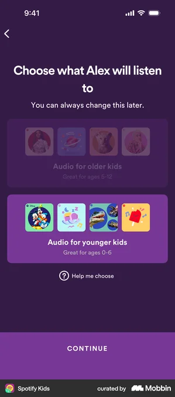 | 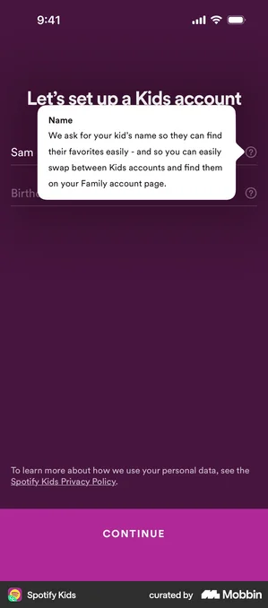 | 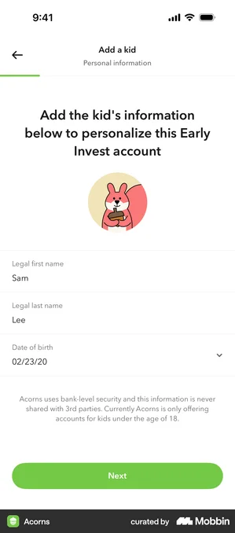 |

**Borrow:** explicit *"younger kids 0–6 / older kids 5–12"* split (Spotify); friendly mascot beside a short form (Acorns); inline consent line. **TimeKids:** ask name + age (4/5/6) → set reading level & narration speed; surface the privacy/consent note here.
Mobbin: [Spotify Kids age band](https://mobbin.com/screens/bf5be757-1d6a-4dd8-9391-cee17bdfc1b3) · [Spotify Kids account](https://mobbin.com/screens/5327f06d-e7b7-4e64-916a-2486b7f87f7b) · [Acorns add kid](https://mobbin.com/screens/f25e907f-4a9f-4efc-ae66-49e926a550d5)

## 2 · Pick your character  *(the child's first delight moment)*
A mascot the child *owns* drives attachment + return visits. Big, expressive, swipeable.

| Spotify Kids — monster A | Spotify Kids — monster B | Duolingo ABC — animals | Duolingo ABC — animals |
|---|---|---|---|
| 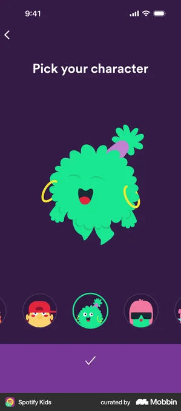 | 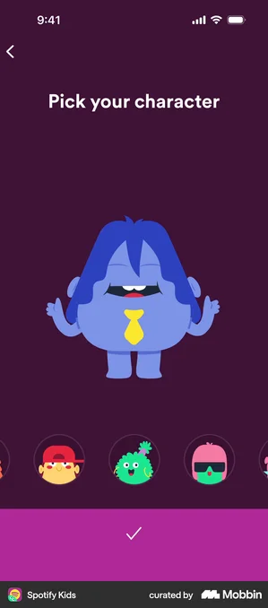 | 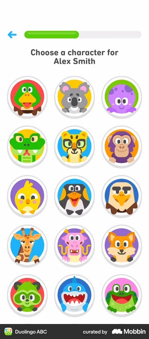 | 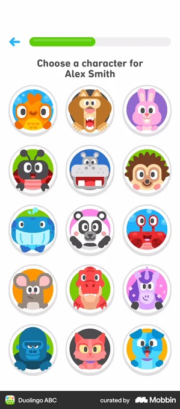 |

**Borrow:** one hero character centre-stage + a swipe row of alternates (Spotify); a grid of round, characterful faces (Duolingo ABC). **TimeKids:** your **time-traveller guide** (e.g. a pet that pilots the time machine). Let the child pick + maybe a simple dress-up later — costume changes per era are a cheap, high-joy reward.
Mobbin: [Spotify Kids pick](https://mobbin.com/screens/8de64c81-e6ba-437d-aa30-7cac484fec3f) · [Duolingo ABC characters](https://mobbin.com/screens/4a88934d-29e7-4bcb-aabd-44fa53ec9c00)

## 3 · Home / Time-Map  *(choose an era → an adventure)*
Your navigation metaphor writes itself: a **timeline / map of eras** as worlds. Node-path = locked→unlocked progression kids understand instantly.

| Duolingo ABC — house map | Duolingo — path + chests | Duolingo — section path |
|---|---|---|
| 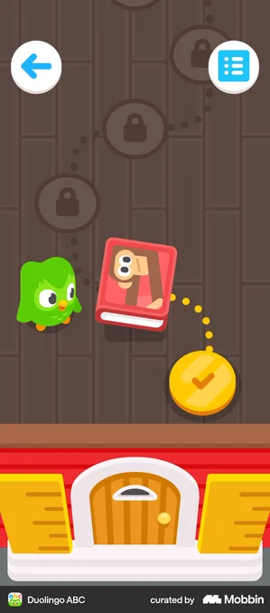 |  |  |

**Borrow:** illustrated "place" you move through (ABC house) vs. vertical node path with **treasure chests + stars** as reward beats (Duolingo). **TimeKids:** a **time machine map** — Dinosaurs → Ancient Egypt → Castles & Knights → … Each era is a themed world; adventures are nodes; a chest/artifact at the end of each. Lead with the 3 kid-magnets: **dinosaurs, Egypt (pyramids/mummies), knights/castles.**
Mobbin: [Duolingo ABC map](https://mobbin.com/screens/6a1a487e-b986-429b-9235-719eb3e0d1be) · [Duolingo path](https://mobbin.com/screens/0e28d33f-fd59-48cb-80c5-738ff089cc97)

## 4 · Story player  *(the core "magical" surface)*
The heart of TimeKids: a narrated, illustrated story the child listens to and taps to explore.

| Duolingo ABC — read-along | Duolingo ABC — story library | Calm Kids — browse characters | Headway — illustrated story |
|---|---|---|---|
| 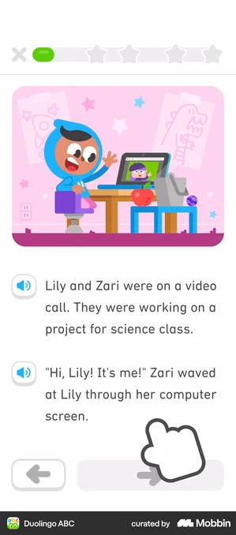 | 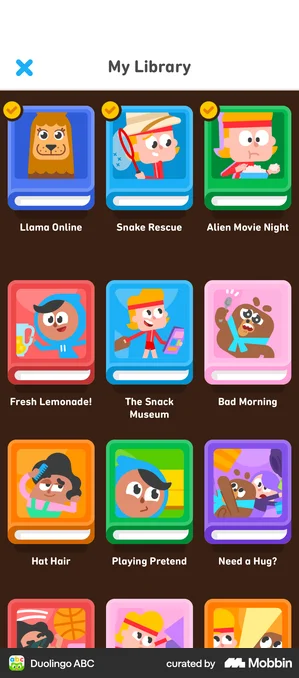 | 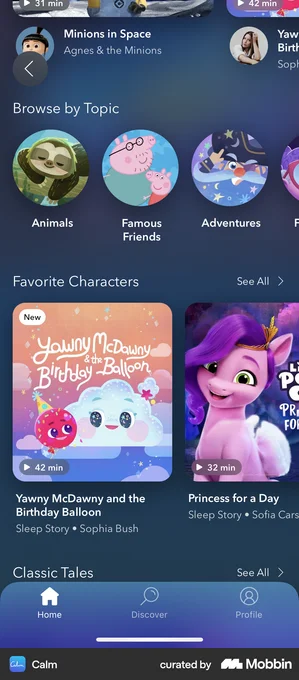 | 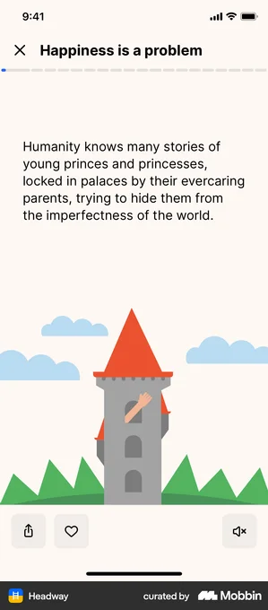 |

**Borrow (this is your closest analogue):** Duolingo ABC read-along — **big illustration up top, large text with a speaker icon on each line, word-by-word highlight as it's read, a pointing-hand hint, simple ◀ ▶ paging.** Library as a grid of character-fronted "book" cards. Calm Kids: browse-by-character / by-topic. **TimeKids:** narrate each line (Cantonese first), highlight as spoken, tap any object in the scene to hear its name; end the story by handing off to the character chat or quiz.
Mobbin: [Duolingo ABC read-along](https://mobbin.com/screens/432429be-92c9-40ff-9dca-bf1a3c43ad89) · [Duolingo ABC library](https://mobbin.com/screens/de3f7d7f-5d0c-4603-b313-84bcbe110833) · [Calm Kids](https://mobbin.com/screens/5b745f51-6089-4a09-a991-caff9939e0b1)

## 5 · Character chat  *(bounded, picture-choice replies)*
Now has solid precedent — **compose** two proven pieces: a **character that speaks in a scene** for the character's turn, and **tap-to-pick reply chips** (which you swap for **big picture cards**) for the child's turn.

| Speak — character in scene | Speak — bubbles + hint | Tolan — warm blob + bubbles | Tabby — quick-reply chips | TextNow — option chips |
|---|---|---|---|---|
| 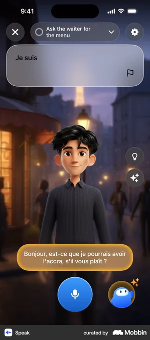 | 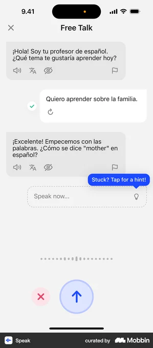 | 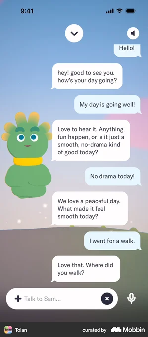 | 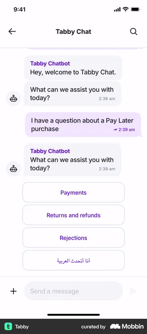 | 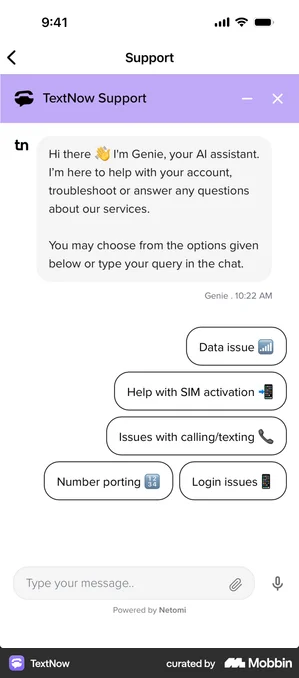 |

**Borrow:** full-screen character with a **speech bubble** carrying a replay 🔊 + translate control, plus a single mic/hint affordance (Speak); a softer, friendlier character with plain chat bubbles for a younger feel (Tolan); the **row of tappable suggested replies** at the bottom (Tabby/TextNow) — exactly the mechanic, just make each option a **picture card** instead of text.
**TimeKids:** your time-traveller guide (or an era local) asks a *spoken* question → child taps one of 2–3 **picture** answers (optional best-effort voice) → character reacts warmly. Put a 🔊 replay on every character line and a "hint" that highlights the likely answer. Never require typing or correct speech to progress (per [[cantonese-realtime-ai-research]]).
Mobbin: [Speak character](https://mobbin.com/screens/c4158d13-ba1a-4968-b164-c07777329a7e) · [Speak Free Talk](https://mobbin.com/screens/3ea456c2-5c6a-4cee-9a14-40ca59d0fdce) · [Tolan](https://mobbin.com/screens/4801af9f-cf80-4877-870f-e561df2d8b50) · [Tabby chips](https://mobbin.com/screens/65d81d5f-7393-4b70-94bf-32e5e2358069)

## 6 · Tap-the-picture quiz  *(your "comprehension check")*
| Duolingo — select image | Duolingo — selected state | Drops — tap matching bubbles |
|---|---|---|
| 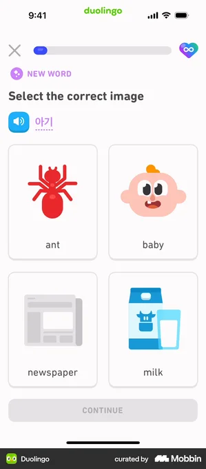 | 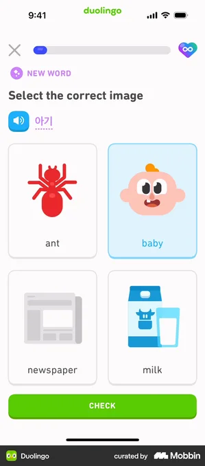 | 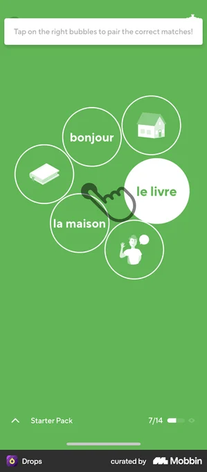 |

**Borrow:** **2×2 grid of big image cards + an audio prompt** ("tap the pyramid"), selected card gets a coloured ring, then a chunky **Check**; Drops shows a lighter tap-to-pair variant. **TimeKids:** picture-only answers, prompt always spoken, generous hit areas, gentle "try again" (no fail/penalty). Keep it to 3–4 questions per adventure.
Mobbin: [Duolingo select image](https://mobbin.com/screens/b967e70e-59e5-4238-a71e-bc618c7ca89e) · [Drops match](https://mobbin.com/screens/c1417271-3935-489c-8b9b-6be9c8bd2541)

## 7 · Reward & celebration  *(collect, don't punish)*
End each adventure with a celebration + a **collectible artifact** for the child's museum/sticker book. (Celebration screens themselves are in [[themes-and-styles]] — Duolingo/Mimo "Lesson complete".)

| Duolingo — achievements | OLIO — badge grid | Bears Gratitude — earn a sticker | GoHenry — XP shields |
|---|---|---|---|
| 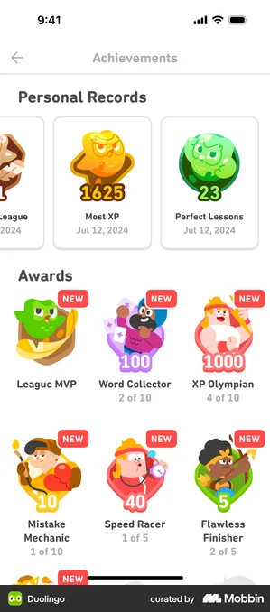 | 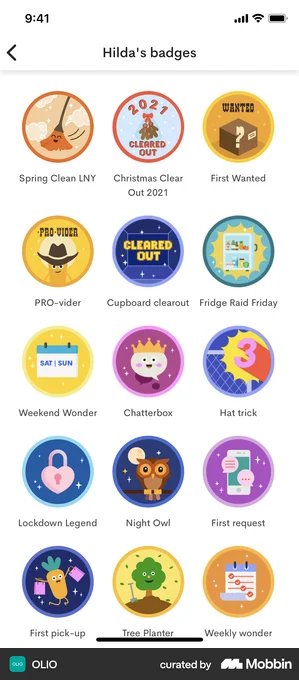 | 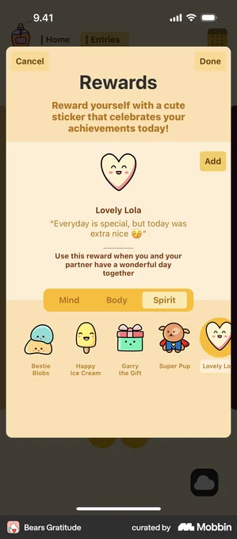 | 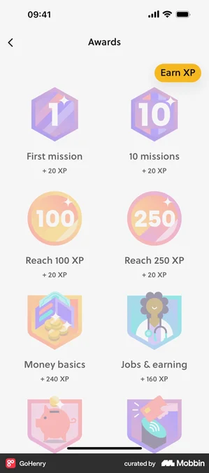 |

**Borrow:** character-fronted badges with progress ("2 of 10") (Duolingo); round, colourful **sticker badges** in a collection grid (OLIO); "reward yourself with a cute sticker" moment (Bears Gratitude); themed shields (GoHenry). **TimeKids:** every adventure drops an **artifact/sticker** into a **"Time Museum" / scrapbook** — one collectible per era builds a completion goal *without* streak guilt. This is your primary retention loop for this age.
Mobbin: [Duolingo achievements](https://mobbin.com/screens/bda574a9-ce33-49d8-a913-48ccbcc91d51) · [OLIO badges](https://mobbin.com/screens/cac9e5b3-a526-4ecd-9359-1be65a1bbcca) · [Bears Gratitude sticker](https://mobbin.com/screens/fa65d57d-6a19-4e9f-a954-c2ecfd5bcc5b)

## 8 · Parent gate  *(door to the grown-up zone)*
Required by App Store for kids apps before settings/purchase/external links. PIN is the common pattern; classic kids-app gates also use "ask a grown-up: enter the year" or press-and-hold.

| Grok — Kids Mode PIN | HBO Max — parental controls |
|---|---|
| 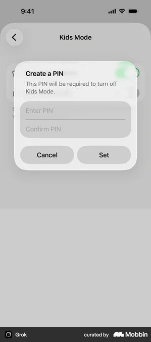 | 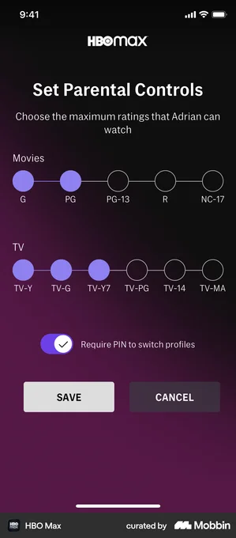 |

**Borrow:** set/enter a **PIN to leave Kids Mode** (Grok); ratings + "require PIN to switch profiles" (HBO Max). **TimeKids:** gate the Parent zone (reports, subscription, settings) behind a 4-digit PIN or a "hold the button / what year is it" adult check. Kid zone has *no* exits to store/web.
Mobbin: [Grok Kids Mode PIN](https://mobbin.com/screens/a6dafa5e-6405-43be-bb6f-a416fee00de7) · [HBO Max controls](https://mobbin.com/screens/1aa41b20-bbc9-4fb4-b9d6-879a68388ecc)

## 9 · Parent dashboard / progress report  *(your adult-value proof)*
This is what makes a parent *pay* — visible learning evidence. Finch's feed is almost exactly your concept.

| Finch — "Latest Progress" feed               | Khan Academy — mastery progress            | Greenlight — family home                        |
| -------------------------------------------- | ------------------------------------------ | ----------------------------------------------- |
| 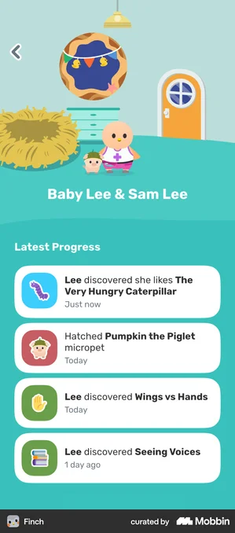 |  | 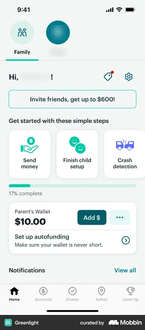 |

**Borrow:** a warm **activity feed** — "*Lee discovered Wings vs Hands · Today*" (Finch); mastery/% per topic (Khan); family overview card (Greenlight). **TimeKids:** per-session card = era explored + quiz result + a one-line **supportive summary** ("Maya learned how pyramids were built and matched 3/3 pictures 🎉"), plus transcript of the character chat. Shape it so the same data later powers the **teacher dashboard** (per [[product-brief]] / [[launch-schedule]]).
Mobbin: [Finch progress](https://mobbin.com/screens/b717349d-ebbb-4ea4-92b1-67eee8675560) · [Khan mastery](https://mobbin.com/screens/95727dfd-9972-4dc6-ad1d-27140eaea02d)

## 10 · Time-Museum / collection  *(your primary retention hook)*
Where every artifact the child earns lives. A grid with **locked silhouettes** creates a "fill it up" pull — *without* streak guilt, which is the right engine for this age.

| Waterllama — collect grid | Waterllama — "collect next" hero | Kahoot — locked by character | Any Distance — embossed slots | Headway — trophy shelf | Headway — claim trophy |
|---|---|---|---|---|---|
| 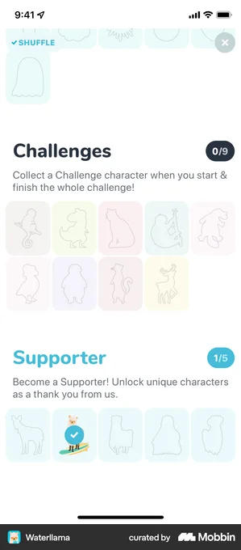 | 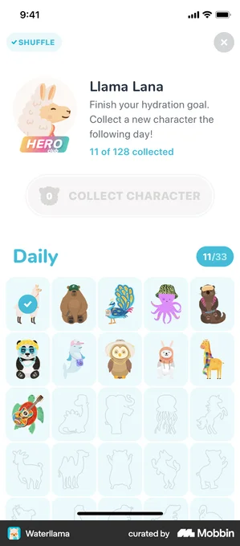 |  | 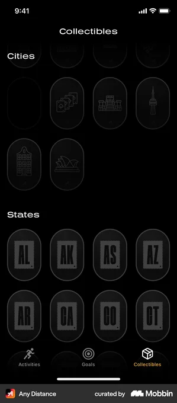 | 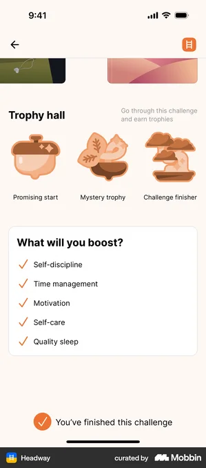 | 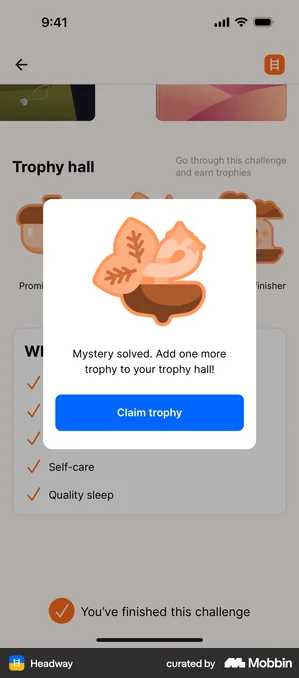 |

**Borrow:** **earned = full colour, not-yet = silhouette/locked**, with an "X of N collected" counter (Waterllama, Kahoot, Reddit); a **hero "collect the next one" card** that pulls the child back tomorrow (Waterllama); embossed slot styling for a "museum case" feel (Any Distance); a **shelf of trophies + a "Mystery solved → Claim trophy" popup** (Headway) as the moment an artifact drops in.
**TimeKids:** one **collectible artifact per adventure**, grouped into an **era shelf/case** (a Dino case, an Egypt case…). Empty slots show era-shaped silhouettes; completing an era unlocks a special character or costume. The end-of-adventure *"claim your artifact"* popup (Headway pattern) is your celebration beat and the bridge from §7 reward into the museum.
Mobbin: [Waterllama collection](https://mobbin.com/screens/0655382d-2c4c-4ecd-96bd-59302c24b567) · [Kahoot emotes](https://mobbin.com/screens/3fbf4c46-aa0f-44e8-b914-e7e2415e1786) · [Any Distance collectibles](https://mobbin.com/screens/25b649c8-1da0-40a3-9238-804ef3fd3f5f) · [Headway trophy hall](https://mobbin.com/screens/7218131a-5d65-4d74-aab0-d524dacc51e1)

---

## Build-order suggestion (maps to flagship-prototype week in [[launch-schedule]])
For the **one polished Ancient Egypt lesson**, you only need 5 of these surfaces end-to-end:
**3 Time-Map → 4 Story player → 5/6 Chat or Quiz → 7 Reward/sticker → 9 Parent report.**
Onboarding (1), character pick (2), and parent gate (8) can be stubbed for the demo and built out for beta.

## Gaps / to design custom
- ~~Character chat UI~~ → now referenced in **§5** (Speak/Tolan character-in-scene + quick-reply chips → picture cards).
- ~~Time-Museum / scrapbook~~ → now referenced in **§10** (Waterllama/Kahoot silhouette grids + Headway "claim trophy").
- **Cantonese read-along highlighting** — *still open*: confirm TTS can drive word-level highlight timing (spike in [[cantonese-realtime-ai-research]]).
- **Era scene art + tappable hotspots** — the genuinely custom, content-heavy build: illustrated era worlds with tap-to-hear objects. No off-the-shelf reference; this is your art-direction workstream.
