# Education & Learning — Themes & Styles (Mobbin research)

Source: Mobbin MCP, iOS. Apps examined: Duolingo, Brilliant, Mimo, Nibble, Skillshare,
MasterClass, Udemy, Coursera, Mindvalley, Tiimo, Uptime, Speechify, Speak, Babbel,
Preply, Quizlet, Kahoot!, Acorns, Revolut (finance-learn).
Screens saved locally in `./images/`.

---

## 4 visual archetypes

### 1. Gamified / Playful — *the dominant mode*
Duolingo · Mimo · Nibble · Kahoot!
- Saturated brand-color floods (Duolingo green, Mimo/Nibble purple, Kahoot blue) as full-screen splash + accent.
- A **mascot** as emotional guide (Duo owl, Mimo robot) — onboarding, celebrations, empty states.
- **Chunky rounded buttons** with a solid "3D" bottom edge that depresses on tap.
- On-screen game economy: **streak flame, XP, hearts/lives, leagues, daily goal rings**.
- **Celebration moments**: confetti, mascot poses, stat cards (Speed / Accuracy / XP).

| Lesson (word-bank)                        | Lesson complete                             | Streak                                    | Mimo quiz                           | Mimo complete                           | Kahoot flashcard                           |
| ----------------------------------------- | ------------------------------------------- | ----------------------------------------- | ----------------------------------- | --------------------------------------- | ------------------------------------------ |
| 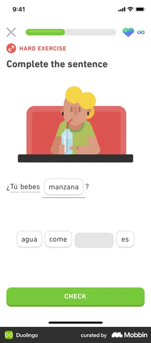 | 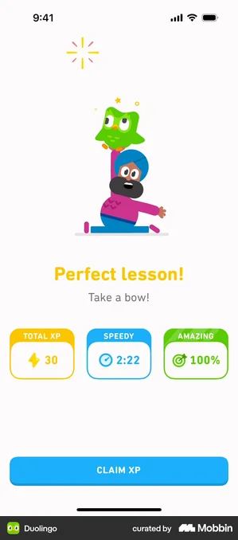 | 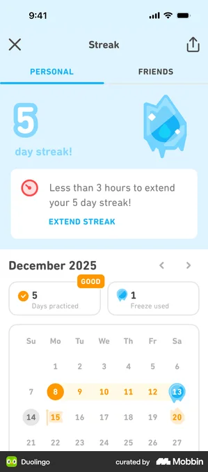 | 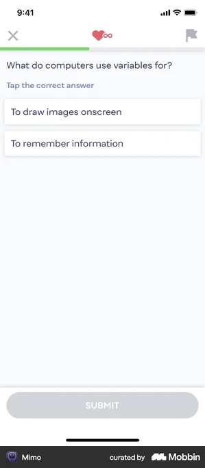 | 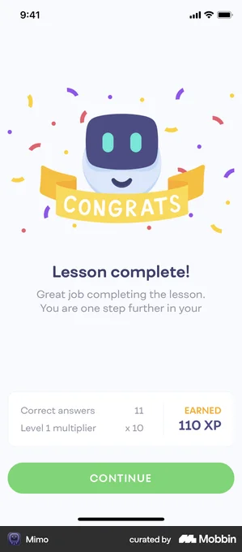 | 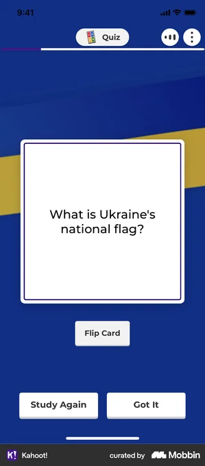 |

Mobbin: [Duolingo lesson](https://mobbin.com/screens/13212f2b-5fd3-45b9-8813-d63959c41286) · [Duolingo complete](https://mobbin.com/screens/8890cd2b-0375-4eea-963d-58a1fdc79f00) · [Mimo path/onboarding](https://mobbin.com/flows/a59b2d63-1c67-4f4c-9fac-e9565ee90657)

### 2. Premium / Cinematic
MasterClass · Mindvalley
- **Dark** canvas (near-black, deep cosmic purple), full-bleed hero video/imagery.
- **Instructor is the product** — portraits, "taught by an Oscar winner" framing.
- Single restrained accent (MasterClass red, Mindvalley purple gradient); high-contrast type.

| MasterClass lessons | Mindvalley course |
|---|---|
| 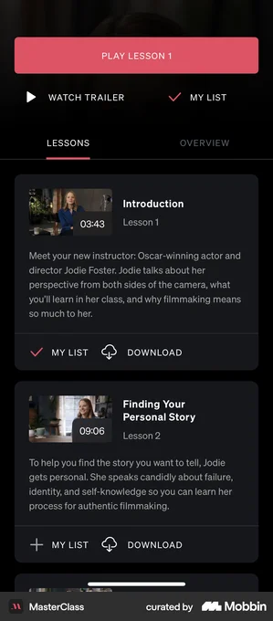 | 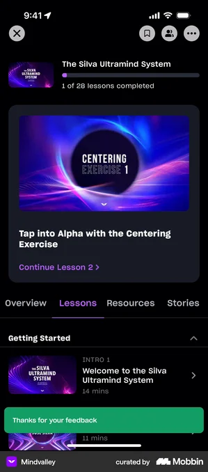 |

Mobbin: [MasterClass](https://mobbin.com/screens/5fff6632-5ecc-40fd-adbd-ddbf501e87ce) · [Mindvalley](https://mobbin.com/screens/2d7fd41c-357e-40c6-bcb6-995c5b8d69af)

### 3. Credible / Institutional
Coursera · Udemy · Skillshare
- Trust **blues** / neutral grays, structured & information-dense.
- **Curriculum accordion** (sections, lecture counts, total hours), **certificates**, "100% online / flexible deadlines / beginner level".
- Heavy **social proof** (student counts, ratings) and explicit **pricing + Buy now / Enroll**.

| Coursera | Udemy curriculum | Skillshare |
|---|---|---|
|  | 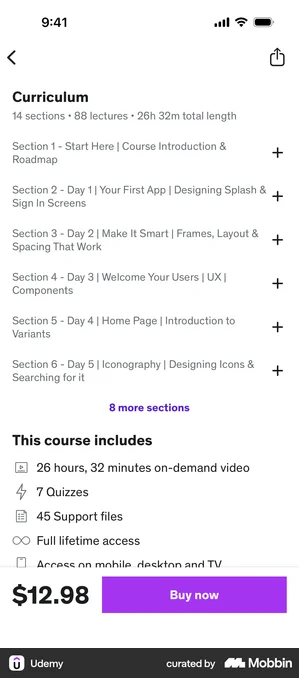 | 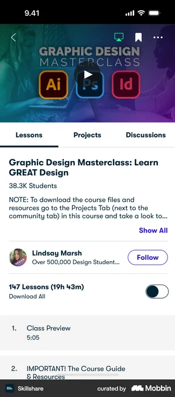 |

Mobbin: [Coursera](https://mobbin.com/screens/91f042a0-1b43-47d1-b927-f5ae2253ea5a) · [Udemy](https://mobbin.com/screens/5e01b048-c664-4479-9483-82922f9f5947) · [Skillshare](https://mobbin.com/screens/f5e50d42-0c56-41e7-9300-70494b9d5d71)

### 4. Calm / Minimal / Focus
Brilliant · Tiimo · Acorns
- Generous whitespace, restrained palette + **one** pop color (Brilliant lime, Acorns/Tiimo cream).
- Geometric or soft illustrations; **low cognitive load** — strong for accessibility / neurodivergent audiences (Tiimo).

| Brilliant home | Brilliant complete | Tiimo lessons | Acorns micro-course |
|---|---|---|---|
| 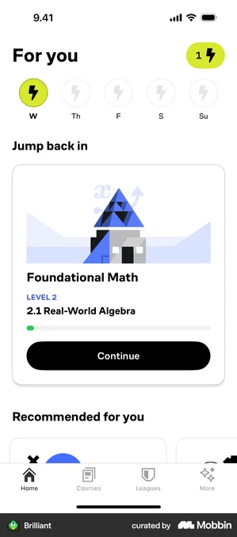 | 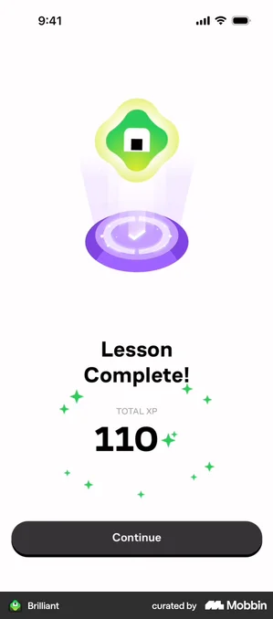 | 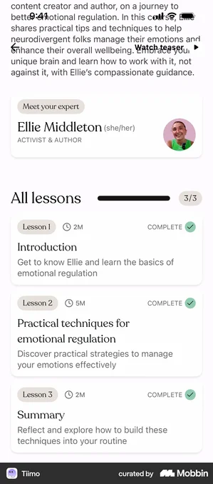 | 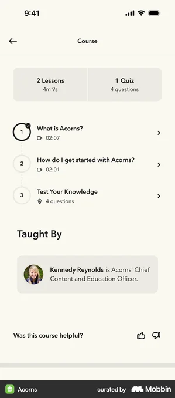 |

Mobbin: [Brilliant home](https://mobbin.com/screens/dd3f3c32-52c8-4440-9c58-aabbf3349826) · [Tiimo](https://mobbin.com/screens/4a3fa710-da4c-4017-8994-b269c1c65c61) · [Acorns](https://mobbin.com/screens/c50e439a-6caf-49f2-b34b-028fa4e87eac)

---

## Cross-cutting patterns (repeat in almost every app)

1. **Onboarding = a personalization quiz**, not a feature tour. Ask: goal → current level → time/day commitment → motivation → topics. Then promise a *"personalized learning path."*
   - Brilliant: "How will learning fit into your day?" · Mimo: experience slider + "5 / 10 / 20 min?" · Duolingo: pick language → routine → placement.
   - Flows: [Brilliant onboarding](https://mobbin.com/flows/7ffbd4f0-78d1-49be-bf0d-9c90cac00e8c) · [Duolingo onboarding](https://mobbin.com/flows/b0b4f93f-5637-46ec-9d77-49ecda6b991d) · [Nibble setup](https://mobbin.com/flows/5df9112e-cba3-41a0-bad1-cf6ea08161e6)
2. **Early social proof** — testimonials ("People love Nibble", "millions of professionals") injected *during* onboarding, before the paywall.
3. **Commitment device → trial paywall** — a timeline ("Today free → Day 5 reminder → Day 7 charged") shown right after the user has invested effort setting goals.
4. **Notification opt-in** reframed as benefit: "Turn on notifications to level up faster" / "I'll cheer you on from your home screen."
5. **Streak + daily goal** = core retention loop; flame + weekday dots + ring, reinforced by widgets.
6. **Progress everywhere** — rings, bars, %, and a node **path/map** of locked→unlocked units.
7. **The lesson reward loop**: big bottom **Check/Submit** → instant correct/incorrect color → end-of-lesson **XP + stat cards (Speed/Accuracy/Perfect)** → Claim → streak bump.
8. **Reusable study primitives**: multiple-choice, fill-in-blank, word-bank, listen-and-choose, **flashcards** (flip / "Got it" vs "Study again").

| Home + daily goal (Speak) | Home cards (Uptime) | Fill-in-blank (Duolingo) | Quiz (Revolut) | Flashcard (Quizlet) |
|---|---|---|---|---|
| 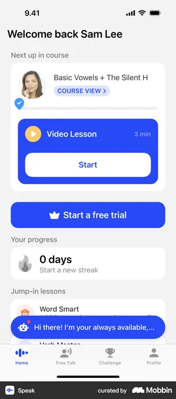 | 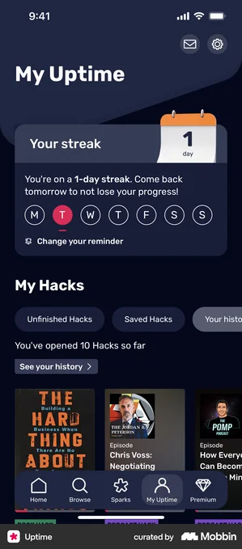 | 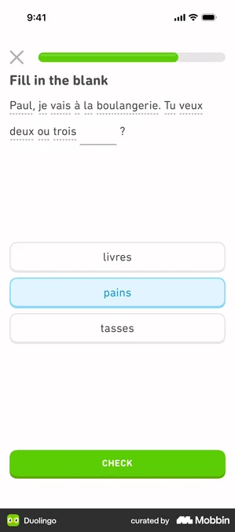 | 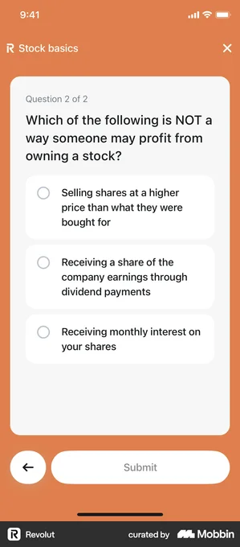 | 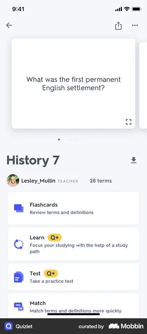 |

---

## Color / type quick-reference
- **Green** = approachable mass-market (Duolingo).
- **Purple** = "smart but fun" tech/coding/microlearning (Mimo, Nibble, Quizlet).
- **Blue** = trust/credibility/credentials (Coursera, Kahoot, Speak, Speechify).
- **Dark + single accent** = premium/aspirational (MasterClass, Mindvalley) OR focus/minimal (Brilliant).
- **Cream/beige** = calm, wellness-adjacent, accessible (Tiimo, Acorns).
- Type: rounded geometric sans + very bold display weights for gamified; refined high-contrast sans/serif for premium.
