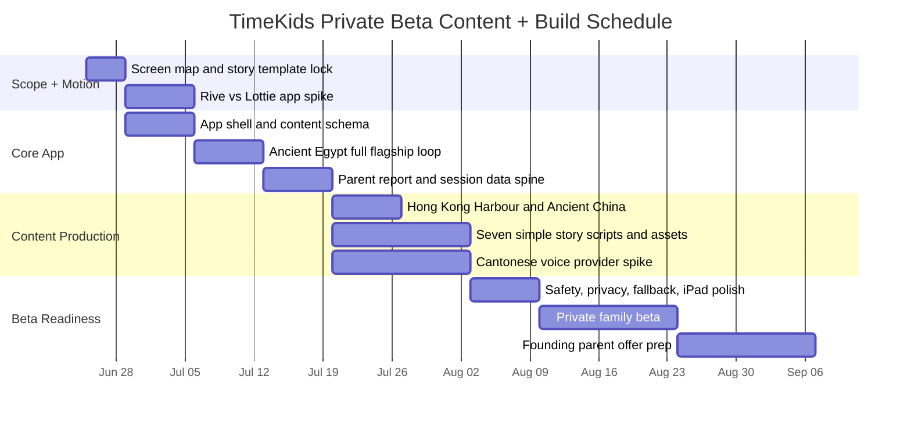

# TimeKids — Private Beta Launch Schedule

> This schedule targets a **private beta**, not a full paid public launch. The build should be enough for **5-10 Hong Kong bilingual families** to test the child loop and parent value.

## Gantt schedule

## Working milestone plan

| Window | Phase | Output | Gate |
|---|---|---|---|
| 2026-06-25 → 2026-06-28 | Screen map and story template lock | Lock [[private-beta-screen-plan]], [[story-script-templates]], and the story/data contracts | Team can build exactly the 16 beta screens/states without scope drift |
| 2026-06-29 → 2026-07-05 | Rive vs Lottie app spike + app shell | Compare Timi idle/talk/reward/hotspot in Rive and Lottie/dotLottie; build app shell and content schema | Motion default is evidence-based in the real app stack |
| 2026-07-06 → 2026-07-12 | Ancient Egypt full flagship loop | Story scenes, hotspots, picture interaction, bounded chat, quiz, reward | Child can finish with listening + tapping only |
| 2026-07-13 → 2026-07-19 | Parent report and session data spine | `StorySession` recording, report dashboard, report detail, transcript/quiz evidence | Adult can understand value in under 2 minutes |
| 2026-07-20 → 2026-07-26 | Hong Kong Old Harbour and Ancient China flagships | Two additional flagship scripts/assets using the fixed template | Local HK and Chinese cultural routes feel credible |
| 2026-07-20 → 2026-08-02 | Seven simple story scripts and assets | Seven simpler complete stories with narration, interaction, quiz, reward, report seed | Product feels like more than a one-lesson demo |
| 2026-07-20 → 2026-08-02 | Cantonese voice provider spike | Test Cantonese STT/TTS providers with adult and child-like sample utterances | Provider choice is evidence-based, not assumed |
| 2026-08-03 → 2026-08-09 | Safety, privacy, fallback, iPad polish | Consent, adult gate, no-key/no-internet/mic-denied fallbacks, reduced motion, iPad pass | Demo feels complete without paid APIs |
| 2026-08-10 → 2026-08-23 | Private beta | 5–10 families test at home; optionally 1 friendly teacher reviews adult view | Kids complete sessions; parents see value |
| 2026-08-24 → 2026-09-06 | Founding parent offer | Refine demo, collect testimonials/screenshots, prepare HK$28–38/month or HK$198–298/year founding plan | Enough proof to ask early parents to pay |

## Private beta build target

Recommended starting point for the private beta:

- **One app, one codebase.**
- **Home/Kid app first.**
- **First buyer:** HK bilingual parents of ages 4–6 who already pay for enrichment or educational apps.
- **Parent report first**, shaped so it can become teacher dashboard later.
- **Exactly 16 screens/states** in [[private-beta-screen-plan]].
- **10 stories**, with Traditional Chinese/Cantonese + English included.
- **Recommended execution:** 3 flagship stories plus 7 simpler complete stories.
- **Monetization:** free private beta first; no paywall or subscription management before beta feedback.
- **No API key required** for demos.

## What not to build before private beta

- Teacher dashboard.
- Paywall.
- Reward shop.
- Full subscription management.
- Advanced classroom tools.
- Large character catalog beyond the first 10-story set.
- Real-time avatar streaming.
- Real public-figure voice/likeness.
- Advanced analytics beyond simple engagement, comprehension, interests, and report evidence.

## Metrics to watch in first tests

| Metric | Why it matters |
|---|---|
| Child completes full loop | Proof the experience works at age level |
| Child uses choice buttons without help | Proof no-reading path works |
| Parent understands adult report | Proof B2C value is visible |
| Parent would share/pay | Early consumer traction signal |
| No-key/no-internet/mic-denied recovery | Proof beta families do not hit broken dead ends |

## Kindergarten pitch gate

Do not pitch kindergartens seriously until the family beta has:

- 5–10 family beta users,
- 60–70% child completion of one full story loop,
- 3–5 children returning for a second session,
- 3 parent quotes/testimonials,
- one clear parent report example,
- Cantonese voice quality tested enough for a credible demo.

## Verification plan

Detailed test gates live in [[private-beta-test-plan]].
